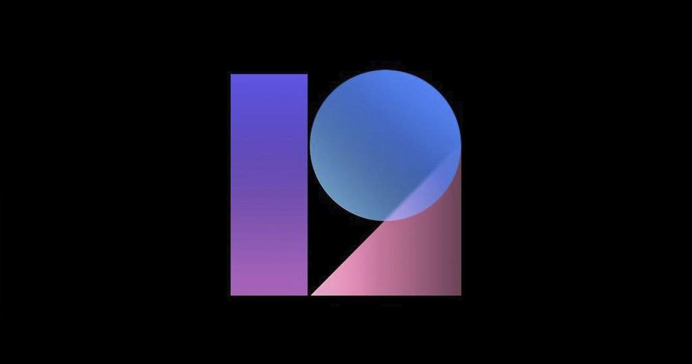
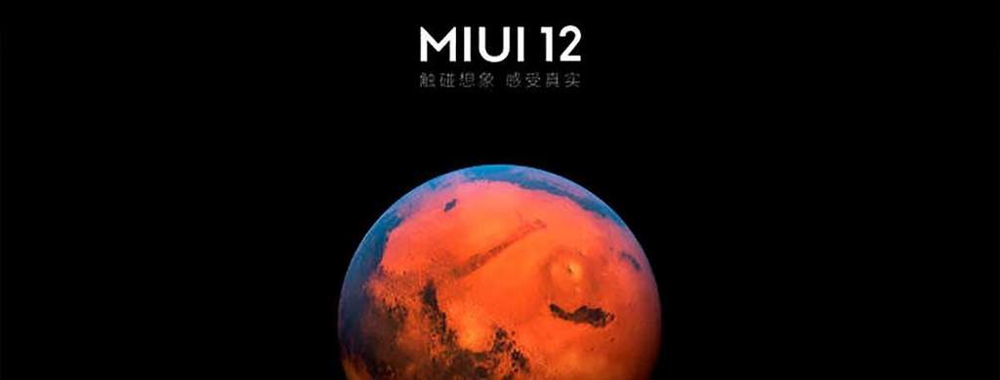
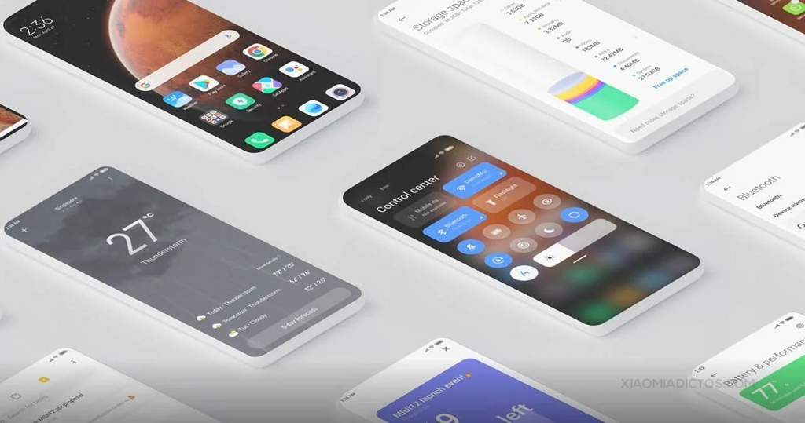
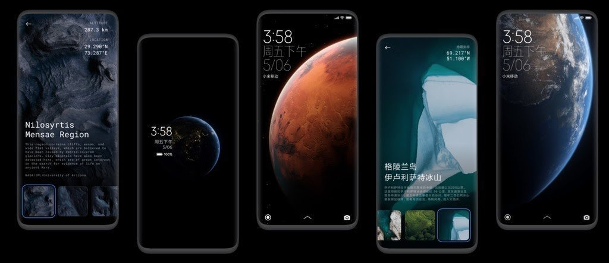
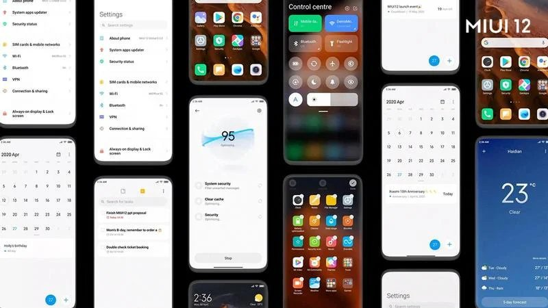
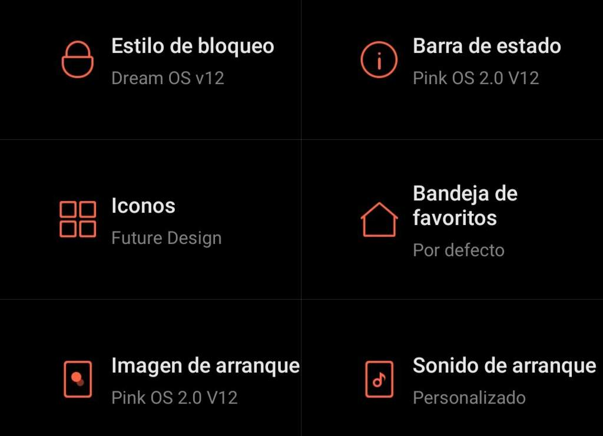
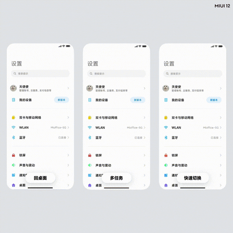
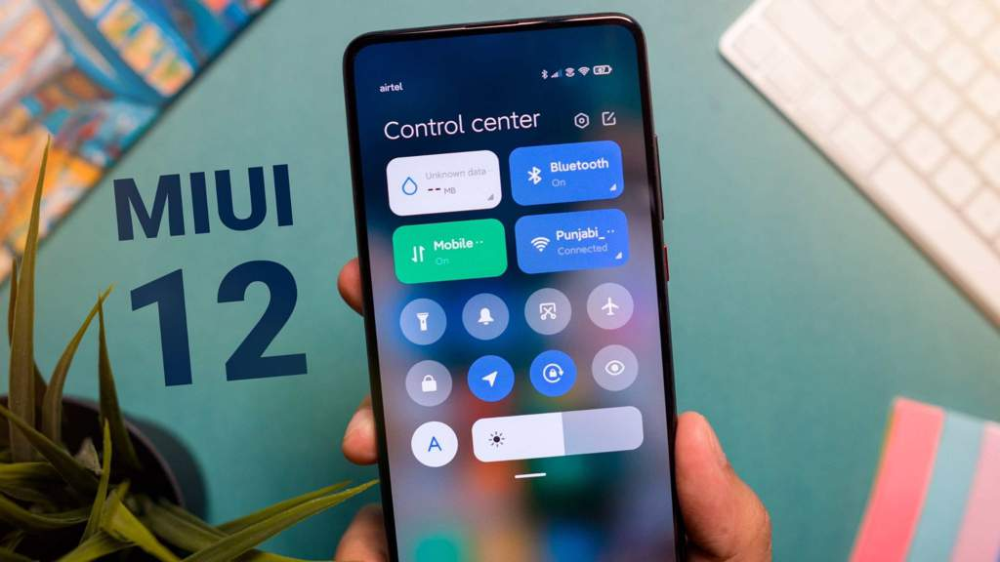
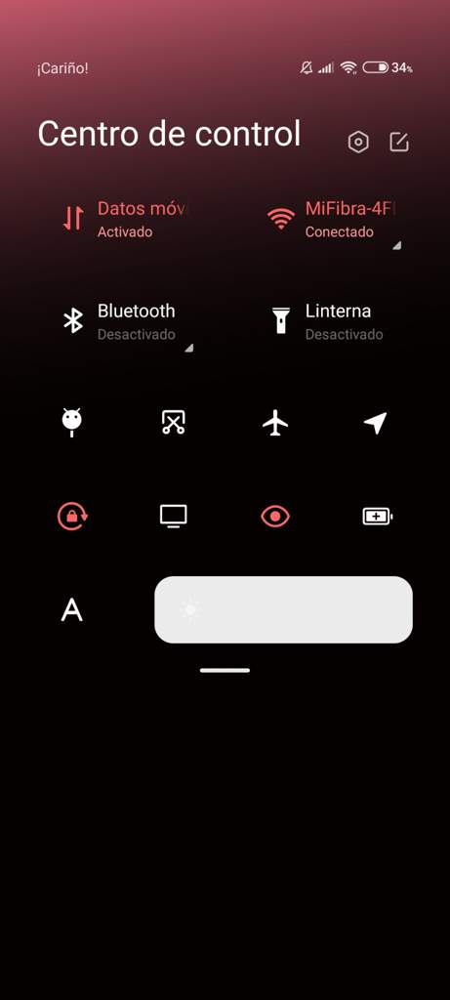
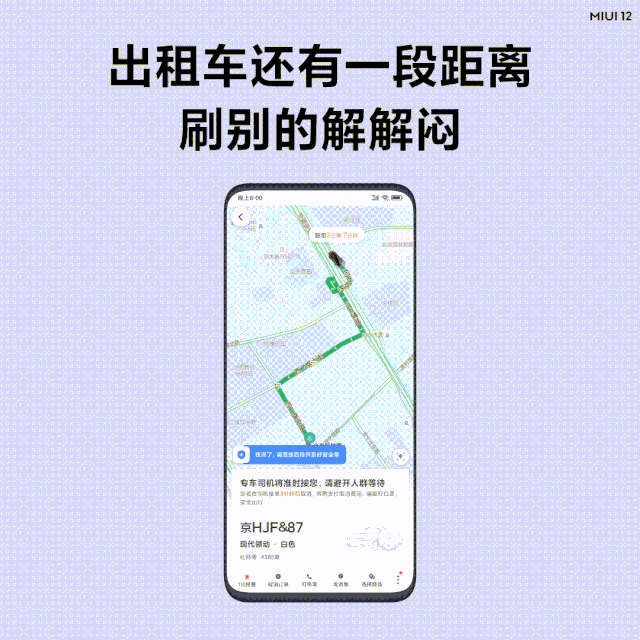

# MIUI 12
<b>By: Tori - 05/01/2021</b>
 
 
Blog especial por el aniversario 200 miembros de la comunidad.

<b>¿Como? ¿Quién eres?</b>

En fin, déjame preguntarte algo.

¿Sabes que es MIUI 12 o como afecta a tu teléfono?

¡Interfiere más de lo que crees

## ÍNDICE

- ¿Que es MIUI 12?
- Ficha Técnica
- Personalización y Apariencia
- Optimización
- Nuevas Funciones

## ¿Que es MIUI 12?

Verás, primero generalicemos ¿Que es MIUI?

Bien, MIUI es un Firmware desarrollado por Xiaomi.

Hay 2 tipos de MIUI
- Versión Global
- Versión China

Ya que esto influye en MIUI 12, el tema principal del blog, es mi obligación mencionar la diferencia entre la versión global y la versión china.

Es simple, la china no tiene servicios de Google, mientras la global si.

Volviendo al tema, MIUI, pronunciado (Mi you-ai), siendo breves, es una "Capa de personalización".

Que brinda al usuario muchas funciones que, la versión de stock no ofrece.

*¡Así como cambios en la barra de notificaciones, aplicaciones preinstaladas (Bloatware)!*

## Ficha Técnica

- Desarrolladora: Xiaomi
- Programado en: C, C++ y Java
- Desarrollo: Código cerrado (Aún habiendo excepciones)
- Fecha de lanzamiento: 16/Agosto/2010

## MIUI 12.

**Destacado por su interfaz…**

Siempre que nos hablan sobre una nueva versión de MIUI, exceptuando sus nuevas funciones, siempre tomamos como principal su apariencia.

Esa capa de personalización que tanto nos gusta

*¿A quién no le gusta un móvil que destaque por encima de los demás?*

Ha llegado uno de los momentos más esperados, dejando la larga introducción atrás, hablaremos sobre la capa de personalización.

Ya pues, MIUI parece haber hecho un muy buen trabajo en cuanto a ofrecernos lo más llamativo del mercado.

## MODO OSCURO 2.0

Con su anterior entrega, MIUI 11, ya se introdujo un modo oscuro, teniendo como propósito ahorrar batería. Aunque, no gustó a todos, ya que sólo oscurecia la pantalla, sin aplicar tonos negros; y, Solo en aplicaciones del sistema.

Dejenme presentarles el nuevo modo oscuro, que fuerza dicho modo a aplicaciones de terceros, aplicando mayor contraste, siendo capaz de reconocer los tonos de aplicaciones que incluso no son compatibles con dicho modo, aplicándose sobre estas también.

*Usando la tecnología Anti-Color Lab.*

## Cambios Generales sobre la Interfaz

No hay mucho que recalcar aquí...

Sólo ha sido rediseñada la interfaz del sistema, así como del bloatware que este incluye.

*Tenemos ejemplos como... ¡Este!*

Pudiendo ver aquí el calendario, menú de ajustes, aplicación del tiempo, menú de limpieza, barra de control, notas, entre otros.

## Personalización

Simple también.

MIUI siempre trata de dar la mejor experencia al usuario, ¿Como no va a faltar la personalización?

¡Hay una tienda oficial dedicada a eso!

En la cual puedes encontrar ajustes como estos:

Y es muy bueno saber que los temas los crea la gente, y puedes mezclar características entre sí, haciendo aún más vivo tu estilo.

Muy interesante y útil ¿Cierto?

>>__________________________>>

Pd: También podemos encontrar muchas opciones de personalización en el menú de ajustes, todo lo que trae la versión de stock, y mucho más.

Así como tonos pre instalados para llamadas, notificaciones, fuentes de letra, etc...

(A parte de la inmensa tienda)

## Animaciones

Algo muy característico de MIUI 12, las animaciones

¿Tan importantes son en MIUI 12?

Esto es lo que destaca esta nueva versión son las animaciones, ahora siendo presentes con un nuevo motor en casi todos los lugares del sistema, mejorando de forma inmediata la experencia del usuario entre los menús de su dispositivo.

Dejando a recalcar los gestos de navegación.

## Optimización

Aquí no tengo imágenes que mostrar, ya que, bueno, no las hay.

Ahora estoy usando un Redmi Note 9 Pro, por lo que el rendimiento es muy bueno, no noto fallos ni tirones, la batería aún teniendo 5.000MAh, dura lo que su capacidad tiene que durar, sin ser tirada por el sistema.

Pero, espera un momento.... ¿Que hay de los Gama Media?

Al usar un Redmi Note 7, lo primero que note al actualizar a MIUI 12 fue que el centro del control, tenía pérdidas de FPS, la batería iba como siempre, pero la optimización era nefasta, así generando un mayor consumo de CPU y RAM.

*Dependiendo del dispositivo esto te afectará más, o menos.*

## Funciones

MIUI 12 trae muy interesantes nuevas funciones, las cuales nos facilitarán el día a día usando nuestro dispositivo Xiaomi.

### Centro de Control

Tal como ven, es muy parecido al centro de control de iOS, por no decir el mismo.

*Este también es personalizable con temas, mostrando aquí como ejemplo, el tema que aplique yo.*

Esto es muy útil, ya que podemos usar un menú de notificaciones, y a parte el centro de control, distinguiendo nuestro dispositivo de los demás, haciendo este más especial y único.

### Multitarea Flotante

Aquí podemos ver una muy interesante forma de usar 2 aplicaciones a la vez sin necesidad de utilizar la pantalla compartida, la cual nos estropea la experiencia y comodidad ofreciéndonos la mitad de nuestra pantalla, para usar 2 aplicaciones a la vez.

Esta forma de multitarea, es más eficaz, ya que como se puede apreciar... El tamaño de nuestra pantalla ya no es tan esencial para usar 2 apps a la vez, pudiendo disminuir la pantalla y agrandarla cuando más lo necesites, dejando la miniatura en una esquina cuando más lo necesitemos.

>>__________________________________>>

Sin nada más que añadir, he tenido la gran suerte de poder enseñaros gran parte de lo que podemos ver en nuestro sistema Xiaomi.

¡También tenemos la suerte de poder probarlo!

**Os esperaré en otro blog, donde podré ofreceros una fuente más grande de información útil.**

<b>¡Adiós!</b>

*MIUI = Mi UI (Mi capa de personalización)*
*By Xiaomi*

