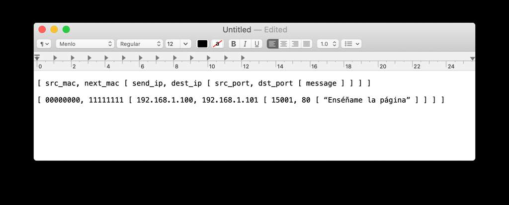
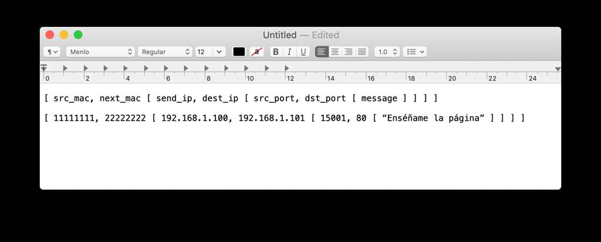

# Modelo OSI
<b>By: Antitesista - 03/01/2021</b>
 
 
En realidad, quería hacer un blog sobre DNS y el uso avanzado de nslookup. No obstante, considero que es importante conocer esto primero.

## Introducción
Para utilizar las redes hoy en día, hacemos uso constante de una arquitectura maravillosa: **el modelo OSI**. Veamos un poco de historia para entender su importancia.

Cuando se crearon las primeras computadoras, cada fabricante hacía sus propios protocolos, estándares de conexión, etc. Como era todo cerrado y acoplado al hardware, era imposible o muy difícil conectar dos máquinas entre sí. Esto se debía a que, si tenías un equipos de la compañía *A* y otro de *B*, ambas empresas habían diseñado de manera totalmente aislada la forma en la que se comunicaban sus equipos entre sí. **ESTO ERA UN GRAN PROBLEMA**.

## ¿Por qué era tan grande el problema?
Imaginemos que queremos hacer una red de computadoras que conecta las principales universidades de Europa con las de EE.UU. Tendríamos que hacer que todas estas instituciones se pongan de acuerdo en qué tipo de equipos utilizar, qué protocolos se usaría, cómo debería estar formada esta red, etc. Y si teníamos una red de empresas que quería hacer lo mismo, el caso no cambiaría. Aquí vemos que hay un gran problema de complejidad, porque hay un trabajo que no es crucial (la comunicación es lo crucial para las entidades, no tanto el medio) y que demanda muchísimo tiempo y acuerdos para ser implementado.

## ¿Cuál fue la solución?
*El **modelo OSI** (Open Systems Interconnection model) propuso dividir la comunicación entre dispositivos en varias capas, en las que cada una encapsularía los datos que le correspondían a la siguiente.* Este modelo tendría que ser adoptado por todas las compañías que quisieran interconectar sus dispositivos. Podríamos hacer una analogía de el problema y la solución.

> Pedro y Pablo han acordado que, para comunicarse, intercambiarán cartas envueltas en un sobre rojo de papel. Estas cartas serán enviadas por correo postal solo los 15 de cada mes.
> 
> Pablo y Roberto han acordado que, para comunicarse, enviarán sus cartas con una paloma mensajera el primer día de cada mes. Estas cartas deberán estar enrolladas a la pata de la paloma para facilitar el transporte.
> 
> Si Roberto se quisiera comunicar con Pedro, tendría un problema, pues no han acordado cómo comunicarse. Y Pablo debe memorizar dos formas totalmente distintas para hablar con alguien, pues ha acordado mecanismos distintos con los otros dos. Por último, si Ana quisiera unirse a cualquiera de las conversaciones, tendría que aprender los métodos de comunicación que se utilizan, lo que complicaría que pudiera socializar con cualquier otra persona.

Con el modelo OSI, se soluciona todo. Todas las personas se ponen de acuerdo en que se van a comunicar de la siguiente forma:
1. El mensaje se pondrá en una carta, que será envuelta en un sobre de papel blanco.
2. El sobre deberá tener el remitente, destinatario y hora a la que fue escrito el mensaje.
3. El sobre se abrirá solo por la parte de arriba.
4. Las cartas pueden ser enviadas por cualquier medio.

> Ahora, Pedro y Pablo solo enviarán cartas en sobres blancos con los datos necesarios y, si Ana quiere comunicarse con cualquiera de ellos, solo necesita conocer sus datos de contacto. Pablo y Roberto podrán seguir usando la paloma como medio de transmisión, pero el mensaje ya no podrá ir enrollado, sino en un sobre.
>
> Si Pedro quiere mandarle un mensaje a Roberto, podría usar una paloma o la oficina de correos, porque sabe que, sin importar el medio por el que llegue el mensaje, Roberto esperará una carta en un sobre blanco con los datos de contacto y el mensaje.

Aquí estamos desacoplando la forma de comunicación. Por un lado está el medio de transmisión, luego el empaque, los datos del contacto y el mensaje en sí. Si se decide, en el futuro, usar otro empaque por consenso, se procederá a cambiar el sobre de papel a uno de plástico, pero el resto de los componentes se mantendrá igual. Si se decide que el próximo año se pueda enviar el mensaje por barco, solo cambiará este componente (medio de transmisión), pero el resto de partes del protocolo se pueden mantener inmutables.

Esta modularidad es la base del modelo OSI y la que nos permite hacer de todo en la red.

## Capa 1
*La primera capa es la física.* Se refiere específicamente al medio que usará para transmitir un mensaje. En la actualidad tenemos diferentes medios:
- Cable UTP/STP
- Red inalámbrica de 2.4/5GHz
- Bluetooth
- Red celular (1g, 2g, 3g, 4g ,5g)
- Fibra óptica
- Cable coaxial
ETC

## Capa 2
La segunda capa es la de enlace. *Permite que los dispositivos sepan qué otros dispositivos están cerca o directamente conectados.* Más específicamente, con quienes están enlazados. Para esto, es utiliza comúnmente la **dirección MAC** (Media Access Control), que no debe confundirse con la marca registrada de Apple. Una **dirección MAC** es una dirección única en el mundo que identifica a cada equipo conectado a una red. No se puede cambiar (pero sí se puede simular), pues se le asigna al equipo en el momento de fabricación.

## Capa 3
*La tercera capa es la de red*. A partir de esta, se tiene información totalmente mutable y lógica. Aquí es donde encontramos a las famosas **direcciones IP**, que indican en qué lugar de la red lógica se encuentra un dispositivo. Hay que notar que, al ser una dirección lógica, esta puede cambiar, al igual que cambiaría la dirección de mi casa si me mudo. Los mensajes podrían seguir llegándome, solo tendrían que cambiar la dirección de destino si me envían una carta. Actualmente conviven dos tipos de direcciones IP: **IPv4 e IPv6**. Aunque muchas redes usan **IPv6** de manera cotidiana, **IPv4** sigue siendo un estándar en la mayoría de las redes y se usa en paralelo a **IPv6**. 

Haré un blog sobre esta capa en detalle más adelante, porque es un tema fascinante en sí mismo.

### Capa 4
Esta es la capa de transporte, *que permite establecer una comunicación efectiva entre dos dispositivos*. *A partir de este punto, se pueden transportar mensajes de un punto a otro sin necesidad de capas superiores*, pero estas casi siempre serán necesarias para estandarizar el tipo de mensaje que se envía y protocolos de comunicación.

*Aquí se utilizan los puertos de red*. Cada interfaz de red (con una dirección IP asignada) puede tener puertos abiertos por los cuales envía o recibe mensajes. Hay 65536 puertos en total disponibles para ser usados, no obstante, el estándar divide el rango 0-65535 en subrangos para distintos casos de uso.
Ejemplos de puertos estandarizados:
- 22: ssh
- 20, 21: ftp
- 23: telnet
- 53: dns
- 80: http
Con esos ejemplos podemos ver que hay aplicaciones que hacen uso de puertos específicos de forma estándar para establecer una comunicación e intercambiar datos.

### Capas 5, 6 y 7
Para concluir con un caso real, mezclaré las 3 últimas capas en una sola, de manera similar a lo que hace el **modelo TCP/IP** (una simplificación del modelo OSI). Esta última capa sería la capa de aplicación, que define los datos que se transmitirán usando las 4 capas anteriores como encapsuladoras.

### Ejemplo
Tengo un switch y dos computadoras *A* y *B* como en la siguiente topología:

*A* es la laptop de un usuario promedio y *B* es un servidor web.
Si quiero entrar a la página web de *B* desde *A*, haré lo siguiente:
*A* armará un paquete de red de la siguiente manera:

*A* le mandará este paquete al switch al que está conectado especificando su dirección MAC, pues están enlazados directamente, este lo verá y se lo mandará al servidor de la siguiente forma

Lo único que ha cambiado ha sido la cabecera con las direcciones MAC, pues ahora se manda el mensaje desde un dispositivo distinto a otro. Luego de hacer esto, el servidor recibe el mensaje por el puerto 80 y envía una respuesta con dirección a *A*, para que sea recibida.

Hay que tomar especial nota entre los parámetros de cabecera que hay en esta comunicación. Las direcciones MAC han ido cambiando constantemente y las direcciones IP y puertos solo han cambiado para la respuesta del mensaje.
Finalmente, el switch recibe el paquete y se lo reenvía a *A* de la siguiente forma:

Con este ejemplo, podemos ver una serie de elementos y eventos interesantes:
1. El switch no necesita una dirección IP, pues solo redirige paquetes a nivel de capa 2.
2. Las capas del modelo son independientes y permiten que se corrijan los errores o se examine el contenido de los mensajes desde diferentes perspectivas.
3. Si el mensaje hubiera estado encriptado y solo lo pudieran leer *A* y *B*, el modelo no cambiaría en ningún punto aparte del mensaje, que sería leído por *A* y *B*, pero esto es totalmente independiente del resto de las capas.

