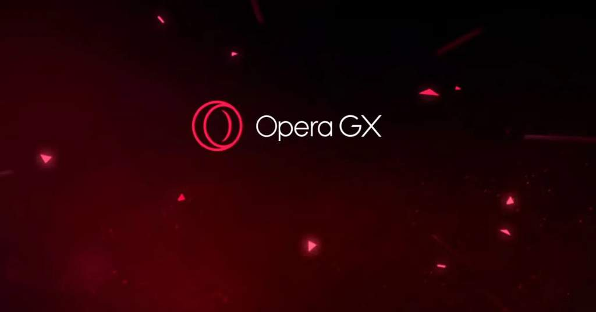
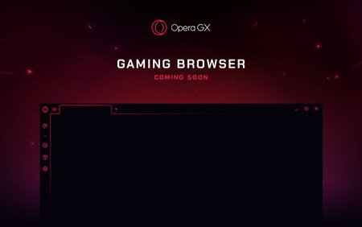
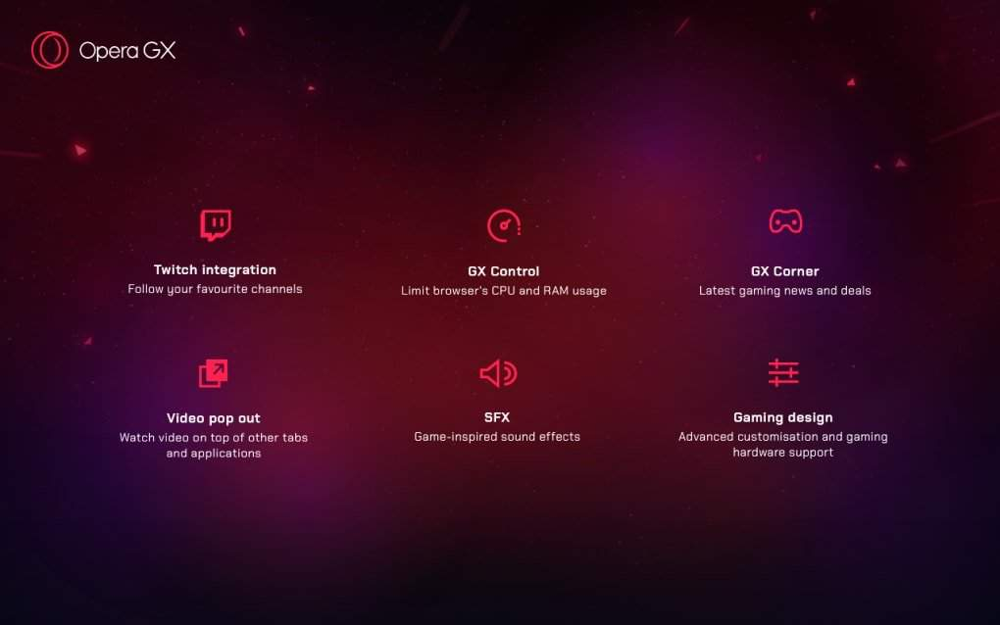
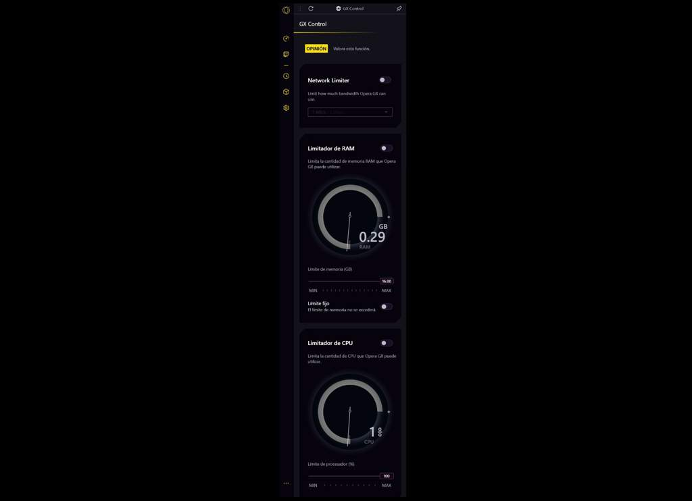
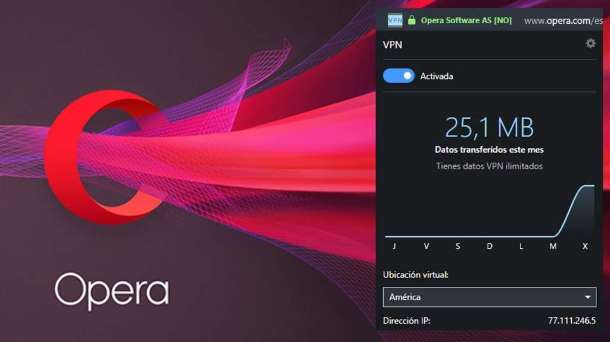
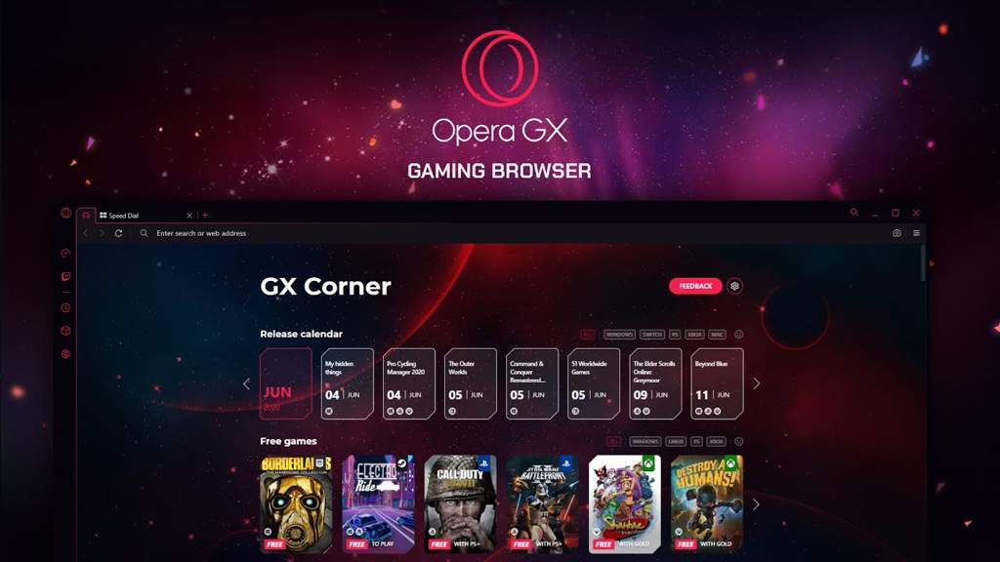
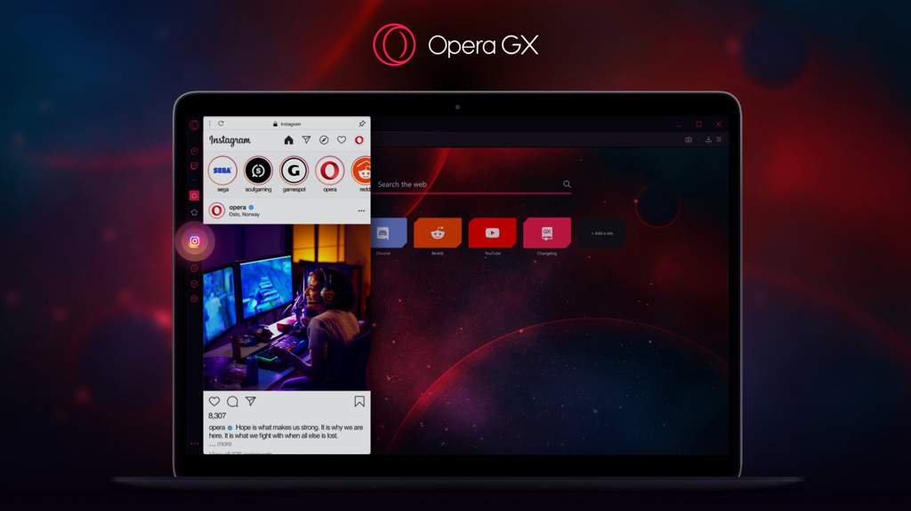
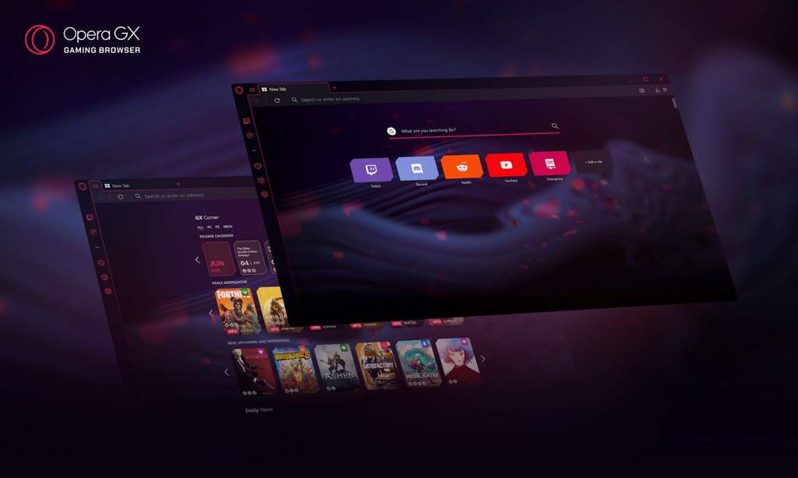
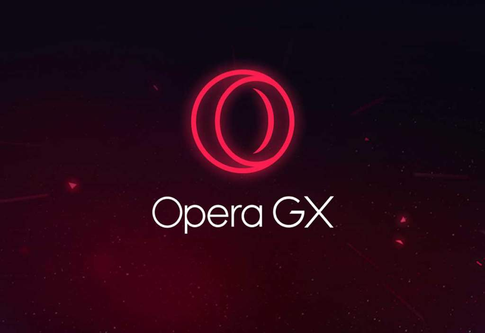

# Opera GX
<b>By: Tori - 20/11/20</b>
 
 
**Muchos buscamos un navegador a nuestro gusto.** 
**Algunos optimizados, otros que rebosen de servicios y buena interfaz, pero** 
**¿Por qué no juntar todo y hacer un navegador perfecto?** 
**Pues si lo hay, Opera GX** 

# Índice

- ¿Que es Opera GX?
- Funciones
- Interfaz
- Personalización
- Opinión personal

## ¿Que es opera GX?

Opera GX es una contraparte del navegador Opera este está orientado al Gaming, así con funciones como gestión de los propios recursos que consume, y una innovadora y muy llamativa interfaz, la cual es casi totalmente personalizable.

Opera GX fue anunciado el 11 de Junio de 2019, justo el día del inicio de la E3, y abierto a acceso anticipado en Octubre de ese mismo año.

## FUNCIONES

Opera GX, como bien dije, cuenta con múltiples y muy interesantes funciones, y muy funcionales, prácticas y cómodas.

## Gestión de RAM, CPU y Ancho de Banda

- La optimización de nuestro PC es algo que todos adoramos, y Opera GX no se queda atrás. ya que tiene un menú muy práctico para limitar la RAM, CPU y Ancho de Banda que deseemos, ajustando el nivel de consumo que mas se ajuste a nuestras necesidades y preferencias.

También muestra el uso de GPU y RAM en ventanas específicas, como si de un administrador de tareas se tratase.

Por no hablar de su GX Cleaner, el cual limpia y optimiza los datos del navegador.

## VPN y AdBlocker

¿Quien no quiere un VPN o Adblocker en su navegador?

Pues Opera también lo implementa, perfecto para aquellos que desean navegar seguros y sin anuncios de por medio.

## GX Corner

Simple, una muy buena función de Opera GX que te permite estar al tanto de las novedades del gaming solo en un click.

Esta incluye:

- Calendario de nuevos juegos

- Juegos gratuitos (Se actualiza y añade los de Epic Store cada semana)

- Nuevo, inminente y muy interesante

- Lector de ofertas

- Tráilers de los juegos

- Noticias diarias

Muy sencillo, accesible, y bello.

## Barra de Tareas Vertical

Una barra de tareas vertical, llena de accesos rápidos, perfecta para usar Instagram, Twitter, Discord, WhatsApp Web, Twitch u otras aplicaciones en una esquina de la pantalla.

Extensiones, marcadores, historial, descargas, y hasta el propio botón de ajustes

## INTERFAZ

Lo más seguramente es que fuiste atraído por este navegador al ver su interfaz, si ya lo probaste antes, y es que creo que también es la principal razón por la que me cambié de navegador.

Este tono rojo que te da al principio y que luego puedes personalizarlo, ese minimalismo y atractivo diseño te llama a kilómetros.

Por no hablar de la barra vertical, la cual cumple con sus funciones y es en solo 5 palabras, un sobresaliente a la vista.

¿Te acuerdas de las funciones de las que hablamos?

Cada menú está cuidado al mínimo detalle para ofrecerte la mejor experiencia

¿Sabías que Opera tiene un menú de carga?

Pues sí, solo dura tan solo unos segundos y la verdad, juega muy bien con el diseño y los sonidos

[Opera GX Menú de carga.](https://m.youtube.com/watch?v=9k9fk9hMftw)

Así como otros tantos sonidos que mejoran la experiencia del navegador aunque no te des cuenta de ellos.

## PERSONALIZACIÓN

Aquí no hay mucho que aclarar, ¿Sabes las líneas que hacen tan característico al navegador?

Puedes cambiarlas, y aunque no lo parezca, tienen mucho efecto, así como puedes cambiar también el fondo de pantalla del menú principal.

Por personalizar, puedes personalizar casi todo. desde la gestión de recursos, la barra de accesos rápidos, e incluso si quieres ver el menú de carga o no.

## OPINIÓN PERSONAL

En cuanto a opinión personal, no añadiré imágenes, solo e de decir que merece absolutamente la pena, hasta tan solo 1 mes antes me cambié a Edge de Microsoft, lo ví mil veces mejor que Google Chrome...

Pues no, Opera GX le ganó, incluso con el hype de Edge que tenía en ese momento, anda que no debe ser bueno.

Te animo a entrar en el link que he dejado en el apartado de interfaz, el me ú de carga me enamora, incluso los demás 20 mil sonidos que añade.

Nota 10/10

No veo absolutamente ningún defecto.

