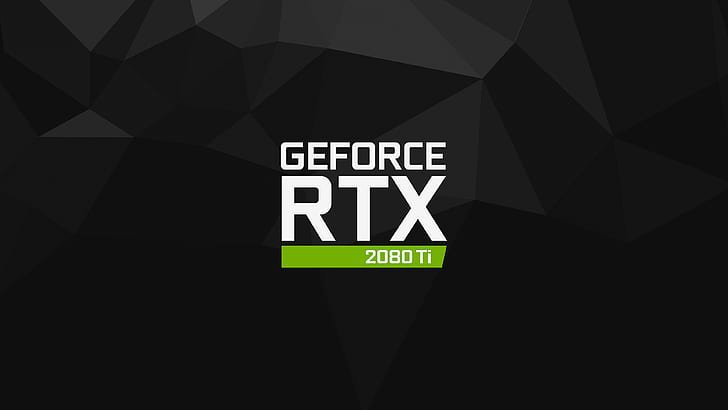
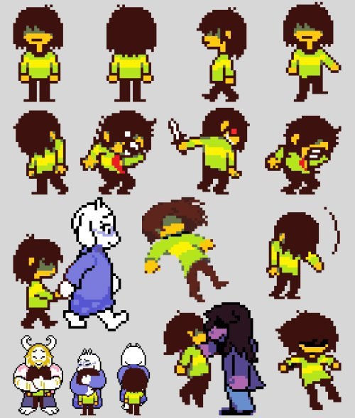
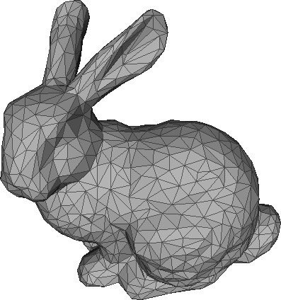
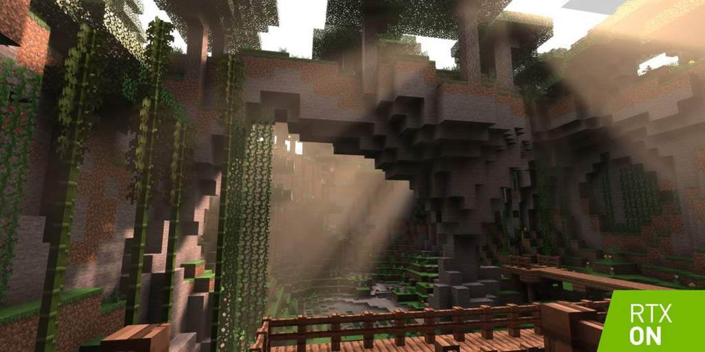
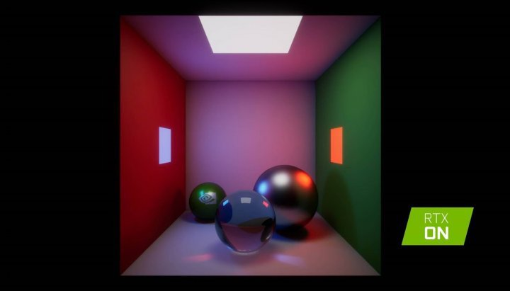
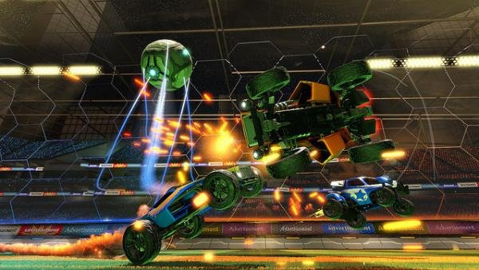
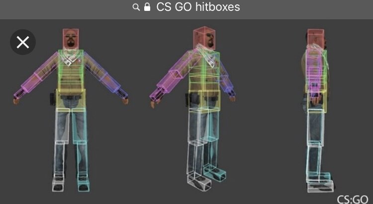
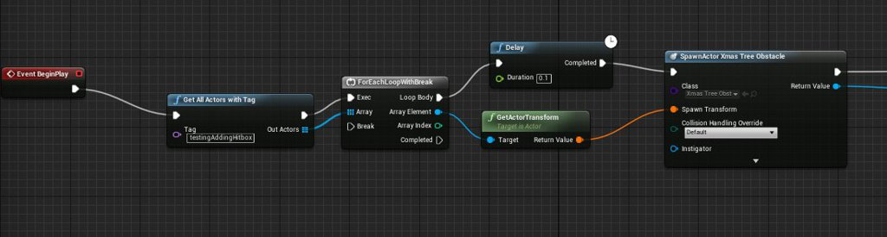
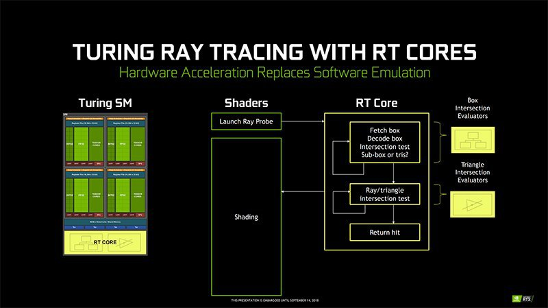

# Ray Tracing ¿Que es?
<b>By: Tori - 15/11/20</b>
 
 

Muchos han oído hablar del Ray Tracing

¿Pero sabes que es realmente o como funciona?

Este blog te ayudara a entender mejor este mundo tan complejo e interesante, antes de nada debo añadir que, iremos por pasos, y quizá añada u índice mas adelante, dicho esto, vamos a comenzar.

¿Como era todo antes?

En la era anterior de las 3 dimensiones, los juegos usaban imágenes planas, que también se las conoce como ``Sprites´´

(Véase la siguiente imágen)

NO SE EMPLEABA NINGUNA TÉCNICA DE ILUMINACIÓN.

Sprites del juego DeltaRune

 

Ahora...

Se usa un sistema de coordenadas ligado a unos modelos, estos formados por polígonos, estos hechos a base de cuadrados y/o triángulos

(Véase la siguiente imagen)

Modelo a base de polígonos

 

Esas coordenadas se guardan en archivos, las coordenadas representan los puntos que componen tu modelo, a más puntos (Polígonos), más peso para el procesador.

Cambiando de tema, para que puedas ver dichos modelos que tanto trabajo le cuestan al procesador y a ti realizar, necesitas algo esencial y obligatorio, LA CÁMARA.

Una escena, una cámara, y tu modelo, ya logrado esto, el ordenador es capaz de convertir esas coordenadas en una representación en 3 dimensiones.

Pero... espera un momento.

El monitor no entiende de entidades, ¿Como podemos conseguir un mapa por ejemplo como el de Minecraft? Un bosque el cual se filtra la luz, ves la entrada de una oscura cueva en la que no sabes que peligros encontrarás dentro, o a lo lejos un iluminado solar, sombras y mapeados.

Es el proceso mas importante, la **Rasterización**.

Ray Tracing aplicado en Minecraft Bedrock

 

Se necesita un iluminado para poder ver los objetos que hay en pantalla, y darle color a cada uno de ellos, no como en la realidad, se utiliza mas de un método.

Podemos comenzar por ejemplo con...

## Iluminación direccional

Entramos en lo difícil, la iluminación direccional.

Nate Gentile: Es un algoritmo que decide el color de los polígonos calculando el ángulo de de los modelos respecto a la fuente de iluminación.

Un grave problema es que si iluminamos un coche frente a una pared blanca, esta debería reflejar los rayos de luz interactuando así con otros objetos, algo que la iluminación direccional no hace.

## RAY TRACING.

Ahora tomando como referencia la iluminación direccional y mas información que hemos mostrado ya.

Empresas como Pixar, usan el método Ray Tracing, ¿Pero por qué no usamos esa técnica?

Por que un solo frame (Fotograma) tarda 29h en renderizarse, y es por ello que Pixar tiene granjas de miles de procesadores para renderizar una película en el menos 1 semana.

### Funcionamiento

Para empezar, como bien antes dijimos, tenemos una escena, un modelo y una cámara.

Tenemos un rayo que impacta contra una superficie visible, vamos a buscar todas las zonas de las que estamos recibiendo luz, como por ejemplo una pared o un coche, ect...

Logrando así 2 tipos de luces:

- Luz Directa: Proveniente del Sol, focos entre otros.

- Luz Indirecta: Proveniente de objetos que reflejan la luz.

logrando corregir así el error que tiene la Iluminación Direccional

Este método es casi perfecto, por que está simulando los trazados de luz y sus reflejos, como lo hace la realidad, pero el problema es que es lento, muy muy lento

Ray Tracing, Escena simple

 

### ¿Por qué es lento?

Vamos a ver, en el Ray tracing es obligatorio la interacción con todos los objetos en los que se reflejen los trazados/rayos de luz, y que se calculen en que influyen unos sobre otros, lamentablemente esto a la tarjeta gráfica se le da muy mal.

En los demás sistemas de iluminación, la Gráfica solo toma en cuenta un polígono, uno tras otro.

En Ray Tracing se deben tomar todos los polígonos que interactúan entre ellos, A LA VEZ.

**Pero…**

¿No hay interacción entre los objetos?

En la imagen se puede apreciar perfectamente como 2 coches y una pelota chocan entre sí, si no, no habría juego.

Colisiones, así interactúan 2 o más objetos, y para ello debemos saber la posición/coordenadas de estos en todo momento.

Para determinar la colisión entre 1 o más objetos, se usa la famosa técnica de los **Hitboxes**.

Hitboxes en un modelo

 

Son cajas que determinan los extremos de un modelo u otro.

¿No se pueden usar los propios polígonos para determinar los extremos

Sí, pero al ser modelos tan complejos, al procesador que deba leer estas coordenadas, le costaría horrores procesar todo esto.

Por ello se usan estas cajas, ya que son mil veces mas sencillas.

El juego procura leer cada frame para determinar si estas cajas están colisionando o no, en una escena pueden haber miles de cajas, por lo que estas se distribuyen en un árbol.

No lo entiendas, es solo una demostración (Árbol de hitboxes)

 

Objetos organizados en grupos según sus coordenadas en el mapa.

Un árbol que distribuye los objetos por zonas en el mapa, a su vez subdivide estas zonas en otras zonas dentro de ellas mismas.

Claro, esto al procesador se le da muy bien, y a las gráficas... digamos que mal.

y para hacer Ray Tracing necesitamos la interacción entre ellos, que no se le da bien a las gráficas.

Para esto se usa de nuevo nuestro árbol de objetos.

Ahora que ya te diste cuenta de todo eso, deberías saber que NVIDIA estuvo trabajando en la **Tree Travelers Unit** (Unidad de recorrido de árboles)

Un núcleo diseñado para recorrer esta estructura de ramas de forma mas eficiente.

Con esto logramos los RT Cores.

Pero eso ya entra en el tema de... Gráficas que soporten esta iluminación de trazado de rayos.

A más RT Cores, mejor rendimiento en cuanto a Ray Tracing.

**A decir verdad, no hay nada mas que explicar, hemos dado todos los puntos, funcionamiento, de donde viene, e incluso información adicional.**

**No creo que este blog sea... Lo mejor del mercado, pero sin duda es tiempo y esfuerzo que creo que ha valido la pena, aunque pueda mejorar.**

