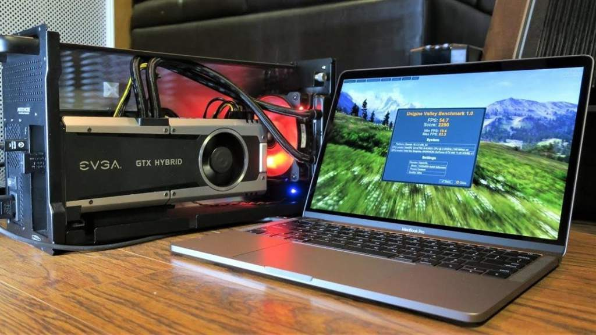
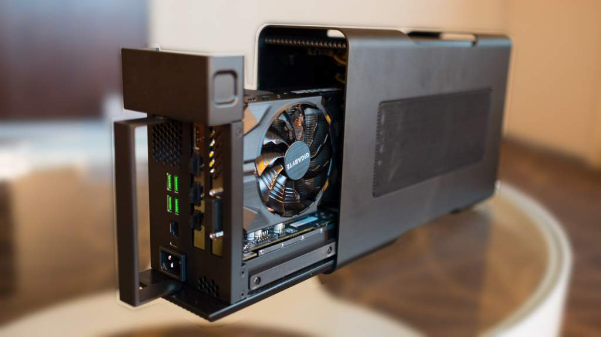
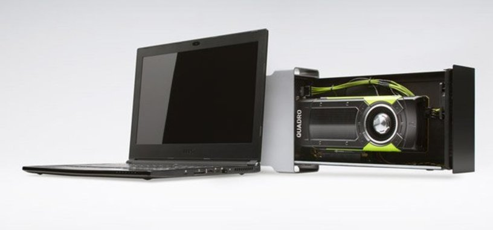
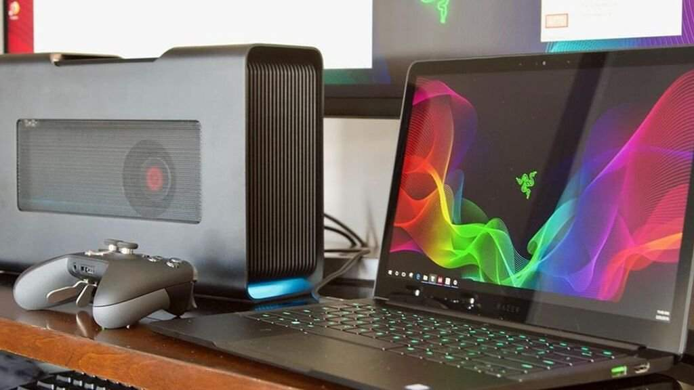

# eGPU ¿Que son realmente?
<b>By: Tori - 13/11/2020</b>
 
 

*Siempre que leemos una GPU externa, solemos pensar que hay miles de posibilidades con ellas, o jugar con gráficos impresionantes con una pero... ¿Que sabes Tu  realmente?*

eGPU significa External Graphic Proccesing Unit, en español... Unidad Externa de Procesamiento Gráfico.

**¿Merecen la pena realmente?**

Aquí veremos el índice, todo lo que entrará en el blog, y así crear nuestra opinión sobre ello.

# Índice

- ¿Que son?
- Ventajas
- Desventajas
- Opinión personal

## ¿Que son?

Una eGPU es el conjunto que nos permitirá conectar una gráfica de manera externa a otro PC, Normalmente se usa un Type-C o Thunderbolt para poder conectar estas al PC, fácilmente, son los únicos puertos que nos proporcionan el ancho de banda suficiente para poder analizar estas eGPUs.

Estas eGPUs están pensadas en proporcionar a un dispositivo de baja potencia, la cualidadde correr juegos o programas de altos requisitos y alto peso, pero ojo ESTAS NO TIENEN NADA DE GRÁFICA DEDICADA.

## Ventajas

Puedes tomar en cuenta las ventajas cuando sabes que tu dispositivo cuenta portátil cuenta con una gráfica integrada que carece de potencia, o en su día no tenias pensado un portatil hecho para gaming o que proporcione los requisitos para algunos juegos de hoy en día como Grand Theft Auto 5, Shadow of the Tomb Raider, PUBG entre otros...

Una solución básica seria comprar un nuevo portátil o un PC de sobremesa.

O bien pensar en una eGPU, estas suelen ser compactas y no pesan mucho, su diseño generalmente es llamativo, puedes elegir si quieres algo que deslumbre, muy pícaro, o minimalista, una verdadera envidia si sales de casa o algún amigo viene a la tuya.

## Desventajas

Si, todo es muy bonito, pero siempre es mejor opcion profundizar las cosas, ya que...

1- La interfaz PCIe x16, la nativa de la gráfica interna, puede transferir hasta 118Ggps, algo muy superior en cuanto a la carente de un puerto USB Type-C o el mismisimo Thunderbolt, que proporcionan hasta 40Gbps por segundos... Un verdadero cuello de botella para el rendimiento ¿No crees?

2- Se pierde rendimiento de entre un 15%-20%, hecho por algunos estudios, si a simple vista te parece poco, hablemos del precio.

3- Algo a destacar es que no son precisamente... baratas, ya que en el mercado puedes encontrar de entre 300 y 800 euros, si, no es para tanto, pero tampoco son baratas tomando en cuenta demás desventajas.

4- La movilidad... Si, tu equipo es portátil, pero por desgracia y obviamente, la gráfica debe ir conectada a un puerto de alimentación, volviendo a tu equipo así, no portable.

## Opinión personal

Quitando el que tenga portátil o no, si lo necesite o no... Lo veo un poco absurdo, ya que puedes comprar un equipo de sobremesa con dicho dinero, los perjuicios también entran en que necesitas un Type-C en el portátil o Thunderbolt, lo bueno es que... No logro evitar que me llame la atención, lo logra bastante bien, y veo que puede mejorar para el futuro, por lo que mientras le pongo un... 6/10

Muchas gracias por leer el blog al completo si llegaste hasta aqui, es el primero que hago con fines de enseñanza, por lo que agradecería que muestres en lo que pueda mejorar.

