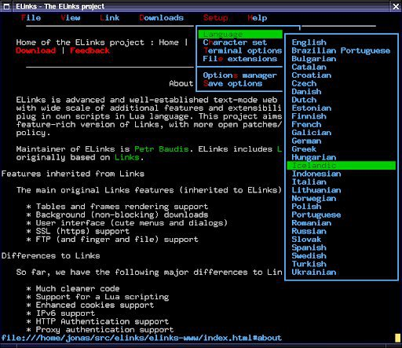

# Elinks - Google desde la terminal
<b>By: Darth Venom - 10/12/2021</b>
 
 
Para este blog se me ocurrió hablar sobre Elinks, que es un navegador web que corre en la terminal.

*¿Por qué usaría alguien un navegador web en la terminal si puede usar Chrome, Firefox, Opera o alguna de las tantas opciones?*

Bueno, algunos dirán que es cosa de gustos, y otros que depende de lo que cada uno necesite.

Ahora voy a ampliar la respuesta. Gustos son gustos, pero hay casos en los que se posee un dispositivo con un hardware muy viejo o muy limitado y no puede correr navegadores pesados y demandantes como los de ahora, incluso hay gente que prefiere no usar ningún componente gráfico y limitarse a usar la terminal, lo cual ahorra mucha RAM. Para todos los casos anteriores elinks es una buena opción.

Analizando pros y contras nos encontramos con que elinks tiene varias características muy buenas y parecidas al resto de navegadores, por ejemplo, búsqueda de textos en páginas, historial de navegación, marcadores, inspección de elementos en HTML, administración de descargas y soporte para múltiples pestañas. A parte de eso tiene atajos de teclado muy cómodos que hacen que se pueda navegar rápidamente e incluso sin necesidad de usar el mouse (el programa sí soporta interacción con el mouse).

Pasando a revisar las contras de elinks, en la actualidad pesan más que los pros. Elinks carece de tres cosas muy importantes para un navegador en la actualidad: Soporte para JavaScript y poder visualizar imagenes y videos.

Aún viendo las contras, muchos usuarios que no acostumbran a usar componentes gráficos usan elinks por su velocidad, eficiencia y por pesar y consumir muy poco.

## ATAJOS DEL TECLADO

`h`       Historial 
`?`       Buscar 
`\`       Ver HTML (Inspeccionar) 
`.`       Numerar links 
`t`       Abrir pestaña 
`<`       Mover a pestaña anterior 
`>`       Mover a pestaña siguiente 
`c`       Cerrar pestaña 
`d`       Descargar link 
`A`       Añadir marcador 
`s`       Marcadores 
`g`       Ir a URL 
`ESC`     Mostrar barra superior 
`CTRL+R`  Recargar página 

## CONTROLES BÁSICOS

Para mover la página hacia abajo se usan las teclas `CTRL+N`, para subirla se usa `CTRL+P`.

Se puede mover la página usando la ruedita del mouse también.

Para moverse entre links se usan las flechan de arriba y abajo.

Para acceder a un link se puede usar la tecla enter, el mouse o la flecha derecha.

Para volver hacia atrás se puede usar la flecha izquierda.

Como primeros pasos, al abrir elinks puedes tipear la dirección google.com y ya estarás en google y podrás buscar desde la barra.
 

*El post ha llegado a su fin. Si tienes dudas puedes contactarme en Discord. Soy venom_instantdeath.*
