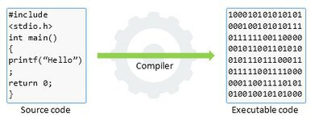
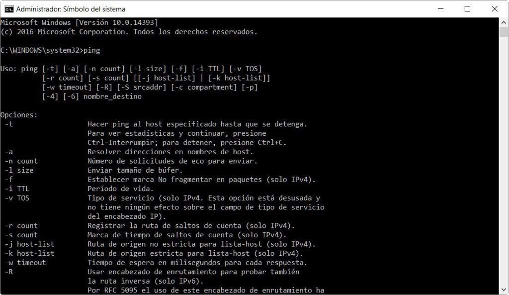
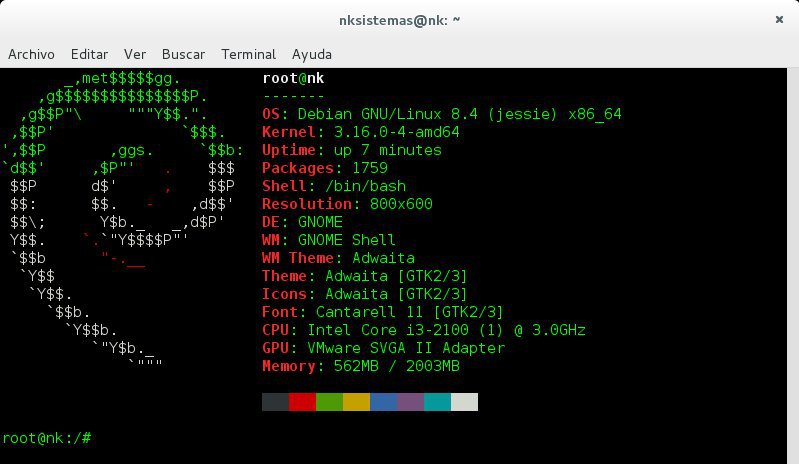
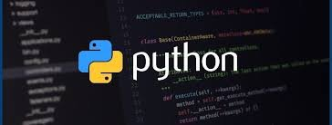
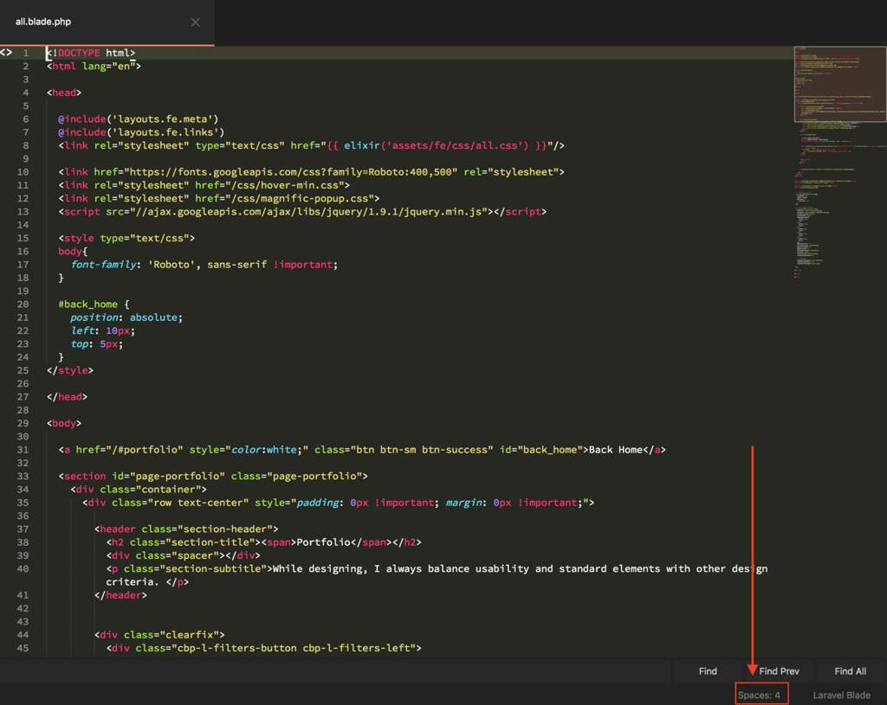

# Por dónde y cómo empezar
<b>By: Darth Venom - 15/08/2020</b>
 
 
*¿Estás buscando empezar y no sabes por dónde? ¿Buscas aprender programación? ¿Hacking? ¿Seguridad en sistemas?*

<b>Bien</b>

Para todo eso hallarás respuesta en este blog.

Este blog está enfocado en los principiantes y en aquellos usuarios que no han empezado y tienen 0 conocimientos previos, es decir, no saben nada de nada sobre estos temas.

Bien, sin más preámbulos comencemos a explorar.

Antes que nada vamos a aclarar algunos conceptos Importantes, iremos desde lo más básico, es importante leer bien las definiciones.

### Programa:

Un programa es un archivo ejecutable que posee un código fuente que contiene instrucciones que serán llevadas a cabo por la computadora, el código fuente es entendible para los humanos pero no para la computadora, por eso este código se traduce a lenguaje máquina mediante un programa llamado compilador. El lenguaje máquina es binario, es decir que consta de 1 y 0, a diferencia de una aplicación, no necesariamente tiene que servir al usuario.

Entonces, el código fuente puede ser entendido por humanos y contiene instrucciones que queremos que el sistema realice, pero pasa y resulta que el sistema no entiende el código fuente, por ende debe haber un programa que lo traduzca a un lenguaje que la máquina entienda, este lenguaje es el lenguaje máquina, y el programa que traduce de código fuente a máquina se llama compilador.

Al proceso de traducción de código fuente a máquina se lo llama COMPILACIÓN.

Ejemplo de código fuente:

int main() {
    std::string x;
    std::cout << "enter your name: ";
    std::getline(std::cin, x);
    std::cout << "\n\nYour name is: " << x << std::endl;
    return 0;
}

Este código trae instrucciones para que el programa te pida tu nombre y luego lo imprima en la pantalla. NO HACE FALTA QUE LO ENTIENDAS, simplemente es una demostración.

### Aplicación:

Programa o conjunto de programas cuyo fin es SERVIR AL USUARIO.

### Programador:

Un programador es aquella persona que escribe código fuente para crear programas, aplicaciones, páginas web, servicios, etc.

Hasta ahí vimos unos cuantos conceptos más que son necesarios e importantes, si te interesa la programación, entonces serás un programador o una programadora. Toca hablar sobre el concepto de Hacker, un concepto que ha sido bastante distorsionado o abstraído de lo que es en realidad.

Se suele creer que un Hacker es toda persona que se sienta en una computadora a atacar sistemas, robar cuentas bancarias, datos ajenos y exponer a autoridades, todo eso mientras en un monitor caen montones de letras de color verde con un fondo oscuro. Este concepto de hacker es ficticio por un lado y erróneo por el otro, la verdadera definicón apunta a otro lado.

Un Hacker es una persona que se especializa en el manejo de varias áreas de la computación, entre estas las que más destacan son las áreas de programación y seguridad en sistemas. Destaco nuevamente que un Hacker es necesariamente un experto.

Un Hacker tiene conocimientos sobre la programación, es decir, un Hacker es por defecto un programador o sabe algo sobre el asunto, sin embargo, un programador no necesariamente es un Hacker.

*Es menester hacer hincapié en que hacker es un titulo, una etiqueta, y no depende de lo que hace la persona, ni de como use su conocimiento, ni de si es bueno o malo; sólo depende de su conocimiento.*

Lo que comúnmente se llama Hacker o **Sombrero negro** es lo que en realidad es un **Cracker**. Una persona que se dedica a vulnerar sistemas para aprovecharse de ellos. Y aquellos a los que se llaman **Sombrero blanco** son lo que en realidad es un Pentester.

*Ni un pentester ni un cracker tiene que ser necesariamente un Hacker ni viceversa (pueden no ser expertos)*.

Cuando hablamos sobre estudiar seguridad en sistemas nos referimos a un estudio teórico sobre esta materia, en cambio cuando nos referimos al **pentesting** hablamos de la búsqueda de vulnerabilidades en un sistema y la explotación (aprovechamiento) de las mismas.

*Mucha gente usa el término Hacking. Esto es un término poco específico que engloba al pentesting, sniffing, cracking, reversing y varias prácticas más.*

Se suele clasificar a los Hackers por **Sombrero blanco, Sombrero gris y Sombrero negro**. Lo anterior es sólo una clasificación bastante superficial y que comparando con la explicación anterior se puede decir que es una clasificación erronea o que asume que todos los "sombreros" son crackers o pentesters.

Como esta es una clasificación muy popular, al menos vale la pena exponerla y de paso contar de qué se trata.

*Lo que viene a continuación es sólo una explicación teórica, debe ser leída con pensamiento crítico y basándose en la explicación anterior.*

Los **Hackers de Sombrero blanco** (White Hat) son aquellos que se especializan en pentesting o pruebas de penetración, buscan vulnerabilidades en los sistemas para reportarlas o parchearlas (mejorarlas). Son **Hackers éticos**.

Los Hackers de **Sombrero negro** (Black Hat), de forma contraria a los de sombrero blanco, explotan las vulnerabilidades de los sistemas para su propio beneficio, a menudo se los llama **Crackers**, sus actos son ilegales, son penados por la ley.

Los Hackers de **Sombrero gris** (Gray Hat) son una combinación de black hat y white hat, es decir, para conseguir objetivos que pueden ser considerados de sombrero blanco realiza maniobras que haría un Hacker de sombrero negro. Es decir, *actúa ilegalmente con buenas intenciones*.

Sabiendo estos conceptos, ya se puede empezar.

Así quieras aprender a programar o quieras aprender hacking (pentesting) y seguridad en sistemas, **la habilidad de manejarse en una terminal es una habilidad escencial**.

Una terminal es exactamente lo que describimos anteriormente como "montones de letras de color verde con un fondo oscuro", exactamente igual a las que usan los hackers de las películas ridículamente.

El caso es que nuevamente, saber usar una terminal es una habilidad esencial, así que sin más rodeos veamos qué es una terminal.

## TERMINAL

*Una terminal es una interfaz entre el usuario y el sistema operativo, es decir, permite que el usuario interactúe directamente con el sistema*. La terminal fue la primera forma de interacción en tiempo real entre un humano y una máquina.

**Lo que comúnmente llamamos terminal es un conjunto de 3 elementos: Emulador de terminal, driver de terminal e intérprete de comandos (shell).**

<u>Un emulador de terminal es un programa que emula el funcionamiento de las viejas terminales físicas, también llamadas teletipos</u>. Para poner al lector en contexto, esto es un teletipo:

<u>El driver de terminal se manifiesta como un archivo especial que sirve como puente para intercambiar datos entre la terminal y el sistema</u>. Cada vez que se presiona una tecla en el teclado, se escribe este archivo con la tecla correspondiente, y al hacerlo, el emulador lee el archivo y recibe el dato (la tecla). Del mismo modo este archivo puede escribirse para que las teclas se impriman en la pantalla.

<u>Una shell o intérprete de comandos es un programa que se encarga de interpretar los comandos que el usuario escriba a través del teclado.</u>

Cuando se abre un emulador de terminal, una de sus tareas principales es conectarse con el driver de terminal (para poder detectar las teclas presionadas y para poder mostrar texto en pantalla) e iniciar la shell por defecto.

**A estas 3 cosas juntas las llamamos comúnmente terminal.**

Perfecto, ¿Cómo se abre una sesión de terminal?

Según el sistema que estemos usando la respuesta a esa pregunta será diferente y *por defecto los comandos disponibles serán otros* (porque los intérpretes de comandos serán otros).

Si usas un sistema Windows puedes acceder a la terminal, aquí el intérprete de comandos se llama cmd. Para acceder al cmd debes presionar la combinación de teclas `HOME+R`, la tecla `HOME` en el teclado tiene el ícono de Windows. Tras haber presionado las teclas aparecerá una ventana de ejecución con un cuadro de texto, debes escribir "cmd" (sin las comillas) y presionar la tecla `ENTER`.
Si realizaste correctamente lo anterior podrás ver la terminal, el mágico instrumento que usan los Hackers en las películas.

Bueno, si en cambio usas un sistema GNU/Linux, es muy probable que ya hayas visto o usado la terminal, generalmente se puede encontrar entre los menúes de programas o presionando la combinación de teclas `CTRL+ALT+T`. Aquí el intérprete por defecto es **bash**.

Si no tienes a mano una PC pero tienes un móvil con Android, debes saber que Android usa Linux, si no entiendes eso ahora no hay problema, será explicado próximamente. Ve a la play store e instala la aplicación Termux. Para acceder a la terminal sólo deberás entrar a Termux. Al igual que en la mayoría de sistemas GNU/Linux, en Termux el intérprete de comandos es **bash**.

¿Cómo puedo aprender a usar Bash?

Excelente pregunta, si usas GNU/Linux o usas Android e instalaste Termux, podrás usar Bash. Si deseas aprender a usar esta shell puedes echarle un vistazo al [índice sobre aprender a usar la terminal](index.md).

Si en cambio usas Windows, por el momento no hay guías sobre el Cmd, pero sí se puede usar Bash en Windows a través del WSL (Subsistema de Windows para Linux). El WSL permite tener un sistema GNU/Linux completo corriendo simultáneamente dentro de Windows, con esto podrás usar Bash.

En caso de querer activar el WSL puedes [echar un vistazo a este post](wsl1.md)

Dependiendo del interés que tenga el lector deberá avanzar de un modo distinto.

## Programación

Si deseas adentrarte en el mundo de la programación, debes pensar antes que nada en qué área te gustaría adentrarte más, desarrollo de software o desarrollo web. Trabajar con software implica crear programas, aplicaciones o juegos que puedan ejecutarse en el sistema, esto implica desarrollar programas para PC en sistemas como Windows, GNU/Linux o Mac, o desarrollar aplicaciones para móviles con sistemas como Android o IOS.

Por el contrario, el desarrollo web, como su nombre lo sugiere, implica enfocarse en el área de la creación de páginas, aplicaciones y servicios que se ejecuten a través de un navegador como podría ser Google Chrome, Firefox u Opera.

Si recuerdas que al principio del post hablamos sobre la definición de un programa, entonces recordarás que dijimos que los programas se escriben en código fuente, un lenguaje entendible por los humanos que luego es compilado (traducido a lenguaje máquina) para que la máquina lo comprenda. El caso aquí es que no hay un sólo lenguaje llamado código fuente, sino que ese el nombre que le damos a todos los lenguajes que no son lenguaje máquina, es decir, hay montones de lenguajes de programación para escribir código fuente, según lo que se requiera se usa uno u otro.

En desarrollo de software siempre recomiendo comenzar con el lenguaje Python, es un lenguaje interpretado muy fácil de leer, aprender y entender, una buena forma de empezar. Habrán guías de este lenguaje en la comunidad, también está creado el chat sobre Python, donde los usuarios pueden unirse, preguntar y compartir.

Si deseas aprender a programar en Python necesitarás lo siguiente:

- Descargar el intérprete de Python, puedes encontrarlo aquí: <https://www.python.org/downloads/>

- Descargar un IDE* para Python. Esto es opcional, puedes escribir en el bloc de notas incluso, pero es más cómodo usar un IDE o un editor de texto diseñado para programar. Puedes descargar el IDE Pycharm para Python aquí: <https://www.jetbrains.com/es-es/pycharm/download/#section=linux>

Desarrollo de software será cubierto en próximas guías empezando por [programación en Python](python1.md).

**IDE**: Entorno de desarrollo integrado. Software que facilita la escritura de código por parte del desarrollador.

En este sitio tenemos una excelente guía muy completa para aprender a programar en Python desde 0 hasta un nivel avanzado. Esta guía es suficiente material para aprender y no se requiere de libros para complementarla.

Por el lado del desarrollo web se empieza aprendiendo el lenguaje HTML, que sirve para estructurar una página, y el lenguaje CSS, que sirve para configurar el estilo de una página, los colores, la posición de los elementos y mas. Hay que aclarar que ni HTML ni CSS son lenguajes de programación, sino que el primero es un lenguaje de marcado de hipertexto, y el segundo es el lenguaje de hojas de estilo en cascada. Ambos lenguajes son muy fáciles de entender y manejar, tras haberlos aprendido toca aprender el lenguaje JavaScript (Muchas veces abreviado como JS), este lenguaje puede cambiar cualquier aspecto de la página, o sea, del código HTML y del CSS, sirve tanto para darle buena apariencia a una página como para permitir que el usuario interactúe con la misma.

Si deseas aprender HTML, CSS o JavaScript no necesitarás nada más que un navegador (Google Chrome o Firefox son ejemplos). Puedes programar directamente en el bloc de notas, pero aunque es opcional siempre es recomendable descargar un editor de texto más enfocado a la programación o un IDE, esto permitirá que programar sea una tarea mucho más cómoda.

Puedes descargar Sublime text desde aquí: <https://www.sublimetext.com/3>

Si estás buscando crear una página web, afortunadamente en este sitio [hay un excelente artículo que explica esto con detalle y de forma sencilla](webprogramming.md).

## Seguridad y/o Hacking

Si lo que deseas es entrar en el mundo de la seguridad en las redes y los distintos tipos de sistemas, lo que querrás hacer es comenzar aprendiendo cómo funcionan las redes, entender esto será de gran ayuda a la hora de entender cómo se realizan los ataques, por qué la gente cae en estos ataques y de qué manera estos pueden evitarse. Aprender los métodos con los que se explotan vulnerabilidades de los distintos sistemas existentes es algo fundamental aquí, pero antes de eso hay que entender los principios básicos de la red, cosas que hoy en día son tan automáticas que las damos por obvias. Sí, aprender esto también hará que puedas replicar los ataques de los cibercriminales, pero eso no es responsabilidad de nadie más que de la persona que aprende estas técnicas, es lo mismo que aprender a forzar la puerta de un auto, puedes aprenderlo para entender cómo lo hace tanta gente y evitar que te lo hagan a tí, o aprenderlo y hacer un mal uso de ese conocimiento.

Bien, tocará comenzar por varios lados, aprender sobre GNU/Linux y sus sistemas dedicados al Hacking y la seguridad, entre ellos los más conocidos son Kali Linux, Parrot, Backbox y BlackArch. Las distribuciones dedicadas al pentesting (Hacking. Pruebas de penetración de sistemas) están configuradas de manera óptima para realizar este tipo de pruebas, para mantener la seguridad y para priorizar el anonimato en la red. A parte de la configuración, estos sistemas vienen equipados con montones de herramientas para realizar pruebas de seguridad, crear malwares, analizar tráfico de red, realizar ataques y más.

Aprender teoría es fundamental, tendrás dos aliados, Google y los libros que consigas en una librería o en el mismo Google, es fundamental comprender los siguientes conceptos, toma nota. Debes estudiar las redes, los protocolos de red, puertos, TCP, UDP, IP, envío y recepción de paquetes en internet, Firewall, Cookies, ingeniería social, concepto de Malware, tipos de Malware, Backdoors y Payloads. Eso es muy necesario, luego se puede ahondar según el material encontrado, si encontraste un libro probablemente profundizar en otro temas sea sólo cuestión de seguir leyendo, en cambio si lo que estudias es en gran parte encontrado de Google profundizar hacia otros temas dependerá de las fuentes que encuentres. Alternativamente una excelente fuente serán los blogs de esta comunidad, donde pronto estarán disponibles las definciones y desarrollo de cada término anteriormente mencionado.

Sobre instalar alguno de los sistemas mencionados anteriormente y usar sus herramientas habrán blogs proximamente que cubran estos temas.
 

*El post ha llegado a su fin. Si tienes dudas puedes contactarme en Discord, soy venom_instantdeath.*
