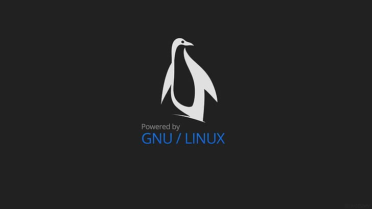

# Cuál Distro de GNU/Linux elegir y por qué
<b>By: Darth Venom - 03/10/2020</b>
 
 

<b>Bienvenidos</b>

Si eres un principiante en el mundo de GNU/Linux o deseas comenzar y no sabes por donde, puedes leer este blog para saber qué distribución GNU/Linux es más acorde para tí.

*Si no sabes qué significa GNU/Linux, qué significa Linux o crees que Linux y GNU/Linux son la misma cosa te recomiendo que leas estos blogs.*

- [Básico - Linux, ¿Qué es? ¿Por qué es tan importante saberlo?](linux1.md)

- [Diferencia entre Linux y GNU/Linux](linux2.md)

En este blog describiré las 7 distribuciones GNU/Linux más grandes y las características principales. Antes de pasar a lo importante, haré algunas notas.

**El término Distro significa Distribución.**

*Las distros GNU/Linux ofrecen mucha libertad, por ende la apariencia no es exactamente lo más importante, a diferencia de Windows, las distros de GNU/Linux son 100% personalizables, todo puede ser modificado a voluntad por el usuario. Si en Windows el usuario se aburre de su escritorio procede a cambiar de fondo de pantalla, en cambio, si en una distro de GNU/Linux un usuario se aburre de su escritorio puede proceder a cambiar todo el entorno de escritorio. Hay montones de entornos muy distintos, eso será abarcado en otro blog.*

Para dar prioridad a los usuarios con menos experiencia comenzaré hablando de las distros más sencillas de usar y terminaré en las más complicadas, aquellas que no se le recomiendan a un principiante.

## Ubuntu

Ubuntu es la distro más famosa y usada en computadoras de escritorio, también es muy usada en servidores. Esta distro es de las más amigables para los principiantes, es decir, si no tienes ningún tipo de experiencia y recién vienes de Windows, entonces Ubuntu es una excelente opción.

Esta distribución está basada en Debian y es súper estable, esto significa que casi nunca habrá problemas a la hora de instalar o actualizar paquetes, es muy inusual que algo se rompa en Ubuntu.

La instalación es muy sencilla, basta con dar click al botón siguiente unas cuantas veces y el sistema queda instalado perfectamente.

## OpenSUSE

Al igual que Ubuntu, OpenSUSE es una distro fácil de instalar, con unos clicks ya está listo. Es bastante amigable con los principiantes.

Es una distro muy estable, casi nunca se experimenta ningún problema al instalar paquetes.

OpenSUSE ofrece 2 versiones, la versión estática, que es recomendable para los usuarios más nuevos y la versión Rollling Release. No recomiendo ninguna distro Rolling Release para un principiante.

## Debian

Hablando de Debian, no es la distro más amigable para los usuarios que a penas comienzan, pero tampoco es díficil de usar.

En una conferencia, Linus Torvalds dijo que quiso usar Debian pero se rindió porque la instalación era muy complicada. Bueno, eso cambió, ahora Debian trae un instalador mucho más sencillo, el proceso de instalación es más parecido al de las distros anteriormente mencionadas.

Debian ofrece 3 versiones, estable, testing branch e inestable. La versión estable de Debian es roca sólida, te garantiza que jamás se romperá nada, no habrán problemas a la hora de instalar cosas desde los repositorios internos.

Es una de las distros más famosas, pero es más famosa como distro para servidores que como distro de escritorio.

*Para un usuario que recién viene de Windows, no es tan recomendable como Ubuntu u OpenSUSE.* 

A continuación tocaré uno de los puntos en contra a la hora de instalar Debian, más que nada si el usuario no tiene mucha experiencia.

*No es tan sencillo instalar software propietario, Debian admite estrictamente la instalación de software de código libre, por ende, instalar drivers de terceros puede resultar un tanto complicado, pero nada imposible.*

## Fedora

Fedora es una distribución bastante popular como sistema de escritorio, aun así no es tan recomendable para los usuarios que aún no tienen mucho contacto con GNU/Linux. Entre la comunidad de usuarios de GNU/Linux ha menudo se pueden encontrar comentarios acerca de que Fedora es inestable, sin embargo, esto no es así.

*Fedora ha demostrado poder ser una distribución estable, todas las entregas de Fedora son sometidas a pruebas con anterioridad al lanzamiento, estas pruebas garantizan la estabilidad del software y pueden ser discutidas por la comunidad.*

Para más información: <https://fedoraproject.org/wiki/Fedora_myths?rd=FedoraMyths#MYTH_-_Fedora_is_unstable_and_unreliable.2C_just_a_testbed_for_bleeding-edge_software>

Una de las razones por las cuales no recomendaría tanto Fedora a quienes recién vienen de Windows o no tienen tanta experiencia es que, al igual que Debian, instalar software propietario puede ser complicado.

*De aquí para abajo están las distros que definitivamente no recomendaría a un principiante.*

## Arch

Arch es una distribución muy simple y liviana. Acá voy a hacer hincapié en que simple no es igual a sencillo/fácil, Arch es una de las distribuciones KISS por excelencia (El concepto KISS será explicado en otro blog).

*La instalación no es fácil, no trae entorno gráfico y puede obligar al usuario a leer un poco de documentación. La distribución trae una guía de instalación en el directorio principal (/root). Todo el proceso de instalación es manual y se hace a través de la terminal.*

Esta distribución es Rolling Release, es decir, no hay Arch 10 ni Arch 25, en todo momento el usuario está usando la última versión. Generalmente se dice que Arch no es una distribución estable, pero no es tan así; seamos justos, al ser una distro Rolling Release no es estable como la versión estable de Debian, sin embargo, tampoco se puede decir que es muy inestable.

Ampliando un poco sobre la estabilidad de este sistema, el autor de este blog usa Arch desde hace un año y algunos meses; ha instalado esta distro en múltiples ordenadores y jamás se encontró con un error lo suficientemente grave como para inutilizar el sistema. Algunos paquetes a veces pueden llegar a romperse, pero generalmente no es problema de la distro sino del usuario, y en estos casos el usuario puede arreglarlos, es más, en la gran mayoría de los casos el usuario puede arreglar cualquier cosa.

## Gentoo

Al igual que Arch, está hecha para usuarios expertos en la materia. Gentoo es una distribución simple y liviana en la que los programas deben compilarse localmente desde el código fuente.

La instalación de Gentoo puede llegar a tomar más tiempo que la instalación de Arch, más que nada por los tiempos de compilación y lo que pueda tardarse el usuario.

## Slackware

Slackware es la distribución más vieja actualmente activa. Muy acorde al concepto KISS, es una distribución simple, liviana y está orientada a usuarios expertos. La principal complejidad que esta distribución presenta, a diferencia de las otras, es en cuanto a la gestión de paquetes. Slackware no posee resolución de dependencias a la hora de instalar software, esto puede resultar un poco molesto para los usuarios que vienen de otras distros, pero es gracias a esto que muchos errores y roturas se evitan.

Principalmente de estas 7 surgen muchas otras distros derivadas que por ser tantas y ser tan distintas no fueron cubiertas en este blog. Lo importante es que el usuario sepa dónde buscar, y las 7 distros anteriormente mencionadas presentan información precisa para poder decidir.
 

*El post ha llegado a su fin. Si tienes dudas puedes contactarme en Discord. Soy venom_instantdeath.*
