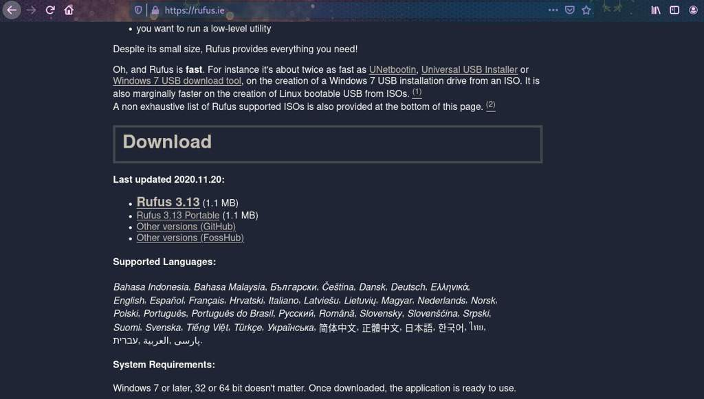
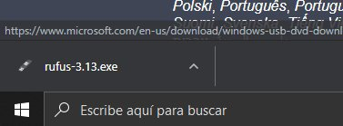
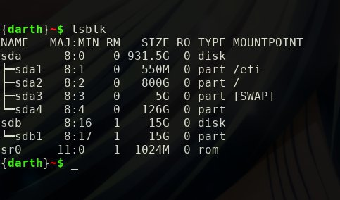
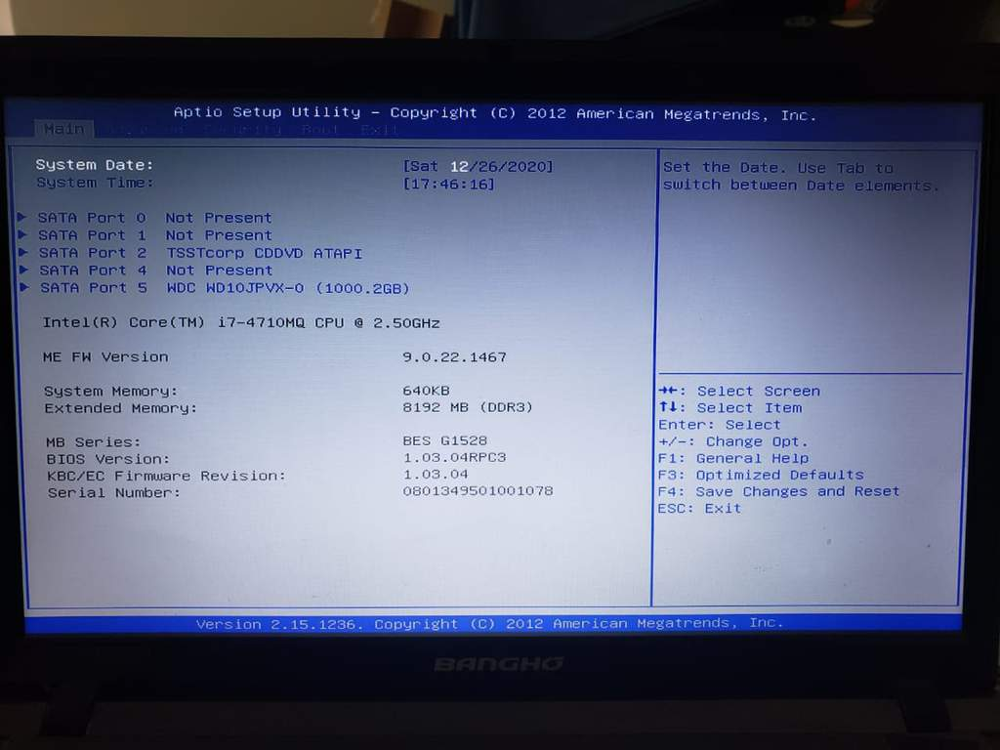
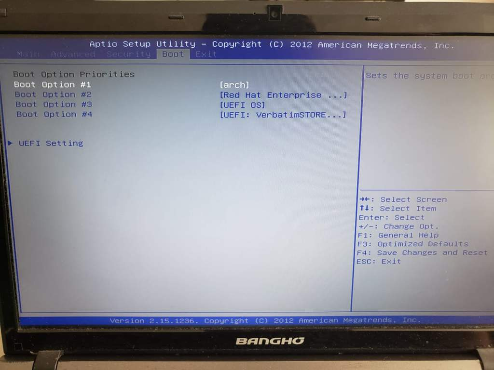
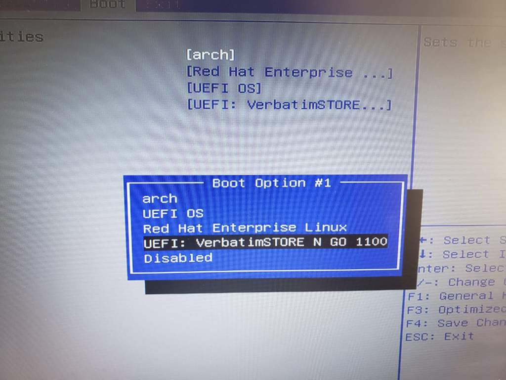
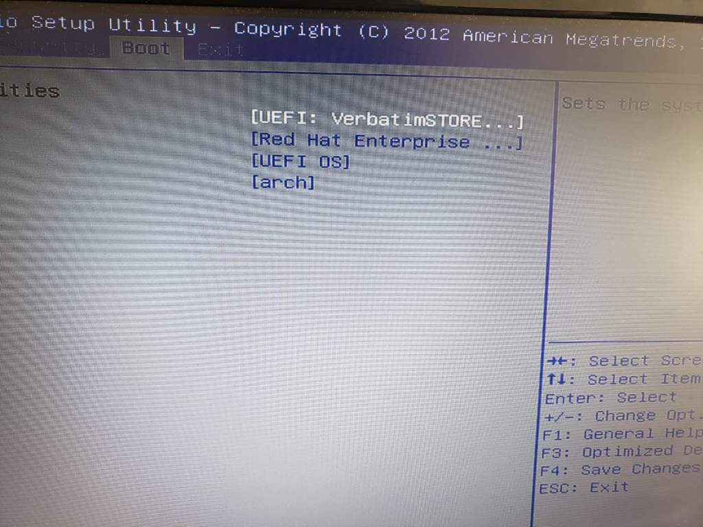
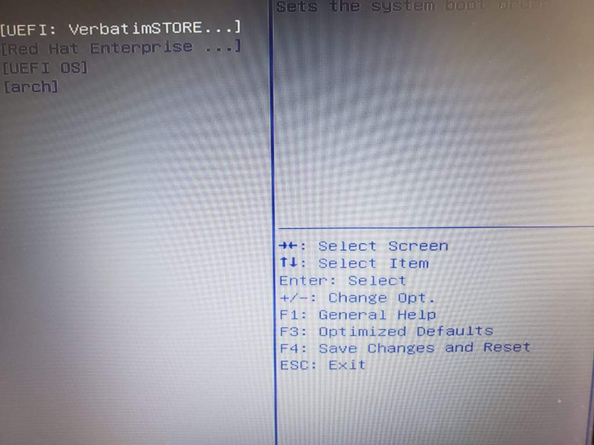

# GNU/Linux - Introducción
<b>By: Darth Venom - 26/12/2020</b>
<br>
<br>
Si hay algo en lo que Hacking-Utils parece especializarse más es en Unix y GNU/Linux. Este blog está inaugurando una nueva serie de blogs sobre GNU/Linux así que no será la excepción a la mayoría de los demás blogs.

*En esta serie de blogs se cubrirán más que nada instalaciones de distribuciones GNU/Linux y curiosidades sobre estos sistemas. La primera guía de instalación será una guía sobre cómo instalar Ubuntu.*

Considero que es una de las distribuciones más sencillas de usar para cualquier persona, más que nada para aquellas personas que provienen de sistemas Windows y que desearon probar GNU/Linux o directamente borrar Windows y usar un sistema de estos. La razón por la que lo digo es porque viene con un entorno de escritorio bastante amigable, un gestor de paquetes gráfico que es similar a cualquier tienda, por ejemplo, la Play Store o la tienda de Windows; también porque es un sistema súper estable y porque ofrece soporte para casi cualquier hardware, es muy raro tener problemas con drivers en Ubuntu. Esta distribución es de las más recomendables para un principiante.

*A pesar de lo dicho anteriormente, no todo es color de rosa respecto a Ubuntu, es amigable pero consume muchos recursos, y esto puede llegar a ser molesto para algunos usuarios o directamente puede hacer que sea imposible de correr en algunos hardwares. De todos modos si eso llegara a ser un problema, se pueden instalar alguna de las variaciones derivadas de Ubuntu, por ejemplo, Lubuntu, que es la versión light de Ubuntu, o si el usuario prefiere que Ubuntu traiga un entorno de escritorio más elegante puede instalar Kubuntu; son solo versiones de Ubuntu. Para más información se puede revisar [la Wiki de Ubuntu](https://wiki.ubuntu.com).*

Dejando de lado a Ubuntu, vamos a pasar a explicar el primer paso antes de instalar un sistema operativo. El primer paso vendría a ser tener un medio por el cual instalar el sistema, para esto se necesitan algunos requisitos.

- Un pendrive con al menos 4GB de capacidad.
- Un mínimo de 15GB de espacio libre en el disco duro.

El medio de instalación será el pendrive. Hay una aclaración importante que el lector debe tener en cuenta, para que el pendrive funcione como medio de instalación se debe descargar la imagen de instalación del sistema operativo y se debe escribir en el pendrive. Escribir la imagen de instalación no es copiar el archivo y ya, conlleva sobreescribir toda la información de la partición del dispositivo.

Para escribir la imagen de instalación usaremos distintos programas según el sistema operativo que tenga el lector. En este blog se mostrarán dos formas, la forma que deben seguir aquellos que usan Windows y la que deben seguir los que usan un sistema GNU/Linux.

## Escribir ISO en Windows

Suponiendo que el lector usa Windows, para empezar a crear el pendrive como medio de instalación se debe comenzar por instalar el programa Rufus. Para esto se visita el siguiente link: <https://rufus.ie/>

Una vez dentro, se baja hasta donde dice Download, busca donde está resaltado "Rufus 3.13 (1.1MB)" y lo clickea. Es probable que con el paso del tiempo la versión deje de ser 3.13 y el peso no sea exactamente 1.1MB, pero no cambia nada, el lector debe clickear en ese mismo lugar. Para guiarse mejor puede ver la foto de abajo.



Una vez clickeado empezará la descarga de Rufus. Tras terminar la descarga, procederemos a clickear en el ejecutable para comenzar con el procedimiento.



En el caso de que aparezca un cuadro preguntando por si se desea permitir que el programa Rufus haga cambios en el equipo se debe aceptar. Tras hacer esto, debería salir la siguiente ventana:


En el apartado de dispositivo se debe seleccionar la unidad (el pendrive) que se desea utilizar. En el apartado de Elección de arranque sólo se debe presionar el botón "Seleccionar" y buscar el archivo ISO del sistema que quieran instalar, para cada sistema del que se haga una guía se proporcionará el link de descarga del archivo ISO correspondiente para llevar a cabo la instalación.

Tras haber seleccionado la unidad y el archivo ISO, sólo queda presionar en el botón EMPEZAR para que comience el proceso de escritura. Hay un *detalle importante*, cuando el proceso termine y la barra de progreso se complete, la barra seguirá diciendo "preparado" y seguirá estando el botón EMPEZAR; esto podría confundir a algunos usuarios. Una vez que la barra de progreso se complete, siempre significa que el proceso ya terminó y que ya se puede cerrar Rufus porque el pendrive fue correctamente escrito.

Una vez que el pendrive fue escrito, ya está listo para usarse como medio de instalación. A continuación hay que arrancar la máquina desde el dispositivo USB en vez del disco duro. Puede avanzar a la sección de configuración del booteo de este blog.

## Escribir ISO en GNU/Linux

Para escribir una imagen de instalación en un pendrive en GNU/Linux se usa el comando `dd`.<br>

*Para empezar, si leyó el [blog del sistema de archivos Unix|http://aminoapps.com/p/acjg6k], todo se trata como un archivo en GNU/Linux, incluso un pendrive y sus particiones. Lo más recomendable antes de empezar es chequear cuál es el nombre del archivo referente al pendrive que se usará, para esto se usa el comando `lsblk`.*



En la imagen se pueden apreciar unos cuantos elementos, primero que nada se puede ver que dice "*sda*". *sda* es el nombre que recibe el disco duro de la máquina, por debajo se puede ver que dice *sda1*, *sda2*, *sda3* y *sda4*; esas son las particiones de mi disco duro. Una partición es simplemente una división del espacio del disco duro.

Más abajo se encuentra *sdb*, que es el nombre que recibe mi pendrive, y debajo está *sdb1*, que es el nombre de la única partición de mi pendrive, esa será la que utilizaré para escribir la imagen de instalación.

**NOTA:** *El próximo comando sobreescribirá todos los datos de la partición del pendrive.*<br>

Usaremos el comando `dd` en la partición seleccionada para crear el pendrive booteable con el que posteriormente instalaremos un sistema. Según el ejemplo, se escribirá la ISO en la partición *sdb1*. Como se explicó en el blog sobre el sistema de archivos Unix, todos los archivos de dispositivo se encuentran en el directorio `/dev`, así que la ruta absoluta hacia la partición *sdb1* es `/dev/sdb1`

```
sudo dd bs=4M if=/ruta/hacia/la/ISO of=/dev/sdb1
```

**NOTA:** La capacidad de almacenamiento de la partición debe ser mayor que el peso de la ISO.<br>
**NOTA 2:** Según varios factores, en otros dispositivos el pendrive puede no ser sdb y ser sdc o sdd, la letra puede variar, lo importante es identificar correctamente qué dispositivo se usará.

Una vez que el comando finalice, la partición habrá sido escrita y el dispositivo está listo para usarse como medio de instalación.<br>

## Bootear desde USB

Para instalar el sistema, se debe ingresar al programa de instalación, el cuál se encuentra en el dispositivo USB que acabamos de escribir. Para ingresar al programa de instalación, apagaremos la computadora y procederemos a bootear (arrancar) directamente desde el dispositivo USB, para esto antes tendremos que configurar la BIOS para que no arranque desde el disco duro. No hay problema con realizar este cambio, ya que una vez que se quite el USB, la BIOS volverá a arrancar desde el disco duro.

El paso 1 es ingresar a la BIOS, pero para cada marca y/o modelo de computadora esto es diferente. Yo tengo una laptop Banghó, para ingresar a la BIOS debo presionar repetidas veces la tecla F2. En otras computadora se entra presionando una sóla vez la tecla F10, como eso varía, si no sabes cuál es la tecla que debes usar para ingresar a la BIOS, debes buscarla en Google. Por ejemplo, si la marca de tu computadora es HP buscas "bios key HP", si es una Lenovo buscas "bios key Lenovo", y así.


Una vez que sabes cuál es la tecla para abrir la BIOS o sabes con cuáles debes probar y cómo debes hacerlo, apaga la máquina y enciéndele. Instantaneamente cuando se enciende, mientas la pantalla está en negro, pulsa la tecla para abrir la BIOS.

Una vez estando dentro de la BIOS, el procedimiento ya es distinto debido a que no todas son iguales, pero aún así se mostrará cómo configurar la BIOS de una laptop Banghó para arrancar desde un USB, en otras BIOS el procedimiento es el mismo, sólo que los elementos pueden estar cambiados de lugar o pueden presentarse de una forma distinta.



Estando dentro de la BIOS, si hay una sección llamada Boot, se dirigen allí. Vamos a cambiar la prioridad del booteo y posicionar en primer lugar al USB para que arranque desde ahí.


En la BIOS utilizada para el ejemplo, se presiona enter en la primera opción y luego en el menú se selecciona el USB para que quede como primer opción.





En otras BIOS puede ser que tengas que bajar con las flechas hasta donde está el USB y usar las teclas + y -, o F5 y F6 para que el USB ascienda hacia la primer opción. De todos modos, siempre hay cuadros con información sobre qué hace cada tecla, esto puede ser de utilidad.



Una vez posicionado el USB en primer lugar, ya está listo para arrancar, en la mayoría de las BIOS presiona F10 para guardar los cambios y salir. Tras hacer esto, se reiniciará la máquina y ahí comenzará el arranque y el inicio del programa de instalación del sistema que se quiera instalar.

Más adelante habrán guías de instalación de varias distribuciones GNU/Linux e incluso de Windows 10.
<br>
<hr>
*El post ha llegado a su fin. Si tienes dudas puedes contactarme en Discord. Soy venom_instantdeath.*
