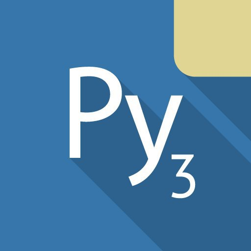
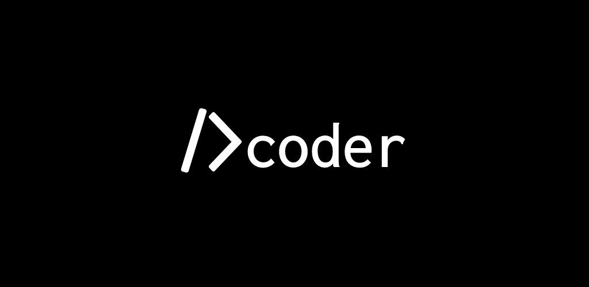

# ¿Cómo programar en móvil?
<b>By: Darth Venom - 09/05/2021</b>
<br>
<br>
Algunas personas quieren aprender a programar y simplemente no tienen una computadora para hacerlo. Si eres de esas personas, entonces este blog es para tí.

Lo primero que hay que tener en cuenta antes de continuar es que este blog se enfocará en aquellos móviles que trabajen con Android, en Android hay soporte suficiente como para programar con facilidad en cualquier lenguaje de programación de alto nivel. Si eres un usuario de IOS, este blog no será de ayuda; aun así existen algunas IDEs para IOS para programar en lenguajes como Python, pero como se dijo anteriormente, no será abarcado en este blog.

## REQUISITOS PARA PROGRAMAR

Para programar en cualquier lenguaje de programación se debe contar obligatoriamente con dos elementos, un editor de texto y un compilador o un intérprete.

Un editor de texto es un programa que se utiliza para escribir texto dentro de un archivo. Para programar se usa un editor de texto para escribir código fuente dentro de un archivo. Un ejemplo de editor de texto es el "bloc de notas", si has usado Windows alguna vez es posible que lo reconozcas. Este editor es muy básico, y aunque eso no significa que no sirva, es preferible utilizar un editor que esté dedicado a la programación, ya que estos editores cuentan con funciones bastante útiles como resaltado de sintaxis, autocompletado, entre otras.

Un compilador y un intérprete son dos cosas distintas y dependiendo del lenguaje en el que se quiera programar se puede necesitar a uno o a otro. Depende de si el lenguaje es un "lenguaje interpretado" o un "lenguaje compilado". Por ejemplo, si se desea programar en Python se debe descargar el intérprete de Python, ya que este es un lenguaje interpretado; en cambio, si se desea programar en C++ se descarga el compilador adecuado, ya que C++ es un lenguaje compilado. Para mayor referencia acerca de lenguajes compilados y compiladores, leer la definición de *programa* en el siguiente blog: <http://aminoapps.com/p/9ajhnck>

## ¿DONDE SE ENCUENTRA TODO ESO?

Yendo a lo importante, para aquellos que quieran programar en Android afortunadamente sí hay IDEs (Entorno de desarrollo integrado) en la Play Store. Para aquellos que no saben, un IDE generalmente integra todo lo que se necesita para programar en un lenguaje, lo que significa que si descargas una IDE no tendrás que preocuparte por descargar nada más.

Así que respuesta corta a "¿Dónde se encuentran todos los requisitos mencionados en los párrafos anteriores?" es: Descargando una IDE en la Play Store.

## RECOMENDACIONES DE IDES

Según el lenguaje en el que se quiera programar habrá que usar una IDE diferente, ya que en Android no es posible instalar un intérprete y una IDE o editor por separado y hacer que interactúen entre sí, sino que se instala una IDE que contiene todo.

Como Python es actualmente el lenguaje más usado y abordado en este servidor, le daré prioridad principalmente a Python. Para programar en Python desde Android la IDE predilecta es Pydroid, es tan buena que incluso permite hacer uso de librerías gráficas.

Link para descargar Pydroid: <https://play.google.com/store/apps/details?id=ru.iiec.pydroid3>



Del mismo creador de Pydroid hay también IDEs para C++ y Java

Link para IDE de C++: <https://play.google.com/store/apps/details?id=ru.iiec.cxxdroid>

Link para IDE de Java: <https://play.google.com/store/apps/details?id=ru.iiec.jvdroid>


Si programas en otro lenguaje que no sea ni C++, ni Python ni Java y deseas una recomendación de un IDE acorde a lo que buscas, esto es para tí.

Se llama **Dcoder**, es una IDE para Android que ofrece soporte para programación en decenas de lenguajes, incluyendo soporte para lenguajes de programación esotéricos como Brainfuck.

Link para descargar Dcoder: <https://play.google.com/store/apps/details?id=com.paprbit.dcoder>



## ALTERNATIVA A LAS IDES ANTERIORES

Una alternativa a descargar IDEs desde la Play Store es usar **Termux**. Tanto como para quienes no saben como para quienes no terminan de entender qué es **Termux**, es un emulador de terminal para Android, es decir, no sirve para programar, no sirve para hacking, etc. Sólo es un emulador de terminal, sólo emula una terminal, pero DENTRO de ese entorno de terminal se puede hacer uso de varias utilidades que pueden permitirnos programar. Junto a Termux se instalan las utilidades básicas para la terminal de los sistemas GNU más el sistema de paquetes dpkg y el gestor apt de los sistemas Debian. ¿Para qué sirve todo eso? En este caso nos permitiría descargar un editor de texto y un compilador o intérprete para programar.

Por ejemplo, si lo que se quiere es programar en Python usando la terminal, se necesita en primer lugar un editor de texto, estos editores tienen que ser editores que corran en un entorno de terminal. En la guía de uso de la terminal se abordó el uso básico de dos editores: **Nano y Vim**. Tras instalar un editor, seguiría descargar el intérprete de Python. Para conseguir todas estas cosas, y suponiendo que quisiera usar vim, el único comando que necesitaría para instalar lo necesario es:
```
apt install -y vim python
```
Eso instalará vim y python. Luego con vim escribiría el programa y lo ejecutaría desde la terminal usando:
```
python <NombreDeArchivo>
```
Sencillo, pero no para cualquiera. La mayoría podría preferir simplemente usar una de las IDEs de las que se habló anteriormente. Pasa que hay ciertas ventajas en usar la terminal que las IDEs de la Play Store no tienen.

## VENTAJAS DE USAR TERMUX

Abordaré un punto que puede expandirse en varias ventajas, este punto se puede resumir en que como Termux incluye software de GNU y el sistema de paquetes de Debian, operar desde la terminal puede traer resultados equivalentes a operar desde una computadora con Debian. En la introducción del blog se dijo que muchos no tienen una computadora y que por ende se sienten limitados por las IDEs de la Play Store, las cuales claramente no son tan buenas como las que están disponibles para las computadoras. Si bien en Termux no se puede hacer uso de IDEs gráficas (no fácilmente), sí se puede acceder a casi todo el software disponible para sistemas GNU/Linux en computadoras.

## MÁS REFERENCIA SOBRE USO DE LA TERMINAL

Para más información acerca del uso de la terminal se puede leer el [índice de la guía de Bash](index.md).

Para información acerca de cómo instalar programas o cómo usar el gestor de paquetes apt: <https://venom-instantdeath.github.io/HU/term3.md>

Para más información acerca de cómo usar Nano o Vim para editar archivos: <https://venom-instantdeath.github.io/HU/term3.md>

## IDES DE PLAY STORE O TERMUX

Mi recomendación es que a menos de que tengas ganas de sacarle el máximo provecho a la terminal o estes dispuesto/a a aprender a usar la terminal no valdrá tanto la pena y la opción para desarrollar cómodamente es usar las IDEs de la Play Store.
<br>
<hr>
*El post ha llegado a su fin. Si tienes dudas puedes contactarme en Discord, soy venom_instantdeath.*
