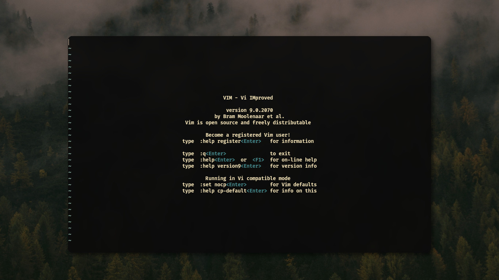
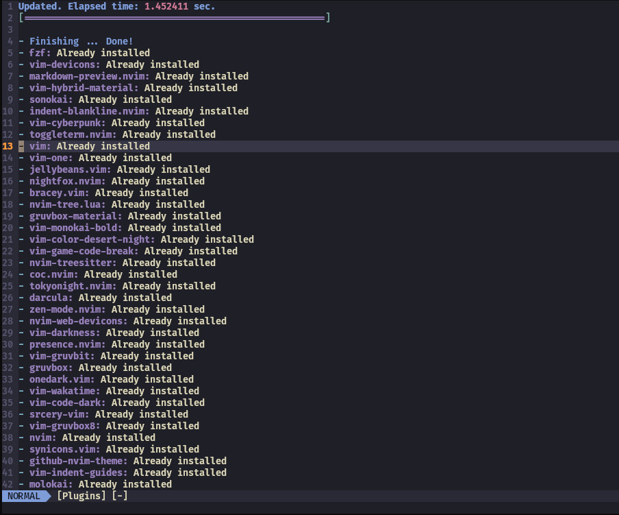

# Plug - Expandiendo Vim.
<b>By: <a href="https://github.com/msh-dv" target="_blank">Tony</a> - 24/11/2023</b>
<br>
<br>

Vim es un editor de texto que destaca por su eficiencia y velocidad, proporcionando a los usuarios un gran control a la hora de programar o editar archivos. Su diseño minimalista, combinado con la amplia gama de comandos y modos, hacen que usarlo sea una experiencia única. 



Pero a menudo nos encontramos con ciertas funcionalidades que nos gustaría que tuviera o añadirle características de otros editores de texto más populares. Es aquí donde los plugins nos ayudan a expandir nuestra experiencia al usar Vim, ya que nos dejan añadir características bastante potentes que nos ayudarán a mejorar nuestra experiencia a la hora de usarlo. 

A continuación veremos como instalar el gestor Plug, como configurar Vim y Neovim para usarlo y como agregar nuestros primeros plugins.



**Hay que resaltar que si bien la mayoría de plugins funcionan en ambos, algunos solo funcionarán en neovim**

## Instalación

Las siguientes instrucciones lo que harán es descargar `plug.vim` en el directorio `autoload/`, la configuración de Plug es similar en vim y neovim.

Puedes copiar el siguiente comando, para tu editor:

**Vim:**
```
curl -fLo ~/.vim/autoload/plug.vim --create-dirs \
    https://raw.githubusercontent.com/junegunn/vim-plug/master/plug.vim
```

**Neovim:**
```
curl -fLo ~/.var/app/io.neovim.nvim/data/nvim/site/autoload/plug.vim --create-dirs \
    https://raw.githubusercontent.com/junegunn/vim-plug/master/plug.vim
```
## Añadiendo plugins

Con vim-plug, tenemos que declarar una lista de plugins que queramos usar en nuestro archivo de configuración de vim/neovim.

Las rutas de estos archivos son:

**Vim:**
```
~/.vimrc
```

**Neovim:**
```
~/.config/nvim/init.vim
```

Dentro del archivo de configuración, tenemos que comenzar nuestra lista, esta debe comenzar con `call plug#begin(PLUG_DIRECTORY)` y terminar con `call plug#end()`, donde `PLUG_DIRECTORY` es nuestro directorio de plugins, quedaría así:

**.vimrc:**
```
"Debajo de la siguiente línea comienza nuestra lista
call plug#begin('~/.vim/plugged')

" Nuestra lista de plugins.
Plug 'junegunn/seoul256.vim'

call plug#end()
"Aquí termina nuestra lista
```

**init.vim:**
```
"Debajo de la siguiente línea comienza nuestra lista
call plug#begin('~/.local/share/nvim/plugged')

" Nuestra lista de plugins.
Plug 'junegunn/seoul256.vim'

call plug#end()
"Aquí termina nuestra lista
```
Una vez añadida la lista, podemos empezar a agregar plugins.
Podemos agregar tantos plugins queramos, solo hay que tener cuidado de que no interfieran los unos con los otros, puedes agregar plugins de terminales, pestañas, temas, etc.

Plug cuenta con varios comandos bastante útiles, entre los cuales están:

+ `PlugInstall`  Instala plugins.
+ `PlugUpdate`   Instala o actualiza plugins a su última versión.
+ `PlugClean`    Remueve los plugins no listados.
+ `PlugUpgrade`  Actualiza vim-plug a su última versión.
+ `PlugStatus`   Muestra el estado de los plugins.
+ `PlugDiff`     Muestra las diferencias después de una actualización.
+ `PlugSnapshot` Genera un script para restaurar la lista de plugins.


### Instalando plugins

En los ejemplos pasados se añadió a la lista el plugin `junegunn/seoul256`, ahora tenemos que instalarlo, esto se hace dirigiéndonos a vim/neovim y ejecutando el siguiente comando:
```
:PlugInstall
```
A continuación el gestor instalará nuestro plugin, una vez hecho, solo tenemos que reiniciar nuestro editor o usar el comando `:source [nuestro-archivo-de-configuración]` y tendremos nuestro plugin listo para usarse.

### Actualizando plugins

Si queremos actualizar un plugin en específico, podemos usar:
```
:PlugUpdate [nombre-de-nuestro-plugin]
```
Si queremos actualizar todos los plugins, podemos usar el mismo comando sin especificar ningún nombre:
```
:PlugUpdate
```
Y para actualizar vim-plug, podemos usar el comando:
```
:PlugUpgrade
```

### Eliminando plugins

Eliminar plugins es un proceso sencillo, solo tenemos que dirigirnos a nuestro archivo de configuración del editor, buscar nuestro plugin en la lista y eliminar la línea donde se encuentra, después de esto, guardamos nuestros cambios, reiniciamos nuestro editor y usamos el siguiente comando:

```
:PlugClean
```
Esto lo que hace es eliminar el plugin y su directorio de nuestro editor, después de esto, podemos reiniciar nuestro editor o actualizar el archivo de configuración y ya no tendríamos dicho plugin.

*Esta guía solo muestra como agregar vim-plug y su uso, en una siguiente entrega exploraremos como añadir plugins de todo tipo y hacer que nuestro editor se vea y funcione mucho mejor.*
