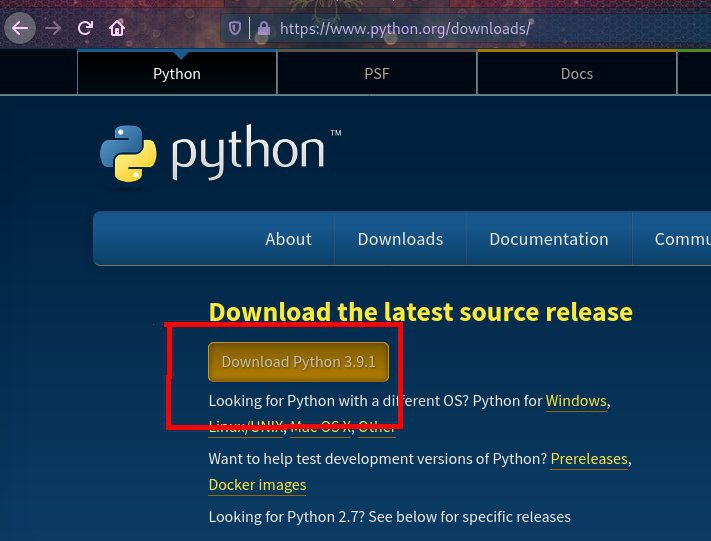
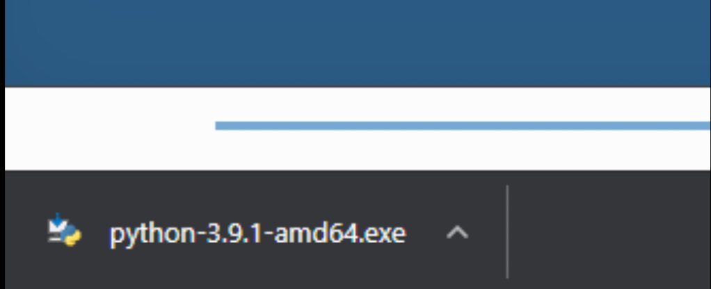
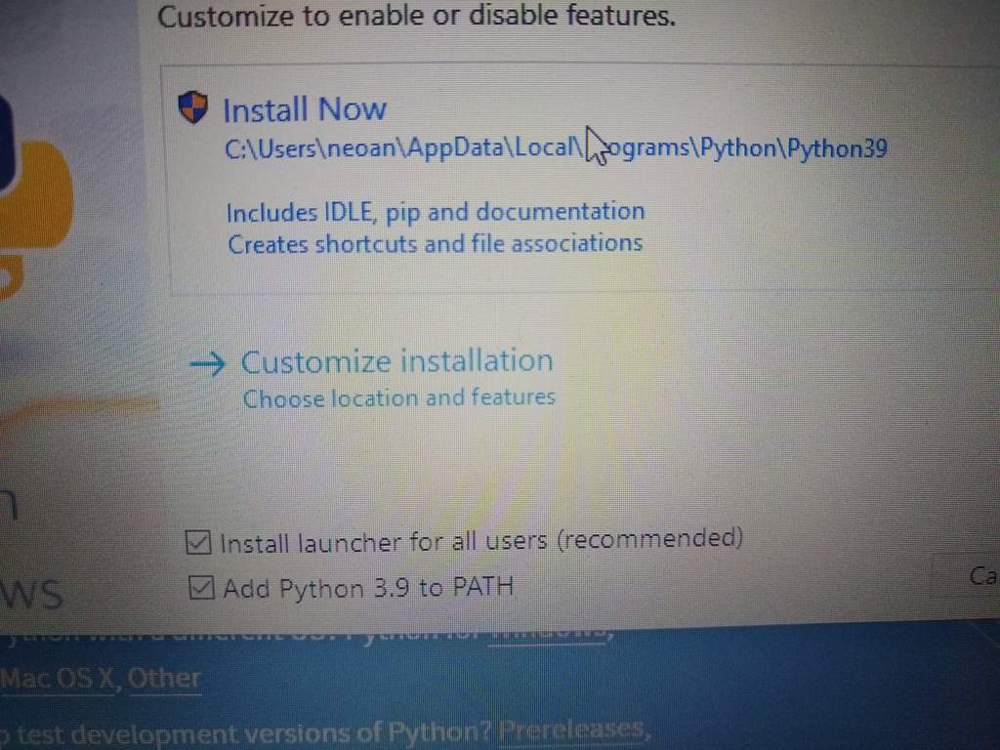
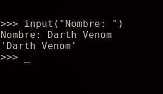

# Python de 0 a 1000 #1
<b>By: Darth Venom - 28/12/2020</b>
<br>
<br>
Con este blog se inaugura la serie de blogs Python de 0 a 1000, el formato del título de estos blogs son copiados de la serie de blogs "Manejando la terminal de 0 a 1000". Evidentemente el autor se está quedando sin ideas para sus títulos.

Bien se sabe que la carencia de ideas del autor no son el enfoque que pretende este blog, así que apuntaremos a lo importante: **Python**.

**Al momento de subir el presente blog, la última versión de Python es la 3.9.1. Para seguir esta guía se debe usar Python 3 o superior.**

Python es un lenguaje imperativo interpretado, es multiparadigma, pero la presencia de objetos es muy abundante. Para ser más preciso, todo es un objeto en Python, por ende no sería erróneo decir que es un lenguaje orientado a objetos.

En este blog, a modo de introducción a este lenguaje, *comenzaremos por entender qué son las operaciones de entrada y salida y cómo se manejan en Python*.

<hr>

Antes de comenzar, es importante primero tener Python, sino no será posible seguir la guía.

### Windows

Para descargar Python en Windows, visita el siguiente link: <https://www.python.org/downloads/>

Una vez ahí, presiona el botón *"Download Python 3.x.x"*



Comenzará la descarga del instalador de Python, una vez terminado, presiona en el ejecutable.



Tras presionar se abrirá el instalador, chequea la casilla **"Add Python to PATH"** y luego pulsa en Install Now.



Tras haber hecho eso la instalación habrá terminado y ya puedes usar Python. Para hacer pruebas y ejecutar las cosas mostradas en este blog, abre el cmd (símbolo del sistema) usando las teclas `HOME+R` y escribiendo cmd.exe. Una vez dentro del cmd, usando el comando python se abrirá el interprete de Python.

### GNU/Linux

Instalar Python en GNU/Linux es... Simple, como todo en GNU/Linux. Abre una terminal y usa tu gestor de paquetes para instalar el paquete Python. Python está en los repositorios de todas las distribuciones GNU/Linux

Si no sabes cuál es tu gestor de paquetes, visita el siguiente blog para saber cuál es tu gestor y cómo usarlo para instalar Python: <https://venom-instantdeath.github.io/HU/term3.md>

Una vez Python esté instalado puedes abrirlo con el comando Python para probar los comandos de este blog.

<hr>

Para explicar las operaciones de entrada y salida (I/O) tomaré prestado un fragmento del blog [Subsistema de TTY #2](unix4.md) de la serie de blogs sobre Unix.

> "Anteriormente se habló de operaciones de entrada y salida, para aquellos que no saben qué significa esto, lo explicaré, es sencillo. Se llama salida a todo dato que un programa envía a otro programa, archivo, o a un dispositivo físico. Un ejemplo de lo anterior es cuando un programa imprime cosas en la pantalla, o cuando un programa envía datos a una impresora para que esta imprima. En este caso, el programa envía esos datos (salida) y la impresora los recibe y los procesa (entrada). Así como la salida son los datos que un programa envía o escribe, la entrada son los datos que un programa recibe, por ejemplo, cuando escribes en una terminal, el intérprete de comandos bash, por decir un ejemplo, lee (recibe) las letras que ingresas a través del teclado."

Sabiendo ahora la explicación teórica, propongo dos preguntas y tienen que buscar la respuesta por sus cuentas, si aciertan las dos veces significa que entendieron bien. Si le erran a una, lo más probable es que se corrijan leyendo la respuesta.

*Las respuestas a estos ejercicios estarán al final.*

1. Si mientras uso un programa presiono una tecla del teclado, los bits que recibe el programa, ¿Son entrada o salida?

2. Cuando tu navegador te muestra este mismo texto. ¿Es entrada o salida?

Una vez tengan la respuesta a las dos preguntas vayan al final del post para chequear la respuesta. Una vez hecho eso, vuelvan hasta aquí y continúen la lectura.

La primera operación que se mostrará en este lenguaje es una tradición en la comunidad de programadores. Cuando se va a empezar un nuevo lenguaje, lo primero que se hace es imprimir las palabras "Hello world" en la pantalla.

Pregunta extra: *Imprimir las palabras "Hello world" en la pantalla, ¿es una operación de entrada o salida?*

La respuesta también estará al final del post.

Para imprimir texto en la pantalla usaremos la función `print()`, esta imprime cualquier dato que se le pase entre los paréntesis. En este caso, para imprimir Hello world usaremos:
```python
print("Hello world")
```
Habiendo hecho esto ya dimos nuestro primer paso en este lenguaje. Ahora sabemos que para las operaciones de salida usaremos `print()`.

Para tomar la entrada del teclado usaremos la función `input()`, que lee la entrada del teclado hasta que se pulsa la tecla `ENTER`. A diferencia de `print()`, lo que va dentro de los parámetros de `input()` es el prompt\*.

**Prompt:** Un prompt es un conjunto de caracteres que se muestran en un programa para indicar que se tiene que ingresar algo a través del teclado.

`input()` primero imprimirá el prompt y luego procederá a leer la entrada del teclado.

Por ejemplo, si se quiere pedir el nombre del usuario, se usa:
```python
input("Nombre: ")
```



Si `input()` no recibe ningún argumento, se tomará la entrada sin imprimir ningún prompt.

Lo que `input()` obtiene del teclado se descarta porque no conocemos un lugar donde guardar esa información aún, entonces en el ejemplo anterior preguntar el nombre del usuario no es que haya sido inútil porque los datos se vayan a descartar, sino que para guardar esos datos hay que hacer uso de un elemento que aún desconocemos. ¡Sabiendo esto habremos completado el primer tema, operaciones de entrada y salida!
<br>
<hr>
*El post ha llegado a su fin. Si tienes dudas puedes contactarme en Discord, soy venom_instantdeath.*
