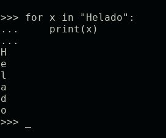
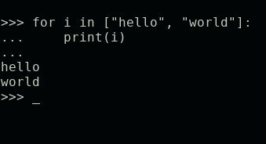
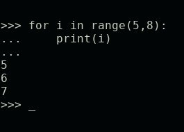
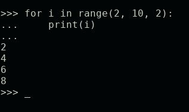
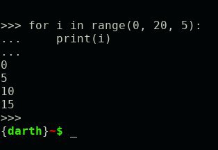

# Python de 0 a 1000 #12
<b>By: Darth Venom - 03/05/2021</b>
<br>
<br>
En este capítulo aprenderemos qué es `for`, como se recorren los *iterables*, qué es la iteración y algunos métodos built-in que son de utilidad.

## ¿QUÉ ES FOR?

`for` es un bucle que se usa cuando se desea repetir cierto código una cantidad determinada de veces. La principal diferencia con `while` es que `while` ejecuta un código una cantidad indefinida de veces mientras una condición sea verdadera.

Otra diferencia con `while` es que `for` no recibe una condición, `for` tiene que recibir un iterable sobre el cuál iterar, por eso la cantidad de ciclos siempre será una cantidad definida.

## ¿QUÉ ERA UN ITERABLE?

Sacado del post [Python de 0 a 1000 #11](python11.html):

> "Todas las estructuras de datos y los strings son objetos llamados "Iterables". Los objetos iterables son aquellos que pueden poseer múltiples elementos y permiten ser *iterados*"

Se dice que un string posee múltiples elementos porque si recuerdas la explicación del post [Python de 0 a 1000 #3](python3.html):

> "Un string es una cadena de caracteres, es decir, un conjunto de letras, símbolos o números". O sea, es casi como si fuera una lista con caracteres (pero no lo es), por esta razón es un iterable y puede poseer múltiples elementos.

## SINTAXIS

```python
for var in iterable:
```

Donde `var` es una variable que será inicializada con la ejecución de `for`, es decir, no es necesario que la variable haya sido previamente declarada para usarla en `for`; e iterable puede ser cualquier iterable sobre el cual se iterará.

## ¿QUÉ ES LA ITERACIÓN?

Iterar significa realizar una acción varias veces, así que para salir de dudas, iterar es sinónimo de repetir. ¿Por qué se usa la palabra iterar en vez de repetir? Simple.

La palabra iteración o iterar en programación se usa para referirse al tipo de repetición que hace el bucle for, porque for no es una estructura a la que le pasas un número para que se ejecute x cantidad de veces sino que le pasas un iterable. ¿Es raro no? ¿No sería más fácil crear una estructura a la cual le pases un número y ya? La respuesta es sí, pero eso no sería iteración; sería repetición, he ahí la diferencia :)

Okay, ahora, ¿Qué es exactamente la iteración y qué hace `for`?

Si revisas la sintaxis for necesita recibir una variable y un iterable, así que supongamos que nuestro iterable será el string `"Helado"`. Recordemos que cada repetición en un bucle se llama ciclo y que la cantidad de ciclos de `for` será la cantidad de elementos del objeto iterable que le pasemos, así que si tenemos el string `"Helado"`, la cantidad de ciclos será 6, o sea que repetirá un código 6 veces. Lo que hace for es **recorrer** ese iterable, eso es iterar, recorre el iterable. A medida que va recorriendo el iterable va cambiando el valor de la variable por el último elemento que recorrió.

Para enteder mejor la explicación, veamos ejemplos.

Si tenemos:

```python
for x in "Helado":
	print("Chocolate")
```

Sabremos que se imprimirá 6 veces la palabra Chocolate. O sea, podemos calcular la cantidad de ciclos que habrán. Pero para entender cómo funciona la iteración y cómo es for recorre al iterable, vamos a imprimir la variable `x` en vez de la palabra Chocolate.

```python
for x in "Helado":
	print(x)
```

El resultado será:

```
H
e
l
a
d
o
```



Como se puede ver, lo que ocurrió es que for recorrió el string `"Helado"` a través de la variable `x`, es decir "iteró sobre el string `'Helado'`". Por cada ciclo, el valor de `x` cambió por otra letra de la palabra.

Veamos otro ejemplo pero con listas:

```python
for i in ["hello", "world"]:
	print(i)
```

Aquí serán dos ciclos porque la lista posee dos elementos, y el resultado será:

```
hello
world
```



**Recordatorio:** *Las sentencias [break y continue](python9.html) funcionan en cualquier bucle y por ende también funcionan en for.*

## FUNCIÓN RANGE()

La función `range()` devuelve un objeto iterable equivalente a una lista de números entre 0 y un número `X`. `range()` espera recibir un número, por ejemplo `range(10)` devolverá un iterable que contiene todos los números desde el 0 al 10. Teniendo en cuenta lo que hace `range()`, ya sabemos exactamente cómo hacer que for ejecute una acción cierta cantidad de veces.

**NOTA:** `range()` comienza a contar desde el 0. Si se usa `range(10)`, el primer número será 0 y el último será 9, o sea, 10 números.

Supongamos que queremos que for imprima la palabra Torta 1000 veces. Sin `range()` esto sería bastante más difícil o menos óptimo y poco elegante. Haciendo uso de `range()` esto sería:

```python
for i in range(1000):
	print("Torta")
```

<center>Otro ejemplo más para entender la iteración:</center>

```python
for i in range(3):
	print(i)
```

El resultado es:

```
0
1
2
```

Como vimos, `range()` recibe un sólo argumento, un número, pero también pueden haber casos en los que reciba 2 o 3 argumentos. Vamos a revisar ambos casos.

En los casos en los que `range()` recibe dos argumentos, hay dos números: Un número A y un número B. En este caso `range()` devuelve un iterable que contiene números entre A y B. Ejemplo:



Y en los casos en los que `range()` recibe tres argumentos ocurre lo mismo que en los casos en los que recibe dos con la excepción de que el tercer número representa el salto que se hará entre cada número (por defecto es 1). Para entenderlo veamos dos ejemplos:





## FORMA CORRECTA DE ACCEDER LISTAS

La forma correcta de acceder una lista, un string, una tupla o cualquier iterable durante la ejecución de un bucle for (a excepción de los diccionarios) es a través de un modo que nos permita referenciar los elementos de la lista a través del índice. Si recuerdas los anteriores capítulos el índice permite acceder a los elementos de una lista, el índice espera recibir un número representando la posición de un elemento en la lista, entonces ¿Qué modo sería el correcto para cumplir con esto?

El modo sería el siguiente. Supongamos que queremos recorrer la lista `L`, usando este método sería:

```python
for i in range(len(L)):
	print(L[i])
```

En este caso, ¿Qué ventajas hay en usar este método sabiendo que sólo queremos imprimir todos los elementos de la lista?

Ninguna.

La ventaja de este método radica en los casos en los que se desea manipular los elementos de la lista.

Por ejemplo, suponiendo que quisiera eliminar todos los elementos de una lista y suponiendo que las listas no tuvieran el método `clear()`, para hacerlo sin usar este método tendría que usar esto:

```python
for i in lista:
	lista.pop(lista.index(i))
```

Y usando este método sería:

```python
for i in range(len(lista)):
	lista.pop(i)
```

La diferencia entre un código y otro radica en que usando este método el código es más rápido y menos largo, haciendo que el programa sea más fácil de leer y más rápido de escribir. Puede que esto último no se note cuando el for sólo tiene una línea de código, pero cuando se ocupa hacer un bucle de varias líneas de código manipulando una lista, se ahorra mucho tiempo de escritura y es mucho más fácil de leer.
<br>
<hr>
*El post ha llegado a su fin. Si tienes dudas puedes contactarme en Discord, soy venom_instantdeath.*
