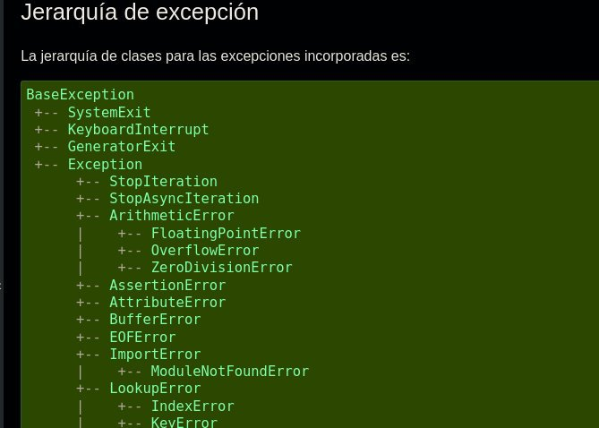
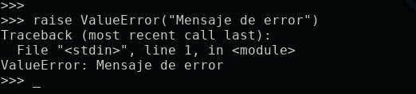

# Python de 0 a 1000 #13
<b>By: Darth Venom - 05/05/2021</b>
<br>
<br>
En este capítulo aprenderemos la sentencia `try`, la sentencia `raise` y el concepto de excepción.

## ¿QUÉ ES UNA EXCEPCIÓN?

Una excepción es básicamente lo que llamaríamos error. Si un programa tiene un error, se lo llama excepción. Si intentas referenciar una variable que no existe se levanta una excepción. Si intentas dividir un número por 0 o sumar un `int` con un string, se levanta una excepción. Pero la definición de "excepción" es más que error, porque una excepción es cualquier tipo de interrupción inesperada. Esto significa que hasta presionar `CTRL+C` es considerado una excepción. Para los que saben cómo funcionan los programas de terminal, al presionar `CTRL+C` se envía una señal de interrupción; esto no es un error, pero como dijimos, es una excepción.

En python existe la posibilidad de detectar y reaccionar ante excepciones, esto se hace a través de la sentencia `try`.

## ¿PARA QUÉ SIRVE TRY?

En Python cuando se levanta una excepción, el intérprete imprime algo llamado **Traceback**, que son los detalles de la excepción. Esto incluye qué excepción se levantó y en qué línea del código se ubica. Esto es útil para detectar de dónde vienen los errores. Una vez impreso el **Traceback**, el programa termina.

`try` sirve para probar un bloque de código y poder reaccionar ante una excepción sin que se interrumpa el programa.

## SINTAXIS
```python
try:
	# Código para probar
except <excepción>:
	# Código que se ejecutará
	# si se levanta una excepción
```
## TRY - EXCEPT

La sentencia `try` debe ser sucedida obligatoriamente por la sentencia `except`. Dentro del `try` va el código que desea ser probado, si alguna de las líneas del código que está dentro de `try` levanta una excepción, esta será atrapada por la sentencia `except` y se ejecutará el código que esté dentro de este bloque sólo si la excepción que se levantó coincide con la excepción que se le pasó como argumento a `except`.

`except` espera recibir una excepción como argumento, pero esto no es necesario. Si `except` no recibe ninguna excepción como argumento, reaccionará a cualquier excepción que se levante dentro de `try`. Si en cambio se especifica una excepción, sólo reaccionará a la excepción especificada o a sus excepciones derivadas. No se preocupe por entender las excepciones derivadas, sólo debe entender que hay 2 excepciones de las cuales derivan todas las demás, nada más al respecto. Estas 2 excepciones se mencionarán en seguida.

Para poner un ejemplo, si ejecutamos este código:

```python
try:
	print(5 + 5)
except:
	print("Ocurrió un error durante la operación")
```

El resultado será: 10, porque 5 + 5 es 10

Pero si en vez de eso, ejecutáramos este código que es muy parecido:

```python
try:
	print(5 + "5")
except:
	print("Ocurrió un error durante la operación")
```

El programa levantará la excepción `TypeError` por intentar sumar un `int` con un string y se ejecutará `except`, imprimiendo: Ocurrió un error durante la operación.

## BARE EXCEPT

En los códigos anteriormente mostrados como ejemplo, except no recibe ninguna excepción como argumento. Esto es desaconsejado por el **PEP8**. El **PEP8** es una serie de estándares establecidos para la programación en Python.

¿Por qué el **PEP8** desaconseja el uso de except sin especificar una excepción?

En el **PEP8** se refiere a ello en el E722 con el nombre de **"Bare Except"**, que se traduce a Except Desnudo, que puede interpretarse como un except al que no se le especifica ninguna excepción que atrapar.

Lo que sucede cuando no se le especifica una excepción a except es que atrapará toda excepción que se levante. Y como bien habíamos dicho al principio del blog, hasta un `CTRL+C` es una excepción, entonces tendrías un `except` que reacciona a cualquier cosa. Por esta razón es desaconsejado. Por ende, la forma correcta de hacerlo y corregir el ejemplo anterior sería:

```python
try:
	print(5 + "5")
except TypeError:
	print("Ocurrió un error durante la operación")
```

Como sería muy largo abarcar todas las excepciones existentes en este blog, lo recomendable es echarle un vistazo a la documentación oficial acerca de las excepciones y la explicación de cada una:

Excepciones y su explicación: <https://docs.python.org/3/tutorial/errors.html#raising-exceptions>

## TRY - EXCEPT - ELSE - FINALLY

A parte de la estructura básica y obligatoria, *try-except*, se puede hacer uso *opcional* de las sentencias `else` y `finally`. Estas sentencias no reciben parámetros así que lo único que se debe saber para entenderlas es qué hacen.

La sentencia `else` se usa para ejecutar cierto código en caso de que ninguna excepción haya sido levantada, o sea, si el código en `try` fue exitoso. Ejemplo de código en el que se ejecuta `else`:

```python
try:
	print("Código")
except Exception:
	print("Ocurrió un error")
else:
	print("Todo bien")
```

Esto resultaría en:

```
Código
Todo bien
```

La sentencia `finally` se ejecuta siempre, así se haya levantado una expresión o no.

## CAPTURAR MÚLTIPLES EXCEPCIONES

Pueden haber casos en los que en vez de querer capturar una sóla excepción se quiere especificar más de una. Para eso hay dos formas distintas y cada una se usa en un caso distinto.

Si se quiere atrapar 2 excepciones y que para cada una se ejecute un código distinto, se tiene que tener en cuenta que un bloque *try-except* puede tener todos los excepts que se quiera. Por ejemplo:

```python
try:
	# Código loco
except TypeError:
	# Reacción a TypeError
except ValueError:
	# Reacción a ValueError
```

Como se ve, en este caso se podría reaccionar a `TypeError` o a `ValueError` con 2 códigos diferentes, pero si se sabe que para cualquiera de las dos excepciones se ejecutará el mismo código, esta solución es mejor:

```python
try:
	# Código loco
except (TypeError, ValueError):
	# Reacción a TypeError y ValueError por igual
```

En este caso le pasamos una *tupla* a `except` que contiene las dos excepciones que queremos atrapar.

## EXCEPT EXCEPTION

Previamente en este blog se mencionó que habían 2 excepciones base de las cuales derivan todas las demás, esto es importante saberlo antes de continuar, ya que hablaremos de ambas excepciones.

Hay una excepción que es de la que derivan todas las excepciones, esta es `BaseException`. Todas las excepciones, incluso un simple `CTRL+C` es una excepción derivada de `BaseException`. Usar:

```python
except BaseException:
```

Es casi lo mismo que usar un "bare except", ya que como todas las excepciones derivan de `BaseException`, todas las excepciones serán interceptadas. Eso es un detalle importante de `except`, No sólo detecta excepciones específicas, sino que también detecta excepciones derivadas.

La segunda excepción que abarca a la mayor cantidad de excepciones es `Exception`. Todas las excepciones comunes deben ser derivadas de `Exception`, pero aún así es mucho más preferible usar `except Exception` que un bare except. Reitero que lo recomendable y lo óptimo es siempre especificar qué excepción se está esperado.

Para entender mejor cuáles son las excepciones base y las derivadas échale un vistazo a este diagrama sacado de la documentación oficial.

<https://docs.python.org/es/3/library/exceptions.html#exception-hierarchy>



## RAISE

Casi finalizando el capítulo toca aprender la sentencia `raise`. Esta sentencia permite forzar el levantamiento de excepciones. La sintaxis es muy sencilla:

```python
raise <excepción>
```

Por ejemplo:

```python
raise ValueError()
```

Poner los paréntesis y no ponerlos no hace diferencia, pero al ponerlos se puede especificar un mensaje para imprimir en el **traceback**. Ejemplo:



Si durante un `try` se usa un `raise` o se levanta una excepción debido a un error y `except` lo atrapa pero lo que se busca es que el **traceback** se imprima, se puede usar un `raise` sin ningún argumento al final de ese `except` para que el traceback se imprima luego de ejecutar el `except` y luego el programa se cierre.
<br>
<hr>
*El post ha llegado a su fin. Si tienes dudas puedes contactarme en Discord, soy venom_instantdeath.*
