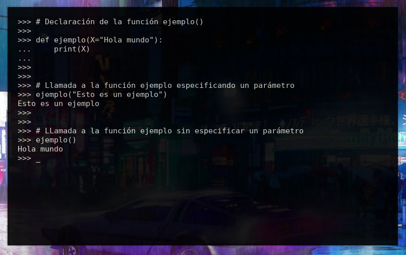

# Python de 0 a 1000 #15
<b>By: Darth Venom - 19/09/2021</b>
<br>
<br>
En el capítulo anterior se explicó qué es una función y cómo se usa, en este capítulo se expandirá acerca de los parámetros de las funciones. No será un capítulo muy largo porque este no es un tema por sí sólo sino una expansión sobre uno de los elementos de las funciones.

## ¿QUÉ SON LOS PARÁMETROS?

Los parámetros son aquellos que se especifican dentro de los paréntesis que van al lado de los nombres de las funciones, por ejemplo, en `print("Hola")`, `print` es la función y `"Hola"` es el parámetro. Lo anterior no fue una explicación, más bien es a modo de orientación, para saber de qué se está hablando.

Los parámetros prácticamente son como las variables, gracias a los parámetros es que se puede ejecutar una misma función con distintos valores.

## ¿CÓMO SE USAN?

La sintaxis de los parámetros no es complicada pero sí es más amplia que la de las variables. Para empezar tienen la particularidad de que sólo pueden declararse al momento de declarar la función, y a diferencia de las variables, a los parámetros no se les asigna un valor al momento de la declaración, es decir:

Si se quiere declarar una variable `X` para que sea una declaración válida se le tiene que asignar un valor:

```python
X = 5
```

En cambio con los parámetros esto no pasa:

```python
def ejemplo(X):
```

Ahí se declara `X` pero no se le asigna ningún valor. Los parámetros reciben sus valores al momento de llamar a la función; es decir, `X` valdrá `5` si yo llamo a la función `ejemplo(X)` de la siguiente manera:

```python
ejemplo(5)
```

Y para que al parámetro `X` se le asigne `"Hola mundo"`, se llama a la función `ejemplo(X)` de la siguiente manera:

```python
ejemplo("Hola mundo")
```

O sea que un parámetro sólo puede tener su valor asignado al momento de llamar a la función y no en la declaración.

**Existe una excepción a lo anterior.**

## VALOR POR OMISIÓN

Se llama *"valor por omisión"*, y si se especifica, es un valor que se asigna al parámetro al momento de llamar a la función si es que no se pasó ningún valor al parámetro.

Ejemplo de un parámetro con un valor por omisión:

```python
def ejemplo(X=5):
```

Aquí si al momento de la ejecución de la función `ejemplo()` no se especifica un valor para el parámetro `X`, entonces se asignará el número 5.

A continuación se muestra una captura del intérprete de Python con un ejemplo que ilustra una función que usa un parámetro con un valor por omisión.



Entonces, una función puede tener o no tener parámetros, y las funciones que los tienen, pueden incluir valores por omisión o no; eso depende de lo que necesite el programador.

Otro aspecto que se debe aclarar es que dentro del cuerpo de la función el valor del parámetro puede ser alterado o reasignado, **y se lo trata como a una variable cualquiera**.

## MÚLTIPLES PARÁMETROS

En una función se puede hacer uso de más de un parámetro, y algunos pueden tener valores por omisión y otros no. La regla sintáctica principal en la asignación de estos parámetros es que los parámetros deben estar separados por comas. Por ejemplo:

```python
def funcion(X, Y, Z):
```

Luego hay otra regla que tiene que ver con el orden en el que se declaran los parámetros. Los parámetros que tengan un valor por omisión especificado tienen que aparecer declarados después de los que no tienen valor por omisión.

Ejemplo de error sintáctico:

```python
def funcion(X, Y=23, Z):
```

Esto levanta un `SyntaxError` debido a que luego de la declaración del parámetro Y (que tiene un valor por omisión) se declaró `Z` (que no tiene un valor por omisión).

Ejemplo de sintaxis correcta:

```python
def funcion(X, Z, Y=23):
```

De este modo, el parámetro `Y`, que tiene un valor por omisión aparece declarado después de los parámetros que no tienen valor por omisión.

Un ejemplo más con más parámetros para orientar al lector:

```python
def funcion(A, B, C, D, E=50, F="Hola", G=3.14):
```

## TYPE HINT

El *"type hint"* fue añadido a la sintaxis de Python en la versión 3.5 y es bastante útil. Python es un lenguaje débilmente tipado a diferencia de otros lenguajes como C o C++, esto significa que el tipo de dato en una variable no está definido sino que es automático y se define a la hora de asignar un valor a la variable.

Como Python es débilmente tipado, a veces podríamos no saber cómo llamar correctamente a una función, qué tipos de datos pasar como parámetro, entre otros problemas. Afortunadamente, gracias al *type hint* este problema se resuelve en buena parte.

Por supuesto que el type hint es opcional, sólo es una buena práctica. Si te estás preguntando por qué deberías usar type hint, te respondo con un ejemplo. Si se debe llamar a esta funcion:

```python
def foo(X, Y):
    return X * Y
```

A menos de que leamos un docstring o algún tipo de documentación sobre esta función, no podremos saber cuál es el tipo de dato correcto para pasar como argumentos de esta función. Claro, esta función es muy cortita y se puede deducir que esos dos parámeros X e Y deben ser `int`, ya que luego se devolverá el producto de la multiplicación entre ellos.

Con la función del ejemplo anterior sí se puede deducir el tipo de dato que deben recibir los parámetros `X` e `Y`, pero si fuera una función larga o compleja, sería más difícil y tomaría tiempo deducirlo. Todo esto se simplifica usando *type hint*. Esto se hace así:

```python
def foo(X: int, Y: int) -> int:
     return X * Y
```

Traduzco; el type hint aquí explica que `X` debe ser un `int`, que `Y` debe ser un `int`, y que la función devuelve un `int`.

El type hint es como un comentario, no afecta al código, y si el type hint dice que un parámetro debe ser un int, pasar un string no hará que el programa levante un error, porque el type hint sólo es un comentario para que el programador tenga en cuenta.

Es muy sencillo de usar, sólo se debe poner dos puntos (':') seguido del tipo de dato que se espera obtener para un parámetro específico. He aquí un ejemplo de type hinting con valores de omisión y todo.

```python
def foo(A: float, B=3: int) -> float:
    return round(A, 3)
```

(La función `round()` no fue explicada en esta guía hasta el momento, es una función matemática para realizar operaciones de redondeo.)

## TYPE HINTING CON ESTRUCTURAS DE DATOS

Para hacer uso del type hint con estructuras de datos usamos la librería `typing` incluida en la librería estándar. Aún la guía no cubre el uso de módulos y librerías, eso lo veremos dentro de unos cuántos capítulos, así que no hace falta que esto se entienda ahora; pero si se necesita hacer type hinting con listas, tuplas, conjuntos o diccionarios se hace lo siguiente.

Supongamos que queremos aplicar type hinting a una función que necesita recibir como parámetro una lista que contenga varios `int` y que devuelva un `int`. Se hace así:

Al principio del programa se pone la siguiente línea:

```python
from typing import List
```

Y luego en la función se usa type hint de la siguiente manera:

```python
def ejemplo(A: List[int]) -> int:
```

De esta forma se puede saber que el parámetro A espera recibir una lista con números enteros (`int`).

En el anterior ejemplo, se requería una lista, y según la estructura requerida para el type hint se debe importar algo distinto de la librería `typing`.

**Según la estructura que se quiera usar se agregará lo siguiente al principio del programa:**

- Listas: `from typing import List`
- Tuplas: `from typing import Tuple`
- Conjuntos: `from typing import Set`
- Diccionarios: `from typing import Dict`

Por supuesto que se puede poner cada una de estas líneas según sea necesario. Si queremos usar type hint con una función que tiene parámetros que requieren diccionarios y listas, al principio del programa ponemos:

```python
from typing import Dict
from typing import List
```

Estas líneas sólo se colocan una vez y son válidas para todo el programa.
<br>
<hr>
*El post ha llegado a su fin. Si tienes dudas puedes contactarme en Discord, soy venom_instantdeath.*
