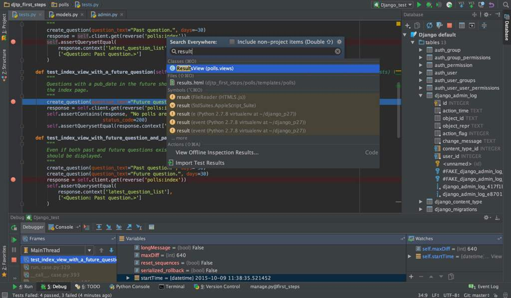

# Python de 0 a 1000 #2
<b>By: Darth Venom - 20/01/2021</b>
<br>
<br>
Bienvenidos a este blog. Antes de continuar la guía de Python es importante seguir o al menos saber lo indicado en este blog. Para trabajar en proyectos o programas que requieren de varias líneas de códigos y varios archivos lo mejor es tener un entorno de trabajo más ordenado y preparado para trabajar cómodamente, un entorno que incorpore todas las herramientas necesarias para trabajar con precisión, eficacia y velocidad. Para eso están las IDEs

Una IDE o Entorno de Desarrollo Integrado es un software que facilita la escritura de código incorporando múltiples herramientas que permiten acelerar la escritura, el proceso de depuración y refactorización, etc.

La IDE predilecta para Python es Pycharm, y en este blog se mostrará cómo instalarla.



Para empezar hay que descargar Pycharm desde la página oficial de JetBrains: <https://www.jetbrains.com/es-es/pycharm/download/#section=windows>

Una vez ahí, se debe asegurar de que se encuentre en la sección correspondiente a su sistema operativo


Descargamos la versión Community, es completamente gratuita.


Si tu sistema es Windows, puedes dar por terminado el blog en este punto ya que sólo es descomprimir el zip e instalar. Si usas GNU/Linux, revisaremos los comandos necesarios para usar Pycharm.

Tras finalizar la descarga, nos quedará una archivo .tar.gz, lo descomprimimos usando el comando
```
tar -xzf [archivo.tar.gz]
```
Tras descomprimir nos dejará una carpeta, accedemos a ella, y luego al subdirectorio `bin`. Dentro del directorio bin habrá un script llamado pycharm.sh, para abrir pycharm se debe ejecutar este script usando
```
bash pycharm.sh
```

Para hacer esto más rápido y cómodo vamos a crear un enlace simbólico a `pycharm.sh` en el directorio `/usr/bin` para que podamos abrir pycharm desde cualquier lugar, incluso desde el menú gráfico de aplicaciones. Para crear link simbólicos usamos `ln -s`.

```
ln -s $(pwd)/pycharm.sh /usr/bin/pycharm
```

Habiendo hecho esto la IDE habrá quedado instalada y estará lista para su uso.
<br>
<hr>
*El post ha llegado a su fin. Si tienes dudas puedes contactarme en Discord, soy venom_instantdeath.*
