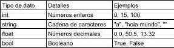

# Python de 0 a 1000 #3
<b>By: Darth Venom - 22/01/2021</b>
<br>
<br>
Continuando con la parte introductoria de la guía de Python, en esta publicación aprenderemos los tipos de datos existentes en Python con ejemplos. Tras terminar de explicar tipos de datos, veremos variables. Estos temas no son tan complicados pero son muy importantes, será algo que usen siempre.

Para comenzar, tenemos que mencionar que durante la ejecución de un programa pueden haber datos que entran o salen del programa, por ejemplo, si un programa te pide tu nombre de usuario, está solicitando un dato; si un programa desea obtener el tamaño de la pantalla a través de una llamada al kernel, está solicitando un dato. Los datos pueden ser de distintos tipos, es decir, si tenemos la información de que hay un usuario que se llama Juán y tiene 28 años, el nombre y la edad son dos datos de distinto tipo. Ampliaremos lo anterior conociendo los distintos tipos de datos.

## TIPOS DE DATOS



**String**: Un string es una cadena de caracteres, es decir, un conjunto de letras, símbolos o números. Los strings tienen una característica que los diferencia de cualquier otro elemento: Se delimitan entre comillas. Todo elemento que vaya entre comillas será SIEMPRE un String. En Python se refiere a String como str.

Ejemplos: `"a"`, `"Hola mundo"`, `""`, `"15"`

**Int**: Int es la forma abreviada de Integer, que en español significa entero (número entero). Los ints son números enteros.

Ejemplos: `23`, `0`, `1444`, `-12`

**Float**: Son números decimales, al igual que en el resto de lenguajes de programación, en Python los números decimales no llevan coma, llevan punto.

Ejemplos: `15.5`, `88.131`, `0.0`, `13.9`

**Bool**: Bool es la forma abreviada de Boolean, que en español significa Booleano. La definición de esta palabra es "que solo admite dos posibles respuestas", los bool sólo pueden ser Verdadero o Falso.

Ejemplo: `True`, `False`

**None**: Representa un valor nulo.

Ejemplo: `None`

## TEST

Entender y recordar los tipos de datos es algo muy importante, por eso haré unas preguntas sobre tipos de datos. Piensen las respuestas y luego bajen a los comentarios para chequear (Los comentarios estrán ordenados).

¿Qué tipo de dato es `"XD"` ?

¿Qué tipo de dato es `123252.0` ?

¿Qué tipo de dato es `True` ?

¿Qué tipo de dato es `"False"` ?

Muy bien, si ya contestaste las cuatro preguntas, puedes chequear si tus respuestas fueron correctas y luego volver a este mismo punto.

Hay un detalle que plantear respecto a los tipos de datos. Si tenemos el string `"a1"` no podemos decir que es mitad string y mitad int, incluso si un string está compuesto únicamente por números sigue siendo únicamente un string, además hay que recordar que <u>todo elemento delimitado por comillas es y será un string</u>.

## VARIABLES

Las variables son un elemento en el cuál se pueden guardar datos de cualquier tipo, tienen un espacio reservado en la memoria (RAM) y poseen un identificador, el identificador (nombre) se lo da el mismo programador. Se llaman variables porque el valor que contienen puede cambiar indefinidamente.

Supongamos que sé que Juán tiene 28 años y quiero guardarlo en una variable, la sintaxis para declarar una variable es la siguiente:

```python
Identificador = Valor
```

El identificador lo inventamos nosotros, las únicas reglas respecto al nombre de las variables es que no pueden empezar con un número, no pueden contener símbolos y son sensibles a las mayúsculas, así que var no es lo mismo que Var.

```python
edad = 28
```

Así es como se declara la variable edad, es una variable que contiene el int 28. Los nombres de las variables no tienen una razón necesaria, el nombre de una variable puede ser cualquiera, sin importar qué contendrá, sin embargo, se aconseja que el nombre de la variable describa lo que contendrá.

Para declarar una variable no es necesario escribir el dato directamente, por ende, podemos guardar el resultado de una función o el valor de otras variables. Este es el mejor momento para recordar una parte del primer blog de esta guía:

> "Lo que input() obtiene del teclado se descarta porque no conocemos un lugar donde guardar esa información aún"

Ahora sí conocemos un elemento en el cuál guardar información. Las variables.

Supongamos que queremos consultar el nombre del usuario usando `input()` y guardar lo que el usuario escriba en una variable de nombre "name", para eso usaríamos:

```python
name = input("Ingresar nombre de usuario: ")
```

Lo que el usuario escriba se guardará en name.

## OPERAR CON VARIABLES

Cuando se quiere operar con variables simplemente escribimos el identificador y Python entenderá que te refieres al valor de la variable que tiene ese identificador. Pongamos un ejemplo, tenemos la variable `X` que vale 5 y queremos hacer la suma 5 + 5. Podemos usar directamente

```python
5 + 5
```

O Podemos usar la variable `X` de la que hablamos recién

```python
X + 5
```

El resultado será el mismo, porque dijimos que `X` valía 5.

Si queremos que `X` valga 10, podemos hacer:

```python
X = 10
```

O podemos sumar sumar la variable de esta forma

```python
X = X + 5
```

Como en esa suma estamos reusando el valor actual de `X` es más sencillo y rápido hacer esto:

```python
X += 5
```

Y tras hacer esto, `X` valdrá 10.

En el próximo blog veremos los distintos operadores existentes, es algo muy útil e importante.
<br>
<hr>
*El post ha llegado a su fin. Si tienes dudas puedes contactarme en Discord, soy venom_instantdeath.*
