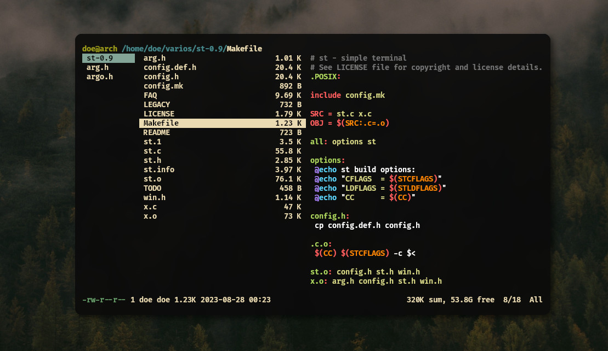
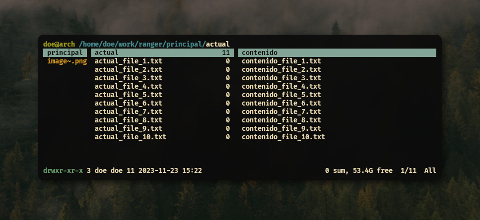
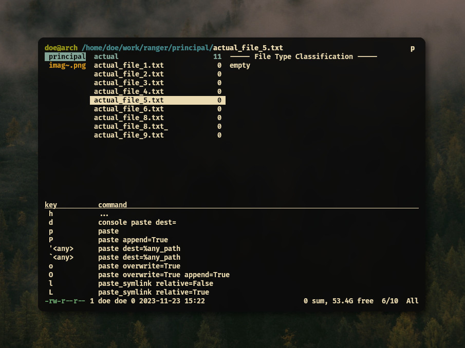
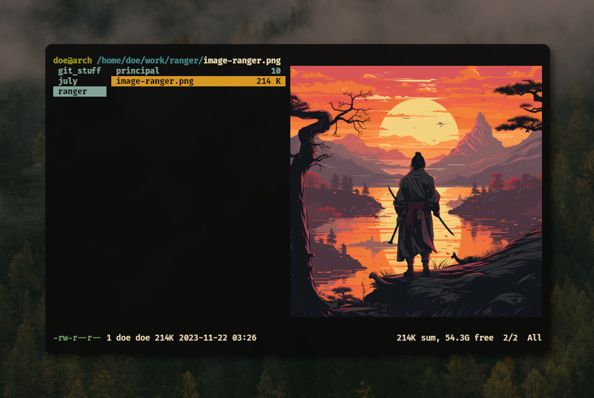

# Ranger: Administra tus archivos desde la terminal 
<b>By: <a href="https://github.com/msh-dv" target="_blank">Tony</a> - 23/11/2023</b>
<br>
<br>

Para la mayoría de usuarios usar los comandos `ls` y `cat` para visualizar los archivos y su contenido o `cp` y `mv` para copiarlos, moverlos o renombrarlos es más que suficiente, pero hoy vamos a ver una menera diferente y minimalista de hacerlo con ranger.

En esta breve guía veremos lo básico como su instalación, interfaz, atajos y configuración.




Ranger es un administrador de archivos minimalista basado en texto, escrito en Python y que usa combinaciones de teclas basadas en VI, así que sí estás familiarizado con [Vim](vim1.html) seguramente te resultara sencillo acoplarte a su uso.
Además de esto cuenta con `rifle` un poderoso lanzador de archivos, cuyo punto fuerte es que puede determinar automáticamente los tipos de archivos y con eso elegir que programa usar para abrirlos, sin necesidad de nuestra interacción. 

## Instalación

Aquí podrán encontrar varias formas de instalarlo dependiendo de su distribución:

**Arch Linux:**
```
sudo pacman -Sy ranger
```

**Debian / Ubuntu:** 
```
sudo apt install ranger
```

**Fedora:** 
```
sudo dnf install ranger
```

**Gentoo:** 
```
sudo emerge -U app-misc/ranger
```

**PyPI:** 
```
pip install ranger-fm
```

Si quieres instalarlo manualmente clonando el repositorio, puedes revisar el proceso [aquí](https://github.com/ranger/ranger#installing)

## Interfaz

La ventana principal muestra de manera predeterminada tres columnas (columnas de Miller):



- La columna de la izquierda muestra el directorio principal, con el directorio actual resaltado.
- La columna central muestra el directorio actual.
- La columna derecha muestra una previsualización del directorio seleccionado o de los archivos seleccionados.

En la parte superior podremos encontrar la ruta del directorio actual y en la parte inferior podremos ver los atributos del archivo actual.

Si ya tienes experiencia con Vim, entonces ya conoces algunas formas de trabajar con ranger, como usar las teclas `hjkl` para moverte entre directrios y archivos, así también comparte algunos modismos con Vim. Por ejemplo: `yy` (copiar), `pp` (pegar), `dd` (cortar). Puedes usar funciones más complejas desde la línea de comandos usando `:` como en Vim.

## Navegando en ranger

Como mencione anteriormente podemos usar las teclas de movmimiento de Vim o las flechas de movimiento:
```
    k    --- arriba
  h   l  --- izquierda o regresar / derecha o entrar
    j    --- abajo
```

La tecla `l` sirve para entrar a directorios, para ejecutar programas, abrir imágenes, etc.

Se puede usar `i` para inspeccionar un archivo, por lo que se pondra en pantalla completa, nos podremos desplazar por el y podemos volver a presionar `i` para salir de la inspección.
Podemos usar también `q` para salir de la inspección, o para salir de una pestaña activa o para salir del mismo ranger.

## Atajos de teclado y sugerencias

Se pueden hacer muchos comandos utilizando sus atajos de teclado, haciendo uso de las sugerencias.
Las sugerencias se muestran cada vez que al presionar una tecla hay multiples acciones disponibles como:

+ `g` para la navegación y pestañas, `r` para el comando `:open_width`, `y` para copiar y `d` para cortar/eliminar.<br> 
+ `p` para `paste` (pegar).<br>
+ `o` para ordenar.<br>
+ `.` para filter_stack.<br>
+ `z` para cmabiar ajustes, `u` para deshacer.<br>
+ `M` para linemode.<br>
+ `+,-,=` para establecer los derechos de acceso a archivos.<br>

Las sugerencias consisten en teclas del lado izquierdo y su comando correspondiente de lado derecho



### Pestañas

Si quieres separar algunos directorios a la hora de trabajar, puedes usar la opción de crear una pestaña dedicada al directorio que elijas. Las pestañas están numeradas. Para cambiar de pestaña, puedes presionar `Alt-N`, donde `N` es el número de pestaña a la que quieres moverte, si esta pestaña no existe, será creada, también puedes usar `Tab` o `Shift-Tab` para moverte entre ellas y las puedes cerrar con `q`.

## Configuración básica

Ranger usa 4 archivos de configuración principales:

- `rc.conf` es utilizando para varias opciones de configuración y atajos de teclado a funciones (más adelante veremos como habilitar la previsualización de imágenes).
- `rifle.conf` decide qué programa se utiliza para abrir los archivos.
- `scope.sh` es un shell script utilizado para generar previsualizaciones para varios tipos de archivos.
- `commands.py` contiene varias implementaciones de funciones, escritas en Python, utilizadas para modificar el comportamiento de `ranger` e implementar tus propios comandos.

Puedes utilizar:
```
ranger --copy-config=all
```
para copiar todos los archivos de configuración predeterminados a la ruta `~/.config/ranger`, puedes reemplazar `all` por `rc, rifle, scope y commands` cualquiera de los archivos que quieras copiar

Al final, deberías tener estos archivos en tu `~/.config/ranger`:
```
commands.py  rc.conf  rifle.conf  scope.sh
```

Se recomienda solo añadir tus opciones y atajos al archivo `rc.conf`, en lugar de hacer una copia completa de la configuración predeterminada.

## Previsualizaciones

Las previsualizaciones de nuestros archivos están ofrecidas por `scope.sh`. Es un shell script normal y su comportamiento está bien documentado en los propios comentarios del archivo.

Se puede reemplazar scope.sh por un script en otros lenguajes o binarios nuestros. Solo debe seguir las convenciones de llamada de scope.sh y sus códigos de retorno.

### Previsualizar imágenes
Como ultima sección, veremos como podemos previsualizar imágenes desde ranger. Sí, se pueden ver imágenes en ranger, aunque solo está disponible para algunas terminales, en el caso de este blog, se usó Kitty.



Ranger admite previsualizaciones fiables en algunas terminales como `urxvt`,`iTerm2`,`Kitty` o `Terminology`. Para habilitarlo, dirígete a tu archivo `rc.conf` y añade las siguientes líneas:

```
set preview_images true
set preview_images_method kitty
```
Con esto ya podríamos ver nuestras previsualizaciones, si quieres ver como hacerlo en las otras terminales, puedes verlo [aquí](https://github.com/ranger/ranger/wiki/Official-User-Guide#image-previews)

*Y eso sería todo, con esta guía básica deberías tener las bases para usar ranger, cubriré más temas en futuras entregas, gracias por leer.*


