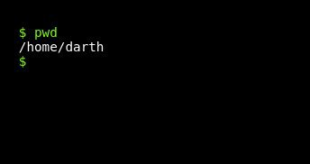
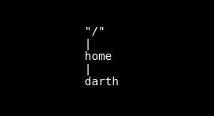
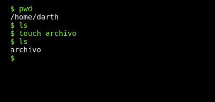
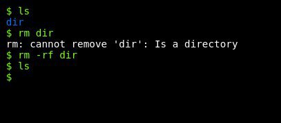
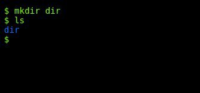

# Bash::Manejando la Terminal - De 0 a 1000 #2
<b>By: Darth Venom - 09/11/2020</b>
<br>
<br>
En el blog anterior se mencionó que una de las tantas cosas que se puede hacer en la terminal es administrar los archivos. En este blog veremos cómo crear, modificar y eliminar archivos. También veremos cómo movernos dentro del sistema de archivos.

<center>En una sesión de terminal, la shell siempre estará apuntando a un determinado directorio del sistema de archivos. De esta manera es que podemos movernos entre directorios y revisar el contenido de cada uno. Al abrir una sesión de terminal, bash se iniciará apuntando al directorio `/home/$USER`, donde `$USER` es el nombre del usuario.</center>

En el caso de que se use termux, el directorio al que apunta al iniciar es `/data/data/com.termux/files/home`

El primer comando de navegación que se mostrará es `pwd`. `pwd` es un comando que devuelve la ruta absoluta* del directorio actual al que está apuntando bash en el momento de la ejecución del comando.



## Ruta absoluta

<center>Cuando haya que moverse entre directorios, habrá que especificar una ruta a la cuál moverse. Una ruta es una ubicación, un punto en el sistema de archivos. Hay dos tipos de rutas, uno de ellos es el tipo de ruta absoluta.</center>

La ruta absoluta de un directorio implica especificar todo el recorrido desde el directorio raíz `/` hasta este. Por ejemplo, si miramos la imagen anterior, la ruta absoluta del directorio darth es `/home/darth`. Para ilustrarlo de otra forma:



[C]Cuando se especifica una ruta absoluta hay que tener en cuenta que el caracter "/" sólo se puede referir al directorio raíz cuando va al principio de la ruta, después se lo usa para especificar un directorio u otro tipo de archivo dentro de otro directorio.

En `/home/darth`, el primer / hace referencia al directorio raíz, el segundo / entre home y darth indica que dentro de home está darth.

Si el ejemplo fuese `/home/darth/dir/archivo1`, puesto en palabra sería: el archivo "archivo1" dentro del directorio "dir" que está dentro del directorio "darth", que está dentro del directorio "home", que está dentro del directorio raíz. Eso es una ruta absoluta.

## Ruta relativa

Las rutas relativas, a diferencia de las absolutas, son aquellas que constan en especificar directorios que estén dentro del directorio actual. Por ejemplo, si se está en el directorio `/home` y se quiere pasar a `/home/darth`, no hace falta obligatoriamente especificar la ruta absoluta, sino que se puede directamente especificar darth, ya que es relativo a home. Si hubiera un directorio llamado dir dentro del directorio darth, podríamos acceder a él desde `/home` usando la ruta relativa `darth/dir`, la ruta absoluta sería `/home/darth/dir`.

# Gestión de archivos

## Navegación entre directorios

Para navegar entre directorios usaremos el comando `cd`, la sintaxis es:
```
cd [ruta]
```
La ruta que podemos pasarle a `cd` puede ser absoluta o relativa, para chequear en qué directorio estamos se puede usar `pwd` en todo momento. Si a `cd` no se le pasa ninguna ruta, apuntará hacia el directorio `$HOME`. Si quieres comprobar cuál es tu directorio `$HOME` puedes usar el comando `echo $HOME`

Todos los directorios tienen dos archivos especiales en su interior, estos son `.` y `..`, el primero es un archivo especial que apunta al mismo directorio y el segundo es un archivo especial que apunta al directorio anterior. Entonces, si estamos en `/home` y queremos pasar a `/` podemos usar `cd` con la ruta absoluta `cd /` o con la ruta relativa `cd ..`.

Para ver qué hay dentro de un directorio se usa el comando `ls`. La sintaxis de ls es:
```
ls [opción] [ruta]
```

Si a ls no se le pasa una ruta, mostrará el contenido del directorio actual. Generalmente `ls` muestra los archivos con distintos colores. Si no se muestran colores, se puede usar la opción `--color=auto`

Los colores de los archivos que muestra `ls` son:

Verde: Archivos ejecutables
Blanco: Archivos comunes
Azul: Directorios
Celeste: Enlaces simbólicos
Rojo: Archivos comprimidos (.tar, .gz, .zip)

## Administración de archivos

Para crear archivos vacíos se usa el comando touch seguido de la ruta y el nombre del archivo que se desea crear, en este blog no veremos cómo editar el contenido de un archivo, eso se dejará para otro momento. Si sólo se introduce un nombre de archivo, se tomará como ruta relativa y se creará en el directorio actual.
```
touch [opción] [ruta]
```



Para remover archivos se usa el comando `rm` seguido de la ruta del archivo que se desea eliminar, recuerda que puedes escribir directamente el nombre de un archivo que esté en el presente directorio, ya que es una ruta relativa.

Para eliminar directorios se usa la opción `-rf` de `rm`. La sintaxis de `rm` es:
```
rm [opción] [ruta]
```



También está el comando `rmdir`, pero sólo elimina directorios vacíos.

Para crear directorios, se usa el comando `mkdir` seguido de la ruta y el nombre del directorio que se desea crear. Si sólo se introduce un nombre de directorio, se tomará como ruta relativa y se creará en el directorio actual.



Para finalizar, podemos leer el contenido de un archivo usando el comando `cat` seguido de la ruta del archivo.
```
cat [opción] [archivo]
```
En el siguiente post trataremos cómo instalar paquetes a través de los distintos gestores de paquetes.
<br>
<hr>
*El blog ha llegado a su fin. Si tienes dudas puedes contactarme en Discord. Soy venom_instantdeath.*
