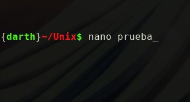
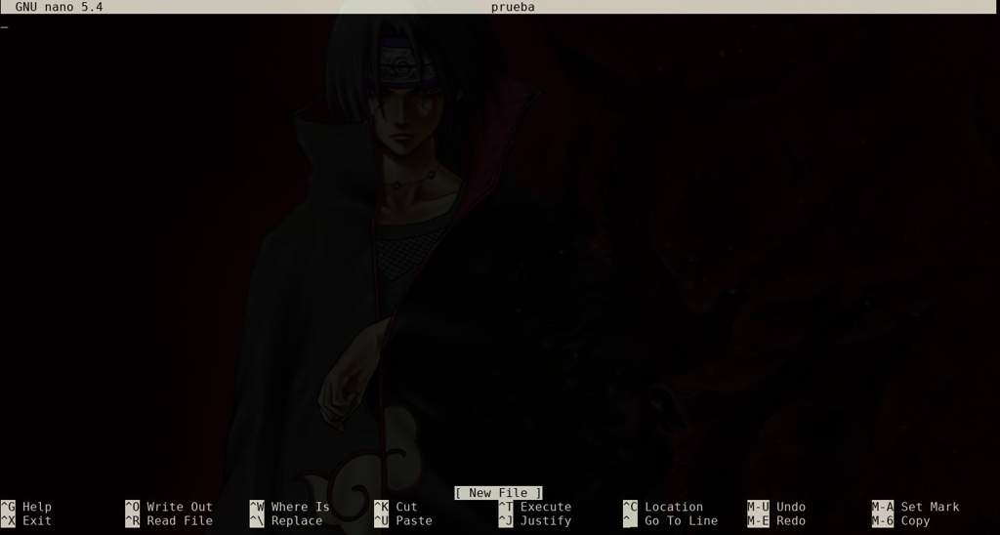
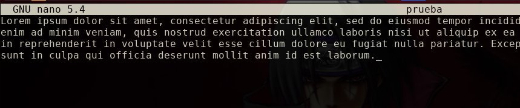
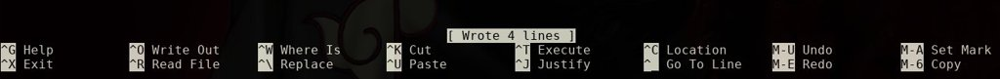
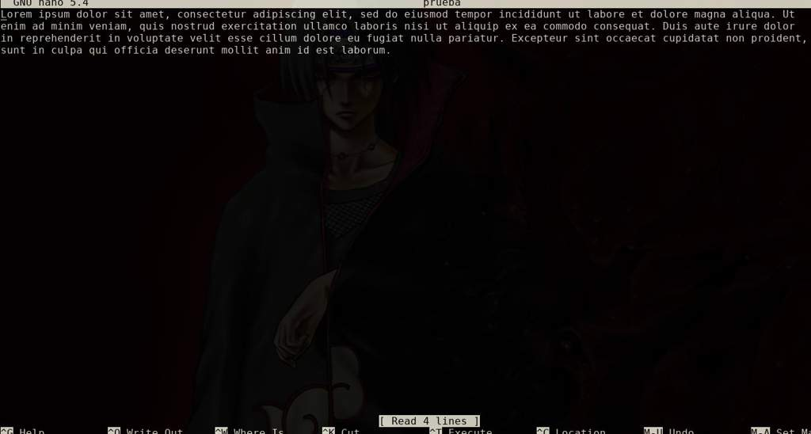
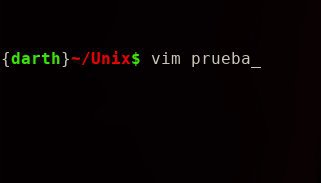
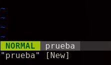
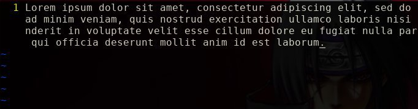
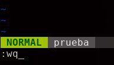
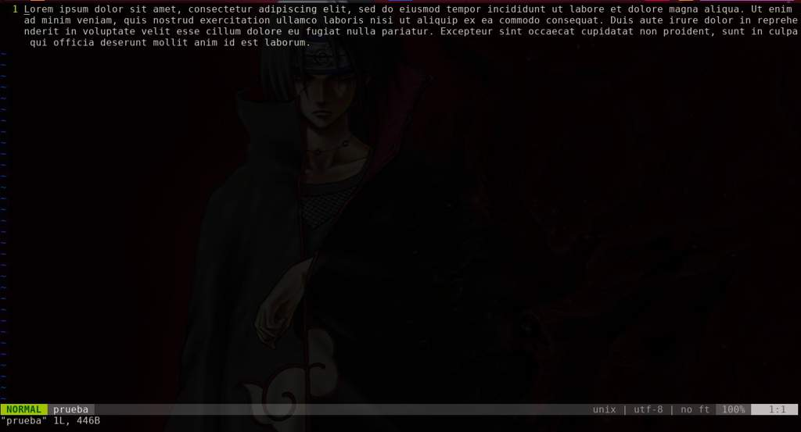

# Bash::Manejando la Terminal - De 0 a 1000 #4
<b>By: Darth Venom - 27/12/2020</b>
<br>
<br>
En esta ocasión aprenderemos sobre edición de texto, escribir y editar archivos desde la terminal. Esto significa que aprenderemos a escribir cosas dentro de los archivos. Esto lo podemos utilizar para cualquier cosa, ya sea escribir notas, documentos formales o programas.

Como la edición de texto no tiene realmente mucha ciencia por detrás, este no será un blog muy extenso. De todas maneras cubriremos básicamente como es la edición de texto en dos de los editores más usados: Nano y Vim. Ambos son editores de texto para la terminal, si hasta ahora no te familiarizaste mucho, puede parecerte raro, sin embargo es muy cómodo, rápido y simple. De cada editor se explicarán los comandos más básicos que el lector pueda llegar a necesitar para una edición simple, más adelante se hará un tutorial un poco más avanzado sobre cada editor, pero por separado.

## Nano

Si no tienen el editor instalado, [instálenlo](http://aminoapps.com/p/yc3te5).

Para comenzar a editar se debe invocar al editor, en este caso Nano. Para esto se usa el comando nano. Si se invoca al editor junto a un argumento, nano intentará abrir un archivo que se llame igual que el argumento con el que se invocó al editor, si este archivo no existe, se creará tras guardar. Si nano se invoca sin argumentos, sólo se abrirá y al momento de guardar se pedirá un nombre.

Comencemos, crearemos un archivo llamado "prueba". Para esto podemos usar:
```
touch prueba
nano prueba
```
O simplemente usar:
```
nano prueba
```

Ya que como dijimos antes, si el archivo no existe, nano lo creará.



Una vez dentro, encontraremos que todo esta vacío, para que todo esto tenga sentido y podamos demostrar cómo funciona el editor, procederemos a escribir cualquier cosa.





Ahora supongamos que terminamos de escribir y ya queremos guardar lo que hicimos. Para eso se usa el atajo `CTRL+s`, y para salir se usa `CTRL+x`. En la parte inferior de nano se encuentran los distintos atajos que el usuario puede aprovechar, rápidamente se puede notar que los atajos se componen del símbolo `^` y una letra u otro símbolo, el símbolo `^` significa CTRL, así que si por ejemplo aparece `^x` significa `CTRL+x`. Y en los atajos que empiezan con "M-", la `M-` signfica ALT. O sea, sí dice `M-U` significa `ALT+U`.



Si deseamos volver a abrir el documento, como ya dijimos anteriormente, sólo se debe volver a usar el mismo comando, pero en este caso nano no creará ningún archivo porque el archivo "prueba" ya existe, entonces lo abrirá.
```
nano prueba
```


Eso es lo básico que se tiene que saber para editar textos en nano. Crear archivos, abrir archivos, guardarlos y salir.

<center>━━━━━━ ◦ ❖ ◦ ━━━━━━</center>

En orden de salvar tiempo, copiaré algunas partes de la explicación de nano en la explicación de vim ya que algunas cosas son exactamente iguales independientemente del editor y el autor no ha querido parafrasear.

<center>━━━━━━ ◦ ❖ ◦ ━━━━━━</center>

## Vim

Si no tienen el editor instalado, [instálenlo](http://aminoapps.com/p/yc3te5).

Para comenzar a editar se debe invocar al editor, en este caso Vim. Para esto se usa el comando vim. Si se invoca al editor junto a un argumento, vim intentará abrir un archivo que se llame igual que el argumento con el que se invocó al editor, si este archivo no existe, se creará tras guardar. Si vim se invoca sin argumentos, sólo se abrirá y al momento de guardar se pedirá un nombre.

Comencemos, crearemos un archivo llamado "prueba". Para esto podemos usar:
```
touch prueba
vim prueba
```
O simplemente usar:
```
vim prueba
```

Ya que como dijimos antes, si el archivo no existe, vim lo creará.



Una vez dentro, encontraremos que todo esta vacío, para que todo esto tenga sentido y podamos demostrar cómo funciona el editor, procederemos a escribir cualquier cosa. En vim hay principalmente dos modos, el modo Normal y el modo insert. El modo normal se puede usar para navegar por el texto y ejecutar comandos de vim, el modo insert se usa para escribir. Cuando se abre vim, el programa está en el modo Normal.



Como dijimos, vamos a escribir cualquier cosa, para eso entraremos en el modo insert presionando la tecla i.



Ahora supongamos que terminamos de escribir y ya queremos guardar lo que hicimos. Para eso volvemos al modo Normal usando la tecla ESC y luego escribimos el comando :w para guardar y luego el comando :q para salir. También se puede usar el comando :wq para guardar y salir.



Si deseamos volver a abrir el documento, como ya dijimos anteriormente, sólo se debe volver a usar el mismo comando, pero en este caso vim no creará ningún archivo porque el archivo "prueba" ya existe, entonces lo abrirá.
```
vim prueba
```


Eso es lo básico que se tiene que saber para editar textos en vim. Crear archivos, abrir archivos, guardarlos y salir.
<br>
<hr>
*El blog ha llegado a su fin. Si tienes dudas puedes contactarme en Discord. Soy venom_instantdeath.*
