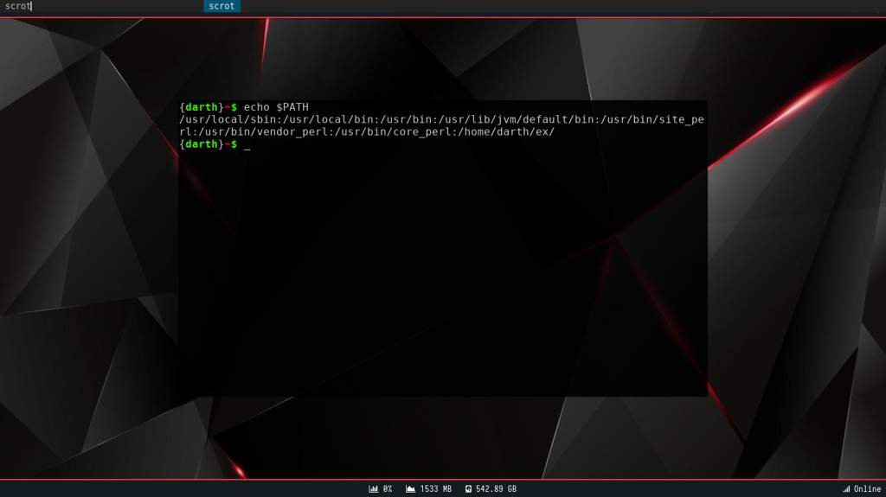
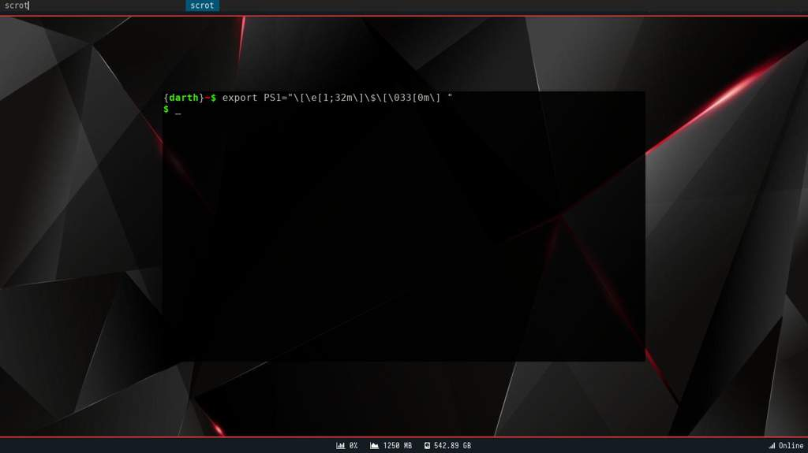

# Bash::Manejando la Terminal - De 0 a 1000 #7
<b>By: Darth Venom - 26/06/2021</b>
<br>
<br>
*En este capítulo veremos qué son las variables de entorno, para qué sirven, cuáles son las más comunes y cómo declararlas*

Las variables de entorno, a diferencia de las variables comunes, no son locales, sino que pueden ser obtenidas por los programas que sean ejecutados por la shell independientemente del lenguaje en el que hayan sido programados.

Entonces, si tenemos una variable de entorno llamada `$PWD`, que contiene un string con el directorio actual en el que estamos trabajando, no sólo podremos acceder a esta variable desde la shell, sino que también podrán acceder a ella los programas que hayan sido ejecutados desde esa sesión de shell.

*Hay variables de entorno predefinidas por la shell, y esto puede variar según la shell y según el sistema operativo; en esta serie de blogs sólo usaremos a bash como shell de referencia y GNU/Linux como sistema operativo. Conocer estas variables pueden simplificar tareas, ahorrar tiempo o ayudar a conocer información de forma sencilla.*

*Tras haber explicado qué es una variable de entorno, veremos cómo declararlas y cuáles algunas de las variables predefinidas de uso más frecuente.*

Como habíamos dicho, bash trae variables de entorno predefinidas, pero podemos declarar nuevas. Para hacerlo usamos la palabra clave export. La sintaxis es la siguiente:
```
export nombre=valor
```

Ejemplo:
```
export OS=Arch
```

A continuación, 15 de las variables de entorno predefinidas más comunes. Para probarlas se pueden imprimir como cualquier otra variable usando `echo`.
```
echo $variable
```

### $USER

Esta variable contiene el nombre del usuario.

### $HOME

Contiene la ruta absoluta al directorio principal del usuario. Ejemplo de un directorio HOME suponiendo que el usuario se llama X: `home/X`

### $PWD

Esta variable contiene la ruta absoluta al directorio actual en el que se está trabajando. `$PWD` contiene lo mismo que la respuesta del comando `pwd`.

### $VISUAL

Esta es una variable que puede no estar definida por defecto en el sistema, pero muchos programas revisan si existe. La variable `$VISUAL` en caso de existir, contiene el nombre del editor de texto por defecto en el sistema.

Ejemplo de `$VISUAL`:


Por supuesto que si se quiere cambiar el editor por defecto basta con sobreescribir el valor de esta variable. Por ejemplo, si el editor por defecto es vim y queremos cambiarlo por nano, usamos:
```
export VISUAl=nano
```
Esto sólo cambiaría el valor de la variable en la shell actual, pero modificar el valor permanentemente, hay que editar el archivo de configuración de bash para que ese export se ejecute cada vez que se abra la shell. Esto lo veremos en el siguiente capítulo.

### $DISPLAY

La variable `$DISPLAY` contiene información útil para Xorg, el sistema de ventanas más utilizado en GNU/Linux. Esta variable por lo puede contener el hostname del equipo (que es un nombre configurable) y el número del monitor al que se tiene que referir, por lo general este dato es 0. Para más información acerca de esta variable de entorno se puede buscar más información en el [manual de X](https://linux.die.net/man/7/x).

### $TERM

Contiene el tipo de terminal que se está usando. Depende de lo que contenga esta variable podrían cambiar las capacidades de la terminal.

### $SHELL

Esta variable contiene la ruta a la shell por defecto en el sistema. Siendo que bash suele ser la shell predeterminada, el valor de `$SHELL` generalmente es: `/bin/bash`

### $LANG

Contiene el idioma configurado del sistema. A través de variables como estas, un programa puede decidir qué lenguaje usar durante la ejecución.

### $PATH

Esta variable es una variable muy usada por bash. Contiene los directorios en los que bash debe buscar la existencia de los comandos que se introduzcan en la shell. Por ejemplo, al usar el comando `rm`, bash buscará en uno de los directorios de `$PATH` y en este caso lo encontrará en `/usr/bin`. Los directorios en esta variable están separados por dos puntos.

Ejemplo de `$PATH`:



*Para añadir un directorio al PATH, se debe reasignar a la variable su valor anterior sumado al nuevo directorio.*

Por ejemplo, si se quiere añadir el directorio `/opt` al PATH se usa:
```
export PATH="$PATH:/opt"
```
Esto sólo cambiaría el valor de la variable en la shell actual, pero modificar el valor permanentemente, hay que editar el archivo de configuración de bash para que ese export se ejecute cada vez que se abra la shell. Esto lo veremos en el siguiente capítulo.

### $PS1

Esta variable contiene el prompt de bash. Para aquellos lectores que desconozcan qué es un prompt:

> Prompt: Un prompt es un conjunto de caracteres que se muestran en un programa para indicar que se tiene que ingresar algo a través del teclado.

En `$PS1` se encuentra el prompt, por defecto el valor es `"\$ "`. Como ocurre con el resto de variables, puede modificarse reasignando un nuevo valor. En la siguiente imagen se puede ver como se cambia desde un prompt personalizado al prompt que viene por defecto redeclarándolo:



El prompt puede contener varios caracteres especiales que luego son interpretados y reemplazados por bash, esto lo cubriremos dentro de dos capítulos.

### $BASH

Contiene la ruta absoluta al ejecutable de la shell actual.

### $?

Esta variable contiene el código de error del último programa ejecutado. Cuando un programa se ejecuta exitosamente, su código de error es 0, si en cambio hay un error durante la ejecución del programa, el código de error será distinto a 0 y según el programa el número del código de error puede significar algo distinto.

### $HOSTTYPE

Su valor hace referencia a la arquitectura del procesador. Básicamente indica si es de 32 o 64 bits.

### $UID

Esta variable es una constante, es decir, no se puede cambiar su valor. Indica el número de identificación del usuario. Entre usuarios este número puede cambiar, pero generalmente se mantiene que el usuario root lleva el UID 0.

<center>━━━━━━ ◦ ❖ ◦ ━━━━━━</center>

Conocer estas variables o por lo menos algunas de ellas es algo muy útil y puede simplificar varias tareas.
<br>
<hr>
*El blog ha llegado a su fin. Si tienes dudas puedes contactarme en Discord. Soy venom_instantdeath.*
