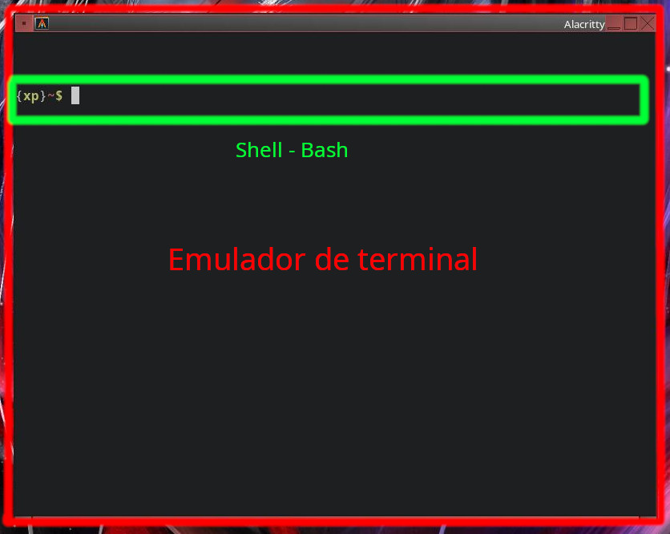

# Bash De 0 a 1000 #9
<b>By: Darth Venom - 28/03/2022</b>
 
 
Es bastante común, tanto entre las personas que van iniciándose en la programación o el pentesting como en las personas avanzadas en estos temas, que tengan definiciones erradas sobre lo que es la terminal o lo que es un comando. Es así que este capítulo está enfocado en explicar de forma concisa lo que es la terminal, y cuál es la verdadera definición de "comando". Las definiciones más confusas se suelen encontrar más entre usuarios de GNU/Linux con conocimientos básicos o intermedios; incluso a veces se emplean términos como "la terminal de Debian" o "la terminal de Ubuntu" como si hubiesen "terminales" distintas, o como si Bash fuese "otro Bash" en cada distribución GNU/Linux.

## ¿QUÉ ES LA TERMINAL?

Prosiguiendo, una terminal es el conjunto de driver de terminal, emulador de terminal y shell (consola). Estos tres elementos juntos conforman lo que llamamos terminal. El driver de terminal es complejo y ampliar sobre ello es algo que puede parecer chino básico para algunas personas, así es que se mantendrá el enfoque en definir lo que es un emulador de terminal y qué es una shell.

Un emulador de terminal es un programa cuya función es emular el comportamiento de las antiguas terminales, los teletipos. Se puede decir que los emuladores de terminal son la versión moderna y digital de los teletipos. Al ejecutar un emulador de terminal este realizará algunas tareas previas a que el usuario pueda escribir o leer cosas en la ventana. Entre las tareas de un emulador de terminal está la interacción con el driver de terminal para poder habilitar el I/O (lectura/escritura), y al acabar con las configuraciones principales procede a invocar a la shell por defecto, generalmente Bash.

O sea, cuando se abre una terminal, el emulador de terminal sería sólo la ventana. El programa que se encarga de interpretar comandos es otro, la shell.

Una shell, en cambio, es un programa cuya función es tomar comandos que el usuario escribe, y al dar enter los interpreta y actúa en consecuencia.

Cuando decimos que abrimos una terminal, lo que abrimos es el emulador de terminal, y luego el emulador de terminal, como habíamos dicho, hace algunos procedimientos y luego abre una shell. Es decir que cuando escribimos comandos, no los interpreta el emulador de terminal, los interpreta la shell. Para entenderlo mejor vea la siguiente imagen que señala los dos elementos visibles de lo que llamamos terminal.

En esta imagen se puede apreciar los dos componentes visibles de la terminal, el emulador de terminal está señalado en color rojo y es toda la ventana, y dentro de un emulador de terminal se pueden abrir procesos como la shell u otros programas y luego el mismo emulador de terminal conectará dicho proceso al stdin (standard input), stdout (standard output) y stderr (standard error), que es lo que llamamos descriptores de archivos. Cuando decimos que el emulador conecta el proceso a stdin, stdout y stderr puede sonar a chino básico, pero se puede entender como "el emulador le da al proceso el poder de lectura y escritura". Lo anterior significa que el proceso podrá ahora "escribir" que significa que podrá imprimir texto en la ventana del emulador, y "leer" que significa que podrá detectar las teclas que presiona el usuario a través del teclado.
 
Dentro del emulador el primer proceso que se abre es la shell por defecto (generalmente Bash), lo que aparece marcado en color verde es la salida de Bash, es decir lo que ha escrito Bash, porque Bash al igual que cualquier programa es un proceso que corre en la memoria, lo que vemos en la pantalla es sólo su salida (lo que escribe).
 

	<i><b>Hasta aquí ya sabemos qué es un emulador de terminal y qué es una shell.</b></i>

 
Al principio dije que una terminal era el conjunto de tres elementos, y dos de ellos ya fueron explicados, el emulador y la shell. El elemento que falta es "el driver de terminal" o también conocido como "driver de TTY". El driver de TTY es el controlador responsable de habilitar la conexión a los descriptores de archivos como stdin, stdout y stderr, que es lo que habíamos resumido antes como "el emulador le da al proceso el poder de lectura y escritura". Para que el emulador le conceda al proceso el poder de lectura y escritura tiene que primero conseguir el acceso a los descriptores de archivos, y ese acceso se lo da el driver de TTY. Cuando el emulador llama a la shell, este emulador conecta el proceso de la shell a estos descriptores de archivo, y así es como la shell o cualquier otro proceso puede escribir en la terminal o leer nuestras teclas.
 

<u><i>ACLARACIONES ADICIONALES</i></u>

 
El emulador de terminal es un programa a parte de la shell, y hay muchos emuladores y hay muchas shells que se pueden instalar.
Así es que podemos afirmar que la terminal no viene con el sistema o con la distribución que use el usuario, sino que son programas que no vienen con la distribución (a excepción de la TTY, que viene incluida en el kernel)
 
## ¿QUÉ SON LOS COMANDOS?<

Los comandos que introducimos en una shell no están todos incluidos en una shell. Estos comandos son ordenes que se le pasan a la shell para que esta la interprete. Se dividen en dos categorías:

### COMANDOS BUILT-IN

Los comandos Built-in son aquellos comandos que vienen integrados en la shell, y son comandos que pueden no estar disponibles en otras shells. La cantidad de comandos built-in no son tantos. En bash son un total de 76 comandos y elementos sintácticos.

### PROGRAMAS

Las shells tienen un órden de análisis en el cual comprueban si lo escrito es un comando o no. Primero las shells suelen buscar si lo ingresado se trata de un [alias](term5.html), de un comando built-in, o de un programa. Si la shell no detecta que el comando era un alias o uno built-in va a buscar en unas rutas especiales si hay un programa que tenga el nombre del comando ingresado.
 
Las anteriormente mencionadas rutas especiales son las que se encuentran contenidas en la variable $PATH. Dentro de ella están las rutas separadas por dos puntos ":".
 
Si se ingresa el comando `pwd`, la shell buscará en todas las rutas de `$PATH` para ver si se encuentra un programa llamado `pwd`, y en este caso `pwd` está en todos los sistemas Unix y Unix-like, y por ende lo encontrará típicamente en la ruta `/usr/bin/pwd`.
 
La cantidad de programas existentes es de más mil millones, y se pueden instalar en cualquier sistema compatible; otra razón por la que un comando en una distribución como Debian no es parte de la "terminal de Debian" sino que simplemente puede ser un programa instalado en este sistema, y para usarlo en otro sistema basta con instalarlo.
 

*El blog ha llegado a su fin. Si tienes dudas puedes contactarme en Discord. Soy venom_instantdeath.*
