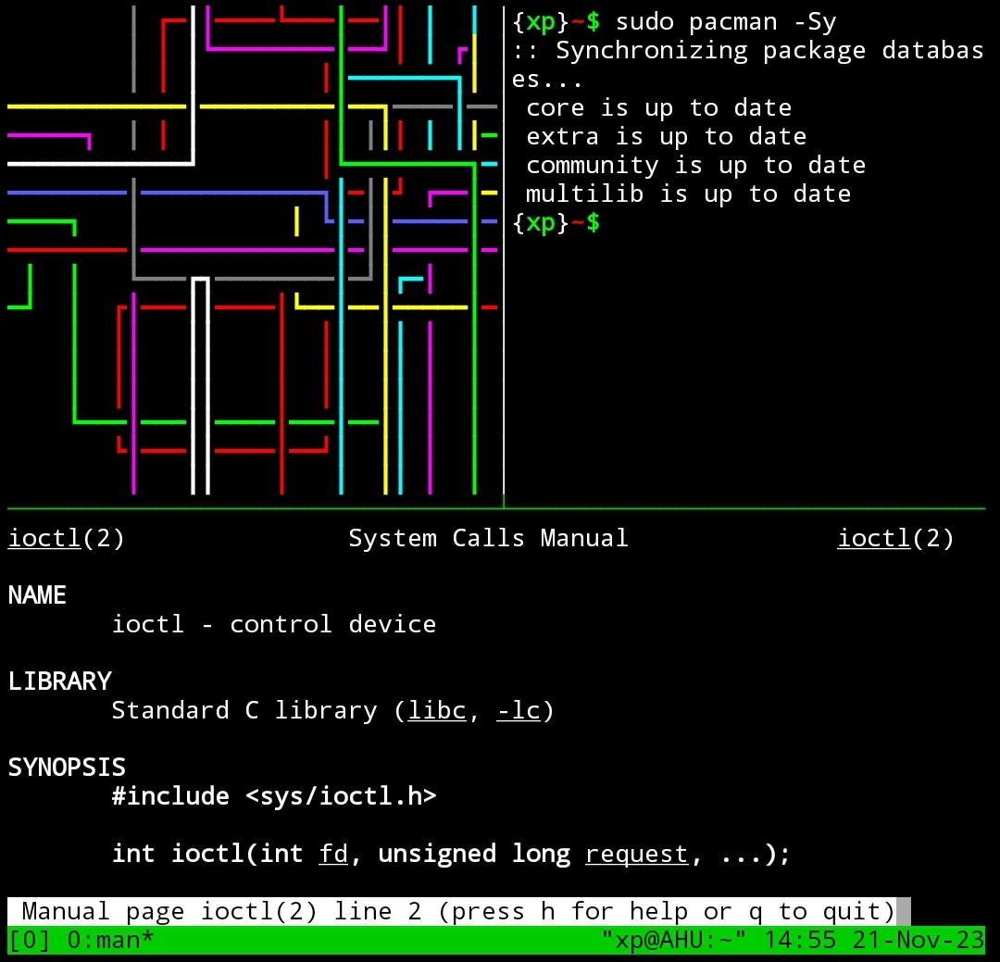

# Instalar y usar tmux
<b>By: Darth Venom - 24/12/2020</b>
 
 
*En este blog vamos a introducir tmux y veremos como instalarlo y usarlo.*

Tmux es un multiplexor de terminal para sistemas tipo unix que permite dividir una consola en varias secciones o generar sesiones independientes en la misma terminal. Es similar a Terminator, solo que tiene varias ventajas por encima de este.

La instalación y funcionamiento son sencillos, toma un momento acostumbrarse, luego se vuelve cómodo y en varias ocasiones puede resultar muy efectivo.

## Instalación

Para comenzar con la instalación vamos a abrir una instancia de terminal y procederemos a [instalar Tmux](term3.md).

Una vez se haya instalado tmux podrá abrirlo usando el comando `tmux`.

## Funcionamiento

El funcionamiento es sencillo, solo basta con acostumbrarse a los atajos del teclado para manejar el programa.

Los atajos constan de `CTRL+B` y una letra. Algunos atajos son los siguientes:

### Control de ventanas

`c` = crear una nueva ventana 
`w` = listar ventanas 
`n` = siguiente ventana 
`p` = ventana previa 
`,` = renombrar ventana 
`&` = eliminar ventana 

### Control de paneles (Divisiones)

`%` = division vertical 
`"` = division horizontal 
`q` = mostrar numero de paneles 
`x` = eliminar panel 
`flecha derecha` = mover hacia un panel a la derecha 
`flecha izquierda` = mover hacia un panel a la izquierda 
`flecha arriba` = mover hacia un panel arriba 
`flecha abajo` = mover hacia un panel abajo 

*Sabiendo eso ya podrás moverte con comodidad en tmux.* 
 

*El post ha llegado a su fin. Si tienes dudas puedes contactarme en Discord. Soy venom_instantdeath.*
