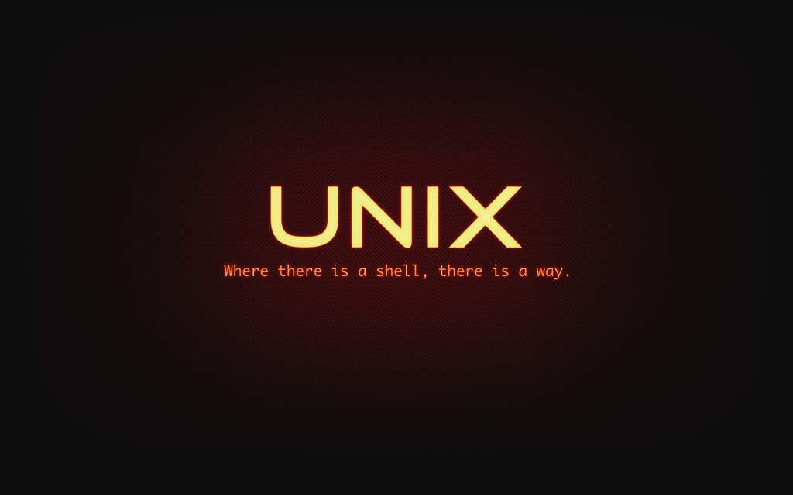

# UNIX::Introducción
<b>By: Darth Venom - 22/11/2023</b>
 
 
Para todos aquellos que estén buscando aprender a usar la terminal o aumentar sus conocimientos sobre Unix, les presento la nueva serie de blogs sobre Unix que estaré subiendo. Estos blogs también sirven para comprender GNU/Linux a fondo, ya que este sistema se creó para ser compatible con Unix.

*En esta serie de blogs se tratarán temas referentes a sistemas Unix, entre estos temas, el árbol de directorios, los deberes de los sysadmins, archivos especiales, sistemas de archivos, y ampliaremos sobre la terminal.*

**Unix es un sistema operativo** completo desarrollado en 1969 por un grupo de empleados de los laboratorios Bell de AT&T. En un principio, Unix fue escrito en lenguaje ASM (Assembler o Ensamblador), más tarde en 1972 decidieron reescribir Unix en C. Haberlo reescrito en C les garantizaba que Unix pudiera ser fácilmente modificado por ellos y por otros programadores, esto es importante ya que significa que iba a ser más rápido y sencillo crear variaciones nuevas de Unix adaptadas para distintas computadoras. Aparte de eso, ahora el código era más compacto y fácil de entender, muy favorable.

En el transcurso de 1975 salieron las versiones 4, 5 y 6 de Unix. Estas versiones introdujeron los *pipes* (tuberías), lo que permitió dar al desarrollo una orientación modular, esto hace que continuar con el desarrollo sea aún más rápido. En un próximo blog hablaremos de los pipes y los procesos. Más tarde en 1983 salió Unix System V (también llamado SysV), que introdujo al edito Vi y la librería Curses, de estas dos cosas también ampliaremos en otro blog.

Si bien Unix es un sistema operativo, también es una marca, y otros sistemas pueden ser llamados UNIX si cumplen ciertos requisitos, por ejemplo, ser 100% compatibles con Unix y que se encuentren certificados por la especificación Single Unix Specification; de lo contario, se lo llama Unix-like. Para poner esto con ejemplos, BSD es un sistema UNIX, AIX también es UNIX, en cambio GNU/Linux no lo es; es un sistema que a pesar de ser compatible con Unix, no es derivado del mismo, tiene un origen independiente. Para referirse al sistema Unix se suele usar el término Unix tradicional o se lo puede llamar por su versión, por ejemplo Unix System III.
 

*El post ha llegado a su fin. Si tienes dudas puedes contactarme en Discord. Soy venom_instantdeath.*
