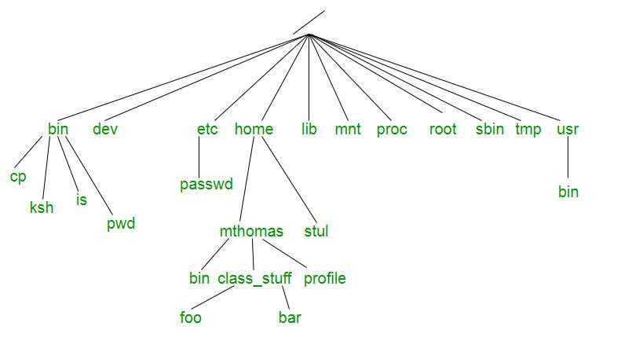

# UNIX::Árbol de directorios
<b>By: Darth Venom - 21/10/2020</b>
 
 
Si usaste Windows lo suficiente, te habrás dado cuenta de que las unidades de dispositivos llevan una letra que las representa, un ejemplo de esto es el Disco Duro principal siendo representado como `C:\` . También te habrás dado cuenta de que todos los archivos tienen que tener necesariamente una extensión en sus nombres para ser reconocidos, un archivo de texto debe tener la extensión `.txt`, un ejecutable debe ser `.exe`, etc. Todo eso será contradecido en este blog por un sistema mucho más ordenado, el sistema de archivos de Unix.

El sistema de archivos en el que se maneja Unix es un gran árbol de archivos que comienza desde una raíz. Todos los sistemas UNIX o Unix-like siguen este modelo, por ende, lo explicado aquí también sirve para sistemas como BSD o GNU/Linux.

*El sistema de archivos Unix tiene como objetivo organizar y almacenar de manera lógica grandes cantidades de datos de manera que sea fácil de administar. En este modelo, la unidad de almacenamiento más pequeña es el archivo.*

En Unix, el sistema de archivo tiene una estructura jerárquica donde el directorio\* de más alto nivel se llama raíz (root), este directorio se representa con una barra inclinada `/`. Debajo del directorio raíz hay varios subdirectorios\*, la mayoría de los cuales contienen archivos del sistema. Debajo de esto pueden existir archivos de sistema, archivos de aplicación y/o archivos de datos de usuario. De manera similar al concepto de relación padre-hijo del proceso, todos los archivos de un sistema Unix están relacionados entre sí. Es decir, los archivos también tienen una existencia de padres e hijos. Por lo tanto, todos los archivos (excepto uno) comparten un vínculo parental común, siendo el archivo superior (es decir, `/`) la excepción.

Un diagrama puede ayudar a comprender lo dicho anteriormente. En el diagrama de abajo se puede ver exactamente como es que el directorio raíz (`/`) está por encima de todo y hay directorios del sistema justo debajo del mismo.

Si bien este diagrama no lo incluye todo, los siguientes directorios están presentes en la mayoría de los sistemas de archivos Unix:

`bin`: abreviatura de binarios, este es el directorio donde residen muchos comandos ejecutables de uso común

`dev`: contiene archivos específicos del dispositivo

`etc`: contiene archivos de configuración del sistema

`home`: contiene directorios y archivos de usuario

`lib`: contiene todos los archivos de la biblioteca

`mnt`: contiene archivos de dispositivo relacionados con dispositivos montados

`proc`: contiene archivos relacionados con los procesos del sistema

`root`: el directorio de inicio del usuario root (Es distinto a /, este es /root)

`sbin`: los archivos binarios del sistema residen aquí. Si no hay un directorio sbin en su sistema, lo más probable es que estos archivos residan en, etc.

`tmp`: almacenamiento de archivos temporales que se eliminan periódicamente del sistema de archivos

`usr`: también contiene comandos ejecutables

## Tipos de archivo

**En el sistema de archivos de Unix, todo se trata como un archivo. Incluso dispositivos como impresoras y unidades de disco.**

Para un usuario acostumbrado a Windows esto puede resultar confuso. Dado que todos los datos son esencialmente un flujo de bytes, cada dispositivo puede verse lógicamente como un archivo.

Todos los archivos del sistema de archivos Unix se pueden clasificar en 3 tipos, específicamente:

1. Archivos ordinarios
2. Archivos de directorio
3. Archivos de dispositivo

*Si bien los dos últimos pueden no parecer archivos intuitivamente, se consideran "archivos especiales".*

El primer tipo de archivo mencionado anteriormente es un **archivo regular**, es decir, un archivo sin "especialidad". Los archivos ordinarios se componen de flujos de datos (bytes) almacenados en algún dispositivo físico. Los ejemplos de archivos ordinarios incluyen archivos de texto simples, archivos de datos de aplicaciones, archivos que contienen código fuente de alto nivel, archivos de texto ejecutables y archivos de imágenes binarias. Tenga en cuenta que, a diferencia de otras implementaciones de sistemas operativos, los archivos no tienen que ser imágenes binarias para ser ejecutables (más sobre esto por venir).

El segundo tipo de archivo enumerado anteriormente es un archivo especial llamado **directorio** (Similar al concepto de carpeta en Windows. No le llame carpeta). Los archivos de directorio actúan como un contenedor para otros archivos de cualquier categoría. Por lo tanto, podemos tener un archivo de **directorio** contenido dentro de un archivo de directorio **(esto se conoce comúnmente como subdirectorio)**. Los archivos de directorio no contienen datos en el sentido de datos del usuario, simplemente contienen referencias a los archivos contenidos en ellos.

*Quizás sea digno de mención en este punto que cualquier "archivo" que tenga archivos directamente debajo (contenidos dentro) de él en la jerarquía debe ser un directorio, y cualquier "archivo" que no tenga archivos debajo de él en la jerarquía puede ser un archivo regular, o un directorio, aunque vacío.*

La tercera categoría de archivo mencionada anteriormente es un archivo de dispositivo. Este es otro archivo especial que se utiliza para describir un dispositivo físico, como una impresora o una unidad portátil. Este archivo no contiene ningún dato, simplemente mapea cualquier dato que llegue al dispositivo físico que describe.

*Los tipos de archivos de dispositivos generalmente incluyen: archivos de dispositivos de caracteres, archivos de dispositivos de bloques, sockets de dominio Unix, canalizaciones con nombre y enlaces simbólicos. Sin embargo, pueden que no todos estos tipos de archivos estén presentes en varias implementaciones de Unix.*
 

*El post ha llegado a su fin. Si tienes dudas puedes contactarme en Discord. Soy venom_instantdeath.*
