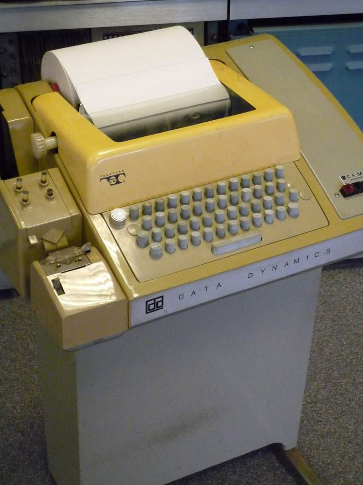
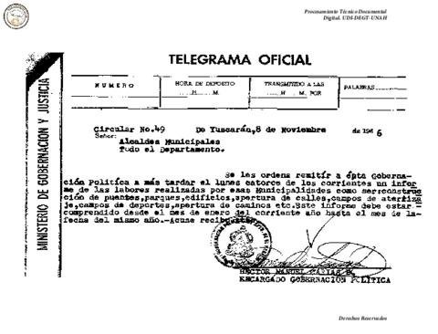
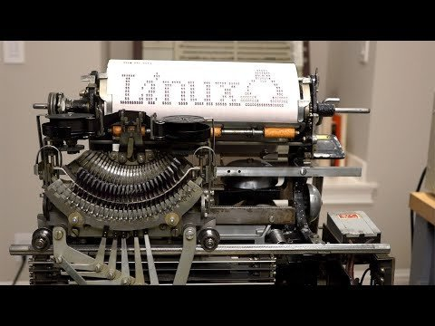
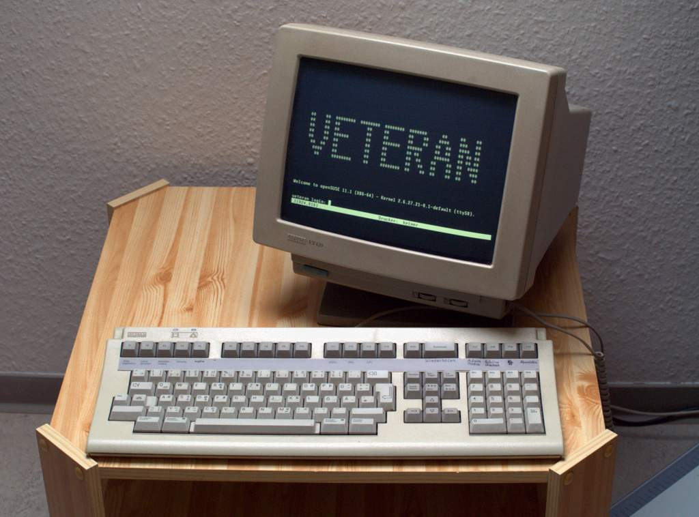
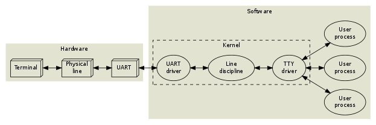
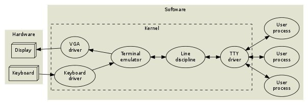

# UNIX::Subsistema de TTY
<b>By: Darth Venom - 22/10/2020</b>
 
 
*Es notable que la orientación de esta comunidad promueve el uso de software libre y cuenta con blogs que permiten que cualquier usuario pueda introducirse cómodamente al mundo de GNU/Linux.*

Como introducción está perfecto, este no será uno de los blogs introductorios a GNU/Linux, sino que se tratará en profundidad un tema más avanzado; el concepto de TTY, el funcionamiento de una terminal, los emuladores de terminal y los intérpretes de comandos.

*El sistema de TTYs es central y fundamental en el diseño de Unix y GNU/Linux*. Durante el arranque, entre las primeras acciones que toma el sistema tras haber cargado los recursos más básicos está alcanzar una instancia de TTY, una vez ahí el sistema ya puede comenzar a imprimir cosas en la pantalla y permitir la interacción del usuario.

**Si hasta acá no estuviste ni cerca de captar qué es una TTY, entonces está bien, eres humano.**

## ¿Qué es una TTY?

Para poder explicar las cosas de un modo en el que el lector pueda hacerse una idea gráfica del concepto nos remitiremos a la historia.

El concepto de una PC o una laptop no siempre fue igual, las cosas fueron cambiando con el tiempo. Para poder encajar la historia con el tema que estamos tratando vamos a saltar hacia el tiempo en el que se creó el teletipo, dispositivo al cual se le puede llamar TTY.

Hubo un momento en el que los teletipos estuvieron conectados a través del mundo vía una red muy grande llamada Telex, la cual se usaba para transferir telegramas comerciales, pero los teletipos aún no habían sido conectados a computadoras.

Las computadoras, aún bastante grandes y primitivas pero capaces de ser multitareas, se habían vuelto lo suficientemente potentes como para interactuar con usuarios en tiempo real. Cuando la terminal reemplazó al viejo sistema de procesamiento por lotes, los teletipos fueron usados como dispositivos de entrada y salida porque ya estaban disponibles en el mercado.

Como empezaron a haber montones de modelos distintos de teletipo, se tuvo que crear una capa de compatibilidad a través del software. En Unix, la idea fue dejar que el Kernel se encargue de todos los detalles de bajo nivel como la longitud de las palabras, la tasa de baudios, control del flujo, códigos de control para la edición esencial de líneas, etc. Aspectos como animaciones del cursor o texto con colores, que fueron introducidas con la aparición de las terminales de video como el *VT-100*, fueron dejadas a las aplicaciones.

Para aquellos lectores que hasta el momento se perdieron, *una TTY es un teletipo*.

En la actualidad los teletipos están **obsoletos**, ya no se usan más, lo que sí se puede ver son terminales de video siendo emuladas, software simulando las terminales reales. Lo anterior se refiere a las terminales que se pueden ver presentes en cualquier sistema operativo. En Unix están los archivos de terminal, los cuales pueden usarse a través de un emulador de terminal. Adelanto, si bien las TTYs físicas están obsoletas, en el mundo de Unix (y por ende también de GNU/Linux) el término TTY no sólo no es algo obsoleto, sino que además es fundamental para el funcionamiento del sistema.

## Casos de uso

Supongamos que un usuario escribe en una TTY física. Esta terminal está conectada a través de unos cables a un UART (Universal Asynchronous Receiver Transmiter) en la computadora. El UART es un hardware periférico presente en un microcontrolador, se utiliza para procesos de comunicación serial entre dispositivos y no requiere más que dos cables, uno para recibir datos y otro para transmitirlos. Para este Hardware, el sistema operativo contiene un driver (controlador) de UART que se encarga de administar la transmisión física de Bytes.

*En un sistema primitivo, el controlador UART entregaría los bytes entrantes directamente a alguna aplicación. El problema con esto sería que este procedimiento haría que se carezca de ciertas características esenciales como edición de línea y gestión de sesiones.*

**EDICIÓN DE LÍNEA** es la capacidad de poder editar lo que uno escribe en una terminal. A veces los usuarios cometen errores en la escritura, por ende, es necesario tener una tecla para borrar. Esto podría ser incorporado por las aplicaciones, pero de acuerdo con la filosofía del diseño de UNIX, las aplicaciones deben mantenerse lo más simple posible. Por lo anterior, es el sistema en sí el que proporciona un buffer de edición y algunos comandos de edición básicos (retroceso, borrar palabra, borrar línea, reimprimir) que están habilitados por defecto en la *"disciplina de línea"*. {El concepto de disciplina de línea se ampliará en un próximo blog}

Sobre **GESTIÓN DE SESIONES**, el usuario probablemente querrá ejecutar varios programas simultáneamente e interactuar con ellos de uno en uno. Si un programa entra en un ciclo sin fin, el usuario puede querer matarlo o suspenderlo. Los programas que se inician en segundo plano deberían poder ejecutarse hasta que intenten escribir en la terminal, momento en el que deberían suspenderse. Asimismo, la entrada del usuario debe dirigirse únicamente al programa de primer plano. El sistema operativo implementa estas funciones en el driver TTY (drivers/char/tty\_io.c).

Un proceso del sistema está *"vivo"* (tiene un contexto de ejecución), lo que significa que puede realizar acciones. El driver de TTY **no está vivo**; en terminología orientada a objetos, el driver TTY es un objeto pasivo. Tiene algunos campos de datos y algunos métodos, pero la única forma en que realmente puede hacer algo es cuando uno de sus métodos es llamado desde el contexto de un proceso o un controlador de interrupciones del Kernel. La disciplina de línea es igualmente una entidad pasiva.

Juntos, el driver de UART, la instancia de disciplina de línea y el driver de TTY pueden denominarse *"Dispositivo TTY"* o simplemente TTY.

Ahora comprendemos cómo funciona una TTY física. Como se mencionó anteriormente, las TTY ahora son dispositivos virtuales emulados en software. Para acabar de entender la evolución de la TTY en Unix, hay que comprender qué ha cambiado ahora que en vez de usar papel y un teletipo, usamos un monitor y un teclado. También usamos mouse, pero si entendiste todo hasta ahora, sabrás que una TTY no podría aceptar un elemento gráfico como lo es el cursor del mouse, en la TTY todo es texto. En el caso actual, a diferencia del diagrama anterior, no habrá una terminal física (teletipo) y no estará presente ni el UART ni su driver; en cambio, hay un teclado, un monitor, sus respectivos drivers y un emulador de terminal de por medio (La TTY, ahora virtual). El resto de elementos funcionan exactamente igual que en los ejemplos anteriores.

 

*El post ha llegado a su fin. Si tienes dudas puedes contactarme en Discord. Soy venom_instantdeath.*
