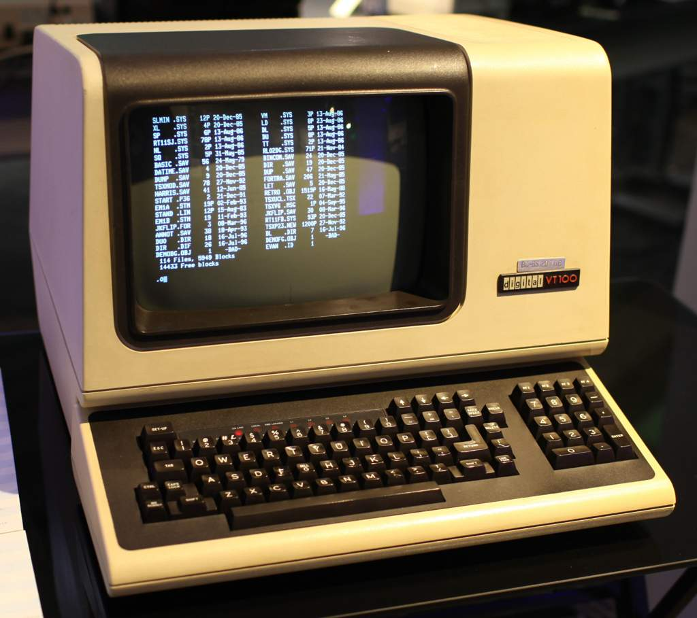
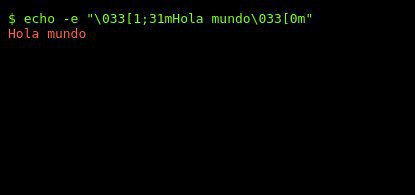
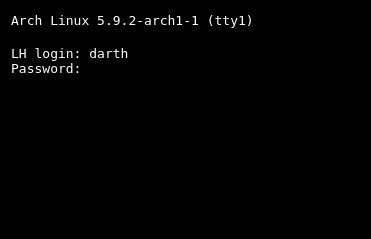
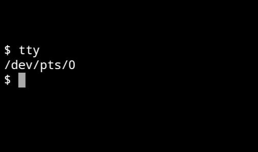
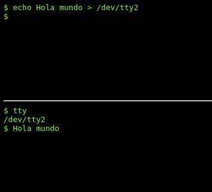
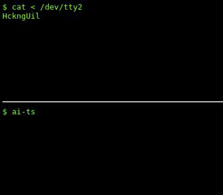

# UNIX::Subsistema de TTY #2
<b>By: Darth Venom - 31/10/2020</b>
<br>
<br>

*En el anterior blog sobre el subsistema de TTYs de Unix se explicó qué era una TTY, cómo funcionaba y cómo son ahora.*

[Subsistema de TTY #1](unix3.md)

Como bien se había mencionado anteriormente, los teletipos o TTYs físicos funcionan como interfaz entre el usuario y el sistema, gracias a estas TTYs es que por primera vez se pudo dar la interacción en tiempo real por parte de los humanos con las máquinas.


Los teletipos ya no existen más, la tecnología es ahora mucho más avanzada que antes, el teletipo fue reemplazado por terminales de video como el VT-100, si bien no tenían la capacidad suficiente como para mostrar gráficos fluidos, constituían un avance muy importante; el teletipo es muy lento y a veces hasta ruidoso a la hora de realizar operaciones de entrada y salida en comparación con un terminal de vídeo. Por si no lo recuerdas, una terminal de video es lo que sin saber llamarías "monitor antiguo".



Si bien los caracteres que se tipean son impresos en la pantalla, hay secuencias de caracteres especiales que pueden ser detectadas por el Kernel mediante la disciplina de línea para realizar cierta acción especial. Por ejemplo, si se está corriendo un programa en la terminal, la combinación de teclas CTRL+C puede ser detectada por el Kernel a través de la disciplina de línea para enviar la señal SIGINT a un programa y así terminarlo. Las señales del Kernel serán explicadas en otro blog.
Además de las secuencias de control como `CTRL+c` (`CTRL+c` es un simple byte de código ASCII 3) hay secuencias especiales llamadas escapes ANSI. Estos escapes pueden controlar colores de texto, color de fondo, posición del cursor y estilo de la fuente. Los escapes ANSI también son detectados por el Kernel a través de la disciplina de línea para actuar en consecuencia, estos escapes empiezan con el caracter `ESC`, el caracter `[` y luego un código según lo que se quiera hacer.

Si tienes una sesión de terminal, puedes probar los escapes ANSI usando el comando `echo` que sirve para imprimir texto, este comando se usará en este caso junto a su opción -e que permite interpretar los escapes. En un próximo blog se hablará en detalle de los escapes ANSI, pero hasta entonces dejo un ejemplo de un comando que imprime "Hola mundo" en rojo.
```
echo -e "\033[1;31mHola mundo\033[0m"
```


Anteriormente se habló de operaciones de entrada y salida, para aquellos que no saben qué significa esto, lo explicaré, es sencillo. Se llama **salida** a todo dato que un programa envía a otro programa, archivo, o a un dispositivo físico. Un ejemplo de lo anterior es cuando un programa imprime cosas en la pantalla, o cuando un programa envía datos a una impresora para que esta imprima. En este caso, el programa **envía** esos datos (salida) y la impresora los **recibe** y los procesa (entrada). Así como la salida son los datos que un programa envía o escribe, la **entrada** son los datos que un programa recibe, por ejemplo, cuando escribes en una terminal, el intérprete de comandos bash, por decir un ejemplo, lee (recibe) las letras que ingresas a través del teclado.

Cuando existía el teletipo, las operaciones de entrada y salida las hacía el teletipo mecánicamente. Las teclas que se digitaban, o sea, la entrada; y el texto que imprimía el teletipo, o sea, la salida de los programas. Eso era antes, ahora que ya no existen más y todo esto se da virtualmente, se puede intuir que ya no existe ese procedimiento mecánico que hacía el teletipo. Como se ha dicho ya más de una vez, con la desaparición de los teletipos, **el término TTY hace referencia ahora a las terminales emuladas por software**, y aquí es donde viene lo importante.

Antes de avanzar, es menester reconocer los componentes que se usaban en la época del teletipo. Estaba el teclado como dispositivo de entrada, el rollo de papel como medio de salida, y el teletipo que detectaba las teclas que se pulsaban, hacía procedimientos mecánicos, podía reaccionar a teclas especiales, enviaba la entrada mediante UART hacia la computadora y recibía los datos que los programas enviaban hacia la TTY para ser impresos.

Tal y como se describió en el blog sobre [el árbol de directorios de Unix](unix2.md), en el sistema de archivos Unix todo es un archivo. En este punto, si el lector lo considera necesario, puede repasar ese mismo blog en la parte de los tipos de archivos. Continuando con lo anterior, los datos de la entrada y salida que la TTY física tiene que enviar o recibir, en el sistema de archivos se puede ver como un archivo `ttySx` *(donde "x" es un número referente a un puerto serial)*, estos son **archivos especiales**, no contienen nada, sólo mapean todos los datos que se escriben ahí; así es como un programa puede escribir un texto en ese archivo y los bytes en vez de escribirse en el archivo serán redireccionados hacia el teletipo conectado mediante la comunicación serial por UART, el cual decodificará los bytes con un procedimiento mecánico y los imprimirá en el papel. Ese archivo especial `ttySx` es lo que llamaremos **"archivo de terminal"**.

Ahora el teclado es teclado, el rollo de papel es una terminal de video y la TTY es emulada por un programa llamado **"Emulador de terminal"**. Esto es importante; un emulador de terminal tiene el trabajo de conectarse a un *archivo de terminal*, informar al Kernel sobre el tamaño de la pantalla y otros detalles e iniciar un intérprete de terminal (para la comodidad, lo llamaremos **Shell**). Es decir, el emulador de terminal, como el nombre lo sugiere, hace en software todo lo que el teletipo hacía en hardware.

Avanzando hacia los dispositivos de la actualidad, hay un detalle importante. Si recuerdas el diagrama de cómo funcionan las TTYs emuladas, recordarás que ya no hay comunicación serial por UART, ya no es necesario, la TTY ya no es un dispositivo aparte, está incorporada en el sistema, por ende, el archivo de dispositivo `ttySx` ya no se usará más para esto, no significa que esté en desuso, sólo que es únicamente para comunicación serial, algo que ya vimos que dejó de ser necesario para la TTY.

Ahora los dispositivos de terminal son `ttyx`, donde "x" es un número referente a la sesión de terminal abierta; la primer TTY que se abra se conectará al archivo `tty0`, la segunda a `tty1`, y así sucesivamente. Como la TTY ahora es emulada por software, debes deducir que puedes tener abiertas montones de TTYs al mismo tiempo en una misma computadora. Los datos siguen siendo mapeados a través del archivo de terminal al que se conecte un emulador, estos archivos sirven para que se puedan dar las operaciones de entrada y salida, su función es mapear los datos que entran o salen. Llegó la parte interesante, probarlo.

Considerando que ahora podemos tener más de una TTY abierta, haremos un experimento para probar el funcionamiento de los archivos de terminal, y así por intuición entenderás mucho mejor cómo es que estos archivos mapean los datos.

En los sistemas Unix o GNU/Linux, al iniciar se abre la TTY uno, la mayoría de las personas con sistemas GNU/Linux no notarán que tras el arranque se haya abierto algo parecido a lo que se habló en este blog, esto es porque los sistemas de ahora vienen configurados para lanzar el servidor gráfico Xorg, esto hace que los ordenadores de ahora puedan usar mouse, permitan visualizar fotos, videos, abrir múltiples ventanas, hacer animaciones, etc. Pero ese servidor está corriendo encima de una TTY, la TTY es el nivel más bajo de interacción entre el sistema y el usuario. Lo anterior no detendrá al lector, como había dicho, se pueden abrir muchas TTYs, para desplazarse a través de las TTYs disponibles se usa la combinación del teclado `CTRL+ALT+Fx` donde x es el número de la TTY a la que se quiere ir, así `CTRL+ALT+F1` me llevaría a la TTY1, a la cuál uno no querría ir, ya que en esa está el gestor de sesiones, el programa en el que inicias sesión cuando prendes la computadora. Una vez se llega a una TTY tendrás que iniciar sesión en ella con tu usuario para poder usarla.



Si se quiere volver de nuevo al entorno gráfico, solo debes buscar la TTY en la que estaba iniciado tu escritorio y tus cosas gráficas usando la combinación del teclado anteriormente mencionada. Si en vez de Unix o GNU/Linux estás usando Android, abre Termux y considera que si quieres puedes abrir más de una sesión de terminal deslizando desde el lateral izquierdo hacia la derecha; esto abrirá un menú, cuando se hable de abrir una TTY, abre una sesión de terminal. En el caso de Termux, como no son pseudoterminales, más adelante el comando tty te arrojará algo distinto. Cuando el blog diga `/dev/ttyx`, tú verás `/dev/pts/x`, donde x es el número de la terminal conectada. Reemplaza por lo que te salga.



El experimento consiste en abrir dos TTYs, una la usaremos para alterar a la otra escribiendo datos en el archivo de terminal al que se haya conectado. Para saber a qué archivo de terminal se conectó la TTY se utiliza el comando tty. Usa ese comando en una de las TTYs y recuerda el resultado, ahora ve a la otra y usa este comando:
```
echo Hola mundo > /dev/ttyx   # (Donde dice ttyx lo reemplazan por el número de tty que les haya dado el comando tty)
```


Una vez ingresado el comando, le dan enter y van a la otra terminal. ¡¡Sorpresa!! Ese "Hola mundo" que escribimos en el comando de la anterior terminal apareció en esta otra. Así probamos como el archivo de terminal mapea la salida de datos.

¿Quieres probar lo mismo pero con la entrada de datos? Bueno, vuelve a la otra terminal y ejecuta este comando:
```
cat < /dev/ttyx   # (Donde dice ttyx lo reemplazan por el número de TTY que les haya dado el comando tty en la otra TTY)
```


Una vez escrito el comando, le dan enter y van a la otra terminal. Ahora intenta escribir, verás que la mayoría de las teclas que escribas no aparecerán, esto es porque en la otra TTY usamos el comando cat que lee todos los datos que entran en ese archivo de terminal, por ende, para tu sorpresa, la mayoría de las cosas que hayas intentado escribir en esa TTY se habrán impreso en la TTY en la que ejecutaste el comando cat, ya que cat imprime todo lo que lee. Para terminar el comando `cat` y liberar la otra TTY se utiliza la combinación `CTRL+C`.

## SHELL

Vuelvo a nombrar a la shell, o intérprete de terminal. Si seguiste el experimento anterior, esos comandos no fueron procesados por la TTY, el archivo de terminal, el emulador o algo así, nada de eso tiene la habilidad de procesar comandos; para eso está la Shell. Muy probablemente la shell en la que escribiste esos comandos es *Bash*.


Bash es la shell por defecto en sistemas GNU/Linux, MacOS y como Termux emula cosas de Debian, también está Bash por defecto en Termux. Para pintarlo todo de una mejor forma, la shell es la verdadera forma de comunicarte con el sistema, y lo hace mediante comandos, porque los demás componentes como la TTY y eso, son elementos fundamentales, pero es gracias a que hay una shell interpretando comandos que el usuario puede abrir programas o ejecutar operaciones a voluntad. Bash tendrá dedicada una serie de blogs al respecto, los blogs sobre aprender a dominar la terminal.
<br>
<hr>
*El post ha llegado a su fin. Si tienes dudas puedes contactarme en Discord. Soy venom_instantdeath.*
