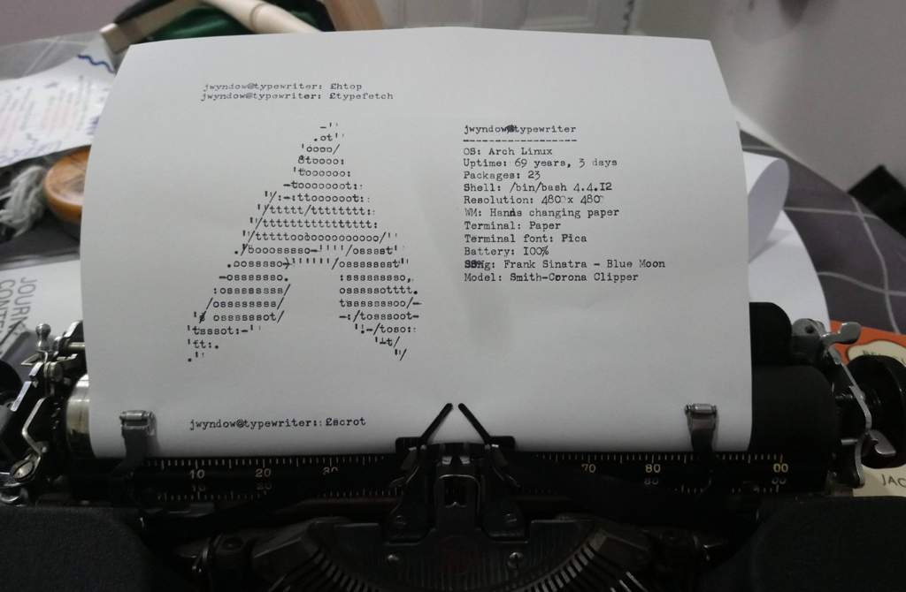
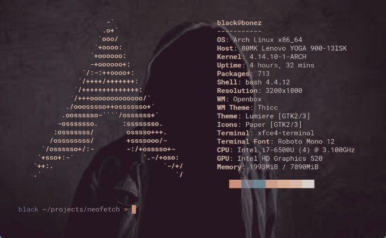

# ¿Cómo programaban en los teletipos?
<b>By: Darth Venom - 24/02/2021</b>
<br>
<br>
Si leíste los blogs acerca del [Subsistema de TTY](http://aminoapps.com/p/13sczv) sabrás que la primera interacción en tiempo real entre humano y computadora se dio gracias a la creación de los teletipos o TTY físicas. Los teletipos son muy parecidos a las máquinas de escribir, la diferencia es que los teletipos no sirven sólo para escribir y tienen mecanismo mucho más complejos.


La interacción en tiempo real entre humano y máquina se da a través del teletipo, el cual funciona como dispositivo de entrada/salida. Digamos, el dispositivo que se usaba para interactuar con la computadora era el teletipo, pero la forma por la cual se interactuaba era a través de un intérprete de comandos en una sesión de terminal. Sería como usar bash en la laptop, pero en vez de ver la terminal en la pantalla, se ve impresa en un rollo de papel.





Hay ciertas limitaciones que tiene el teletipo, la que cubriremos en este blog es que como las cosas se imprimen en una hoja y no en una pantalla, borrar caracteres o mover el cursor a través de un archivo es más difícil o imposible en ese orden. Cuando borramos un caracter en la pantalla, este simplemente desaparece, en cambio esto en un teletipo no puede ser posible debido a que las letras se imprimen con tinta en la hoja, por ende no es como que se pueda borrar. Estas máquinas no traían teclas de navegación como serían las teclas de arriba, abajo, derecha e izquierda, por lo tanto uno se puede imaginar que editar un texto o un documento es imposible de hacer como en los editores que tenemos actualmente.

*En los teletipos el alcance de la edición es de una sola línea, por ende el editor que se use tendría que permitir que se pueda editar todo un documento a través de la línea en la que se encuentre el cursor. El editor que cumple con los requisitos anteriormente mencionados es `ed`. `ed` es un editor de texto que tiene su origen en los tiempos de Unix. A continuación daré un pequeño tutorial sobre `ed`.*

## ED DE 0 A 1000

Generalmente en casi todas las distros `ed` viene preinstalado, pero sino pueden instalarlo desde los repositorios internos según el sistema que usen. Esta guía no será como las demás guías que llevan como setenta partes, esta se empieza y termina en este post.

Antes que nada para empezar a utilizar el programa hay que abrirlo. La sintaxis para abrirlo es:
```
ed [opciones] [archivo]
```
Los dos parámetros son opcionales, para más información acerca de las opciones, pueden revisar el manual de `ed`.

Si queremos comenzar a editar un archivo llamado *hello* desde cero, puedo usar:
```
ed hello
```
O directamente puedo usar el comando `ed` sin ningún parámetro y luego especificar con qué nombre se quiere guardar el archivo. Eso es lo básico relativo a la apertura del archivo. Para evitar confusiones entre los modos del editor lo mejor es usar la opción `--prompt` para que el prompt sea visible cada vez que se espere un comando. Ejemplo:
```
[i]ed -v --prompt=* hello
```
Una vez abierto el editor, `ed` estará a la espera de los comandos del usuario. Los comandos son los siguientes:

`.` 	Imprime la línea actual en el buffer.<br>
`$` 	Imprime la última línea en el buffer.<br>
`N` 	Desplaza el cursor a la línea N, donde N es un número.<br>
`+`     Desplaza el cursor hacia la línea siguiente.<br>
`-` 	Desplaza el cursor hacia la línea anterior.<br>
`,` 	Permite expresar un rango de líneas, si sólo se pone la coma el rango es igual a `1,$`<br>
`;` 	Permite expresar un rango de líneas, si sólo se pone el punto y coma el rango es igual a `.;$`<br>
`/re/` 	Busca la próxima línea que coincida con la expresión regular `re`.<br>
`?re?` 	Busca la línea anterior que coincida con la expresión regular `re`.

`(.)a` 		    Inserta texto en la línea siguiente a la actual.
`(.,.)c` 		Modifica una línea en el buffer.
`(.,.)d` 		Elimina una línea o rango de líneas. La línea eliminada se guarda en el buffer para que pueda ser pegada.
`(.,.)e file` 	Edita el archivo "file". Si el nombre de archivo se precede con un signo de exclamación ed entenderá que tiene que leer el output de un comando.
`(.,.)E file` 	Edita el archivo "file" descartando el buffer actual sin advertir.
`h` 		    Imprime una explicación sobre el último error.
`(.)i` 		    Inserta texto en la línea anterior a la actual.
`(.,.)m(.)` 	Mueve una línea o un rango de líneas hacia otra.
`(.,.)n` 		Imprime líneas enumeradas.
`(.,.)p` 		Imprime las líneas indicadas.
`q` 		    Sale de ed.
`Q` 		    Sale de ed sin preguntar.
`(.)r file` 	Lee el archivo "file" y lo inserta después de la línea actual.
`(.,.)t(.)` 	Copia una línea o rango de líneas hacia otra.
`u`	            Deshace el efecto del último comando.
`w file` 		Guarda el archivo "file". Si el archivo ya tiene nombre no hace falta especificar el nombre del archivo.
`(.)x` 		    Pegar.
`(.,.)y` 		Copiar una línea o rango de líneas al buffer.

Cuando se usan los comandos: `a`, `i`, `c`, ed se cambia al modo de inserción. En este modo todo lo que el usuario escriba se insertará en el buffer del archivo, para detener el modo de inserción se debe escribir un *'.'* en una línea sóla.

`ed` es un editor bastante interesante, actualmente no es necesario usarlo con tan buenos editores que existen pero puede resultar una buena experiencia para los curiosos.
<br>
<hr>
*El blog ha llegado a su fin. Si tienes dudas puedes contactarme en Discord. Soy venom_instantdeath.*
