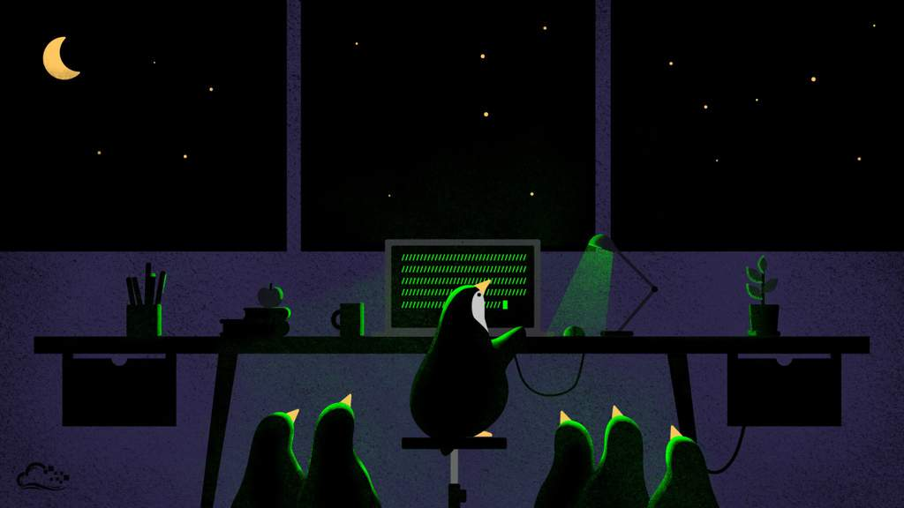

# Ver Imagenes y videos en la TTY
<b>By: Darth Venom - 06/01/2022</b>
<br>
<br>
Si eres alguien que usa distribuciones GNU/Linux minimalistas como Arch, Gentoo o Slackware y prefieres usar la TTY antes que iniciar el entorno gráfico y usar aplicaciones gráficas, seguro muchas veces te has preguntado si se pueden ver imágenes en la TTY, y sobre ver videos seguro hasta pensaste que era imposible. Ya no hace falta iniciar la interfaz gráfica para visualizar imágenes o videos porque este blog te enseñará rápidamente cómo hacerlo sin necesidad de tener xorg abierto.



## IMAGENES

Para ver fotos desde la TTY se puede usar el programa `fbi` (Framebuffer Imageviewer). A continuación se muestran los nombres que este paquete tiene en distintas distros.

**GENTOO:** `media-gfx/fbida`
**ARCH, FEDORA, SLACKWARE:** `fbida`
**DEBIAN, OPENSUSE:** `fbi`

Este programa puede usarse fácilmente de la siguiente forma:
```
fbi nombreDeImagen.jpg
```
Para salir de fbi se puede usar la letra `q`.

<center>(fbi también soporta otros formatos a parte del jpg)</center>

## VIDEOS

Si por alguna razón deseas visualizar un video y no deseas iniciar toda la interfaz gráfica sólo para eso, puedes usar el famoso `vlc`. Este programa que está disponible hasta en Windows, al ser ejecutado desde la TTY y sólo desde la TTY se inicia de un modo distinto aprovechando el framebuffer para renderizar en gran calidad un video sin la necesidad de usar xorg.

A continuación se muestran los nombres que este paquete tiene en distintas distros.

**GENTOO:** `media-video/vlc`
**ARCH, DEBIAN, OPENSUSE, FEDORA, SLACKWARE:** `vlc`

Este programa puede usarse fácilmente de la siguiente forma:
```
vlc nombreDeVideo.mp4
```
Para salir de VLC se usa `CTRL+c`.

<center>(vlc también soporta otros formatos a parte del mp4)</center>
<br>
<hr>
*El blog ha llegado a su fin. Si tienes dudas puedes contactarme en Discord. Soy venom_instantdeath.*
