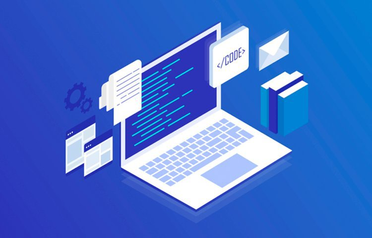
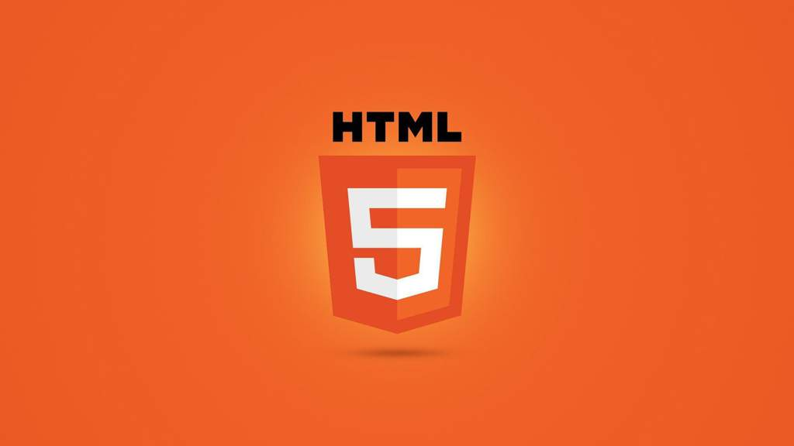
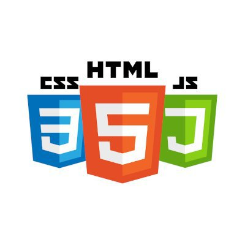
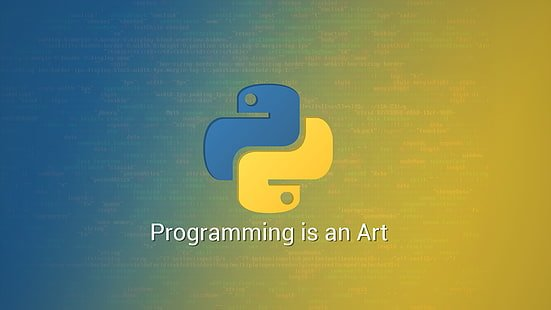
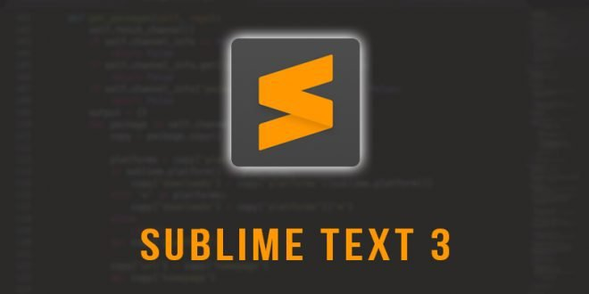
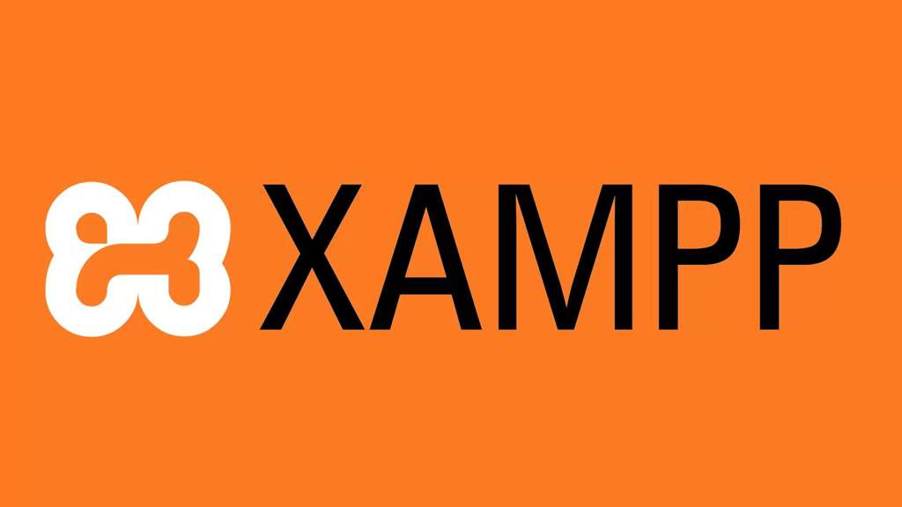
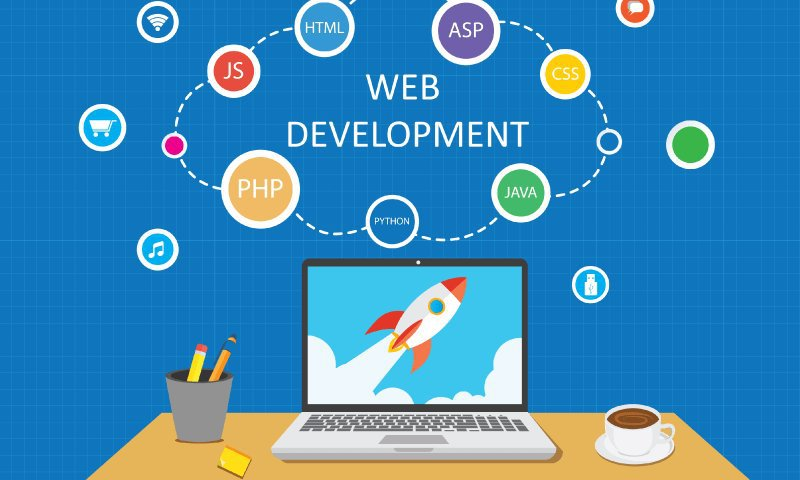

# ¿Cómo crear una página web?
<b>By: Darth Venom - 22/04/2021</b>
 
 
Es un hecho que la programación web es lo más demandado por las empresas hoy en día. Freelancers, restaurantes, negocios de ropa, negocios de tecnología, empresas. Todos piden páginas web, esto significa que en el mercado se necesita a más gente que se dedique a la programación web. Todo el tiempo se buscan programadores orientados a esto, así que, lector, ya tienes un buen punto para estudiar esto y continuar leyendo este blog.

## ¿POR QUÉ ES TAN DEMANDADO?

La razón de esto es muy simple. ¿Qué le conviene más a una empresa? ¿Crear aplicaciones descargables para cada plataforma o crear una página web que pueda ser accedida desde cualquier plataforma con tan sólo un click desde el navegador?

Sí, la opción de la página web suena mejor. Y sí, puede ser que aparezcan quienes digan que hay frameworks que permiten el desarrollo multiplataforma y que no necesariamente habría que desarrollar una aplicación por cada plataforma. Es completamente válido lo anterior, pero aún así habría que descargar la aplicación; una aplicación web no precisa ser descargada y esos frameworks para el desarrollo multiplataforma no cubren plataformas como un Smart TV Samsung que usa el sistema Tizen, una página web sí lo hace.

Entonces sí, hay muchos casos en los que el desarrollo web presenta claras ventajas, pero no son todos los casos, que conste.

## ¿QUÉ HAY QUE SABER?

Una página web contiene un frontend y puede contener un backend. Frontend se le dice a aquello con lo que el usuario puede interactuar y visualizar, o sea, la página en sí, la parte gráfica, lo que se presenta al cliente. El Backend es toda la parte del funcionamiento de la página. Por ejemplo, en una página de inicio de sesión, cuando ingresas las credenciales hay un programa que las procesa. Ese mismo programa se encuentra alojado dentro del mismo servidor y se considera backend. El backend no es algo visible por el cliente como el frontend sino que está conformado por programas que pueden interactuar con el frontend. No es un elemento obligatorio a la hora de realizar una página web.

Para desarrollar el frontend se debe aprender HTML, CSS y JavaScript. Si bien sólo con HTML se puede crear una página web, lo cierto es que sería una página limitada únicamente a mostrar contenido sin ningún estilo, con a penas un poco de formato. Esto se debe a que HTML sólo sirve para marcar la estructura de la página, no es un lenguaje de programación, es un lenguaje de marcado.

CSS es un lenguaje que se usa junto a HTML para darle estilo a la página, esto permite hacer que los textos cambien de colores, los botones, fotos y otros elementos tengan apariencias redondeadas, la página tenga un fondo coloreado o una foto de fondo, etc. Básicamente CSS hace la diferencia entre una página bonita y una página que es texto plano sin nada más.

JavaScript, abreviado JS, es un lenguaje de programación que permite que los usuarios puedan interactuar con la página en tiempo real. Se puede decir que JS le da vida a la página ya que permite interactuar con botones, crear animaciones, manipular eventos, usar estructuras condicionales, etc.

Para el backend los lenguajes de programación más populares son JavaScript, Python y Ruby. Estos lenguajes tienen algunos de los frameworks para desarrollo web más usados, en los siguientes dos links podrán encontrar un poco de información al respecto:

<https://ordergroup.co/en/blog/best-backend-technologies-2019/>

<https://www.merixstudio.com/blog/backend-development/>

## ¿QUÉ HAY QUE DESCARGAR?

Para desarrollo de frontend, respecto a los lenguajes, no hay que descargar absolutamente nada. HTML, CSS y JavaScript son interpretados y ejecutados por el navegador, es decir, lo único que tienes que tener es un navegador. Para escribir código en estos lenguajes o cualquier otro se necesita un editor de texto. Si usas un sistema Windows, por ejemplo, hay un editor de texto que viene preinstalado. Este editor de texto es el "bloc de notas" y puedes encontrarlo entre la lista de programas instalados o buscarlo por su nombre "notepad" o "bloc de notas".

¿Es el bloc de notas un buen editor de texto?

Respuesta corta: **No.**

Que sea suficiente no significa que sea bueno ni mucho menos que sea lo mejor. *Para programar lo mejor es descargar un editor de texto orientado a la programación o una IDE* (Entorno de Desarrollo Integrado). Recomiendo el uso del editor Sublime Text, es muy conocido y recomendado. El link para su descarga es el siguiente: <https://www.sublimetext.com/3>.

Para el desarrollo de backend, además de un editor de texto es posible que se necesite descargar el intérprete o compilador de los lenguajes que se quieran usar. Si por ejemplo se quiere usar Python con uno de sus frameworks más famosos para el desarrollo web, hay que descargar el intérprete de Python, para esto recomiendo que le echen un vistazo [a uno de nuestros artículos](python1.md), esto los ayudará a instalar y configurar Python correctamente.

Como bien sabemos, Python no es el único lenguaje de programación para desarrollo de backend así que para los demás lenguajes el programador tendrá que investigar al respecto.

¿Falta algo más?

Sí, falta algo más. Ya sea que quieras hacer pruebas o montar tu propio sitio web manualmente desde tu computadora necesitarás una aplicación que sirva de servidor web, entre las más populares se encuentra apache http server. A través del siguiente link se puede llegar a la página oficial del proyecto apache, donde se puede descargar el programa: <https://httpd.apache.org/download.cgi>

Alternativamente se puede descargar *XAMPP*, que es un paquete de software libre que entre sus programas YA contiene Apache HTTP Server, pero a parte contiene los intérpretes para PHP y Perl, dos lenguajes de programación bastante usados para crear scripts, y PHP es también bastante usado en el backend. A parte XAMPP cuenta con el sistema de gestión de bases de datos MySQL, así que es la opción más recomendable ya que además de contener todo lo anteriormente dicho, automatiza un montón de procesos y permite que tu página web se pueda mostrar sin necesidad de mucho ajuste.

## ¿POR DÓNDE SE EMPIEZA?

Dentro de desarrollo de frontend se había mencionado que algunos de los lenguajes más usados son HTML y CSS, si piensas aprender frontend o frontend y backend, empezar por HTML y CSS es lo recomendable. Estos dos lenguajes son muy sencillos de aprender, pueden dominarse fácilmente en una semana o menos según el ritmo de quien vaya a aprenderlo.

Si se quiere aprender frontend y backend, la recomendación es que se empiece por frontend ya que es más sencillo y dentro de todo le da al programador algo de experiencia antes de pasar al backend.

Para aprender cualquiera de estos lenguajes recomiendo buscar libros, tutoriales de youtube y consultar en los chats de esta comunidad. Si deseas comenzar con desarrollo de backend y deseas aprender Python, puedes [echarle un vistazo a la guía que hay en este sitio](index.md), es muy completa y si la sigues no necesitarás complementar las bases con ninguna otra guía.

## Conclusión

Para concluir, pronto se estarán subiendo guías de HTML y CSS bastante completas para que los usuarios no tengan que comprar libros o pagar cursos.
 

*El post ha llegado a su fin. Si tienes dudas puedes contactarme en Discord, soy venom_instantdeath.*
