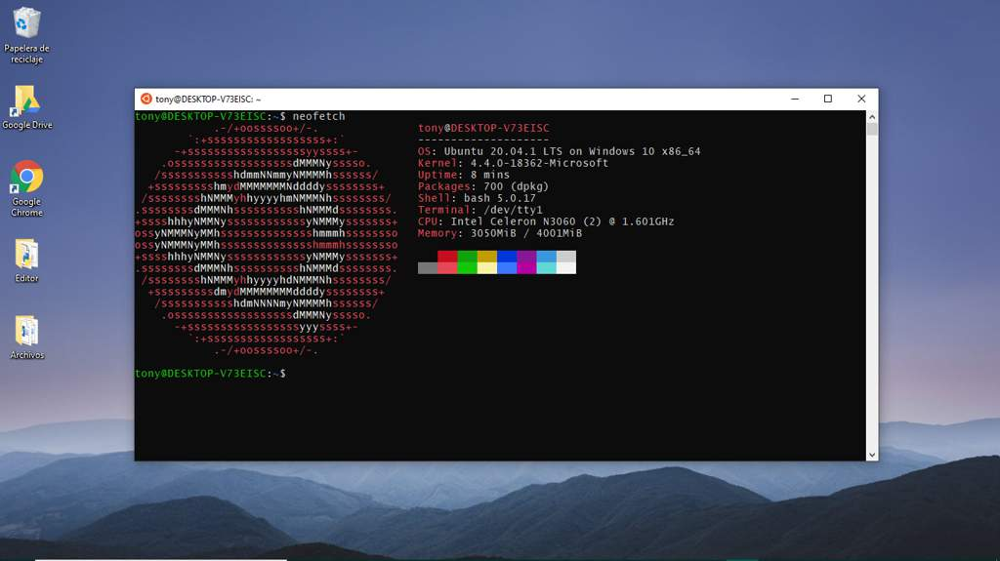
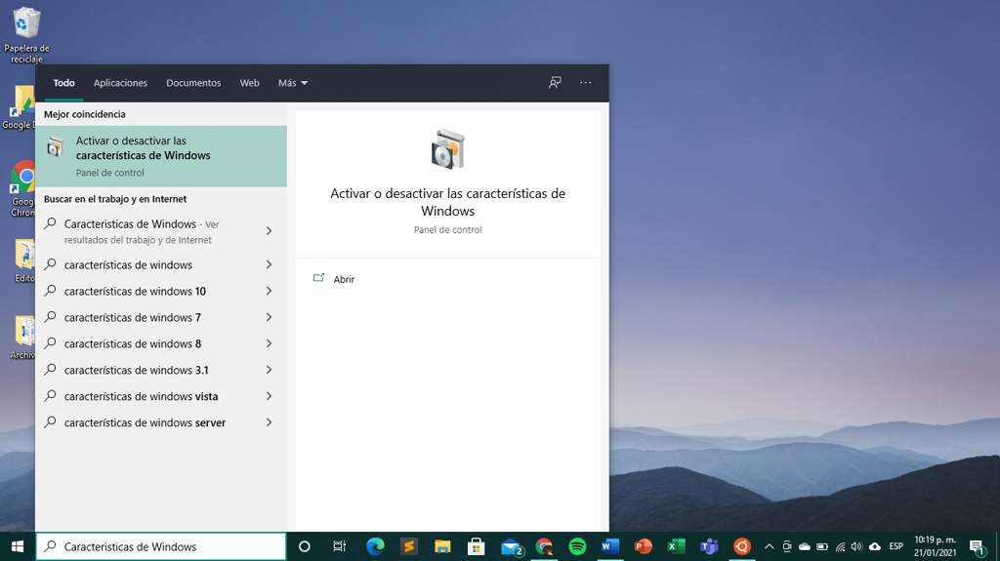
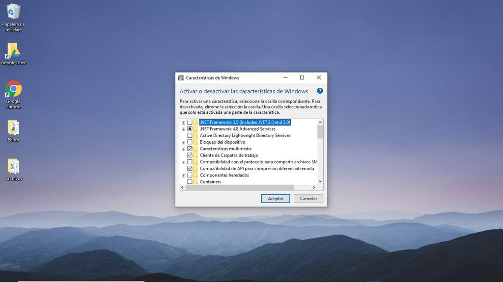
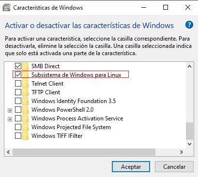
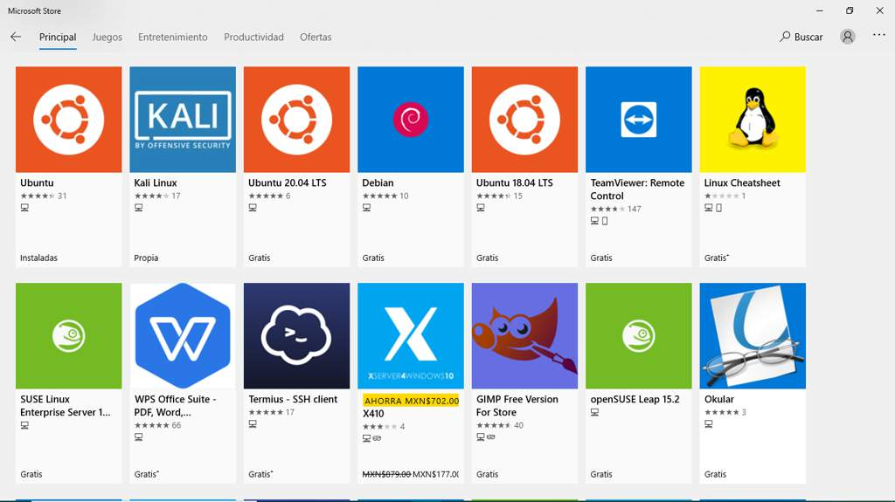

# WSL en Windows 10 
<b>By: [Tony](https://github.com/msh-dv) - 22/01/2021</b>
 
 

Bienvenidos a este blog donde hablaremos de como activar e instalar el subsistema de Windows para Linux en Windows 10(WSL).

## ¿Qué es el subsistema de Windows para Linux o WSL?
Windows Subsystem for Linux, o Subsistema de Windows para Linux, es una característica introducida en Windows 10 que nos permite instalar un Kernel Linux directamente sobre el sistema operativo de Microsoft.

Esto es posible gracias a la virtualización de Hyper-V de Microsoft, y al hacerlo vamos a poder tener acceso a todos los comandos y todos los programas de terminal de este sistema operativo directamente desde una ventana de CMD.

## ¿Para quién está dirigido esto? 

Esto está dirigido a los usuarios nuevos que tienen curiosidad acerca de todo lo relacionado con GNU/Linux y sus bastas distribuciones sin necesidad de tener que instalar una distribución o una VM, además de que ofrece un mejor rendimiento que las ya mencionadas.

## ¿Qué se puede hacer en el WSL? 

- Ejecuta herramientas comunes de línea de comandos, como grep, sed, awk u otros archivos binarios ELF-64.
- Ejecute scripts de Bash y aplicaciones de línea de comandos de GNU/Linux, como:
- Herramientas: vim, emacs, tmux.
- Lenguajes: NodeJS, JavaScript, Python, Ruby, C/C++, etc.
- Servicios: SSHD, MySQL, Apache, MongoDB, PostgreSQL.
- Instala software adicional mediante el administrador de paquetes de distribución de GNU/Linux.
- Invoca aplicaciones de Windows mediante un shell de línea de comandos de tipo UNIX.
- Invoca aplicaciones de GNU/Linux en Windows.
- Ejecución de aplicaciones gráficas GNU/Linux que están integradas directamente en el escritorio de Windows

## Ahora veremos como activarlo
Primero deberemos buscar "Características de Windows", esto lo podremos hacer presionando la tecla de Windows o dirigiéndonos a la barra de búsqueda directamente.

Después de abrir las características de Windows, nos debería aparecer algo así.

Bajaremos entre las características hasta encontrar una opción nombrada como "Subsistema de Windows para Linux"

Después de esto podemos ir a la Microsoft Store y elegir la distrubución que mas nos agrade, en el caso de este blog, usamos Ubuntu.

Para finalizar, solo nos quedaría buscar en "Agregados recientemente", iniciamos nuestra distribución elegida y solo nos faltaria configurar nuestro usuario y contraseña.

Seguido de esto, ya podríamos usar nuestra distribución de preferencia.
